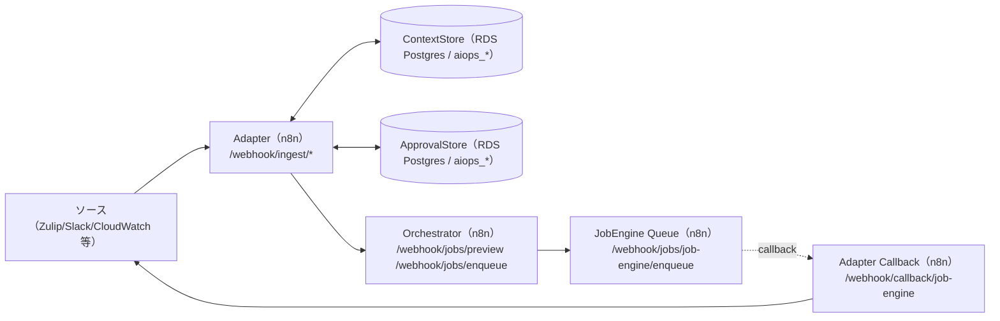

# コンピュータ化システムバリデーション（CSV）
## 最小ドキュメントセット
### AIOps Agent（n8n） / GAMP® 5 第2版（2022, CSA ベース, IQ/oq/PQ を含む）

---

## 1. CSV / CSA ポリシー
**目的**
`apps/README.md` の共通フォーマットに従い、リスクベース（CSA）で最小限の成果物として本 README と検証証跡を維持する。

**内容**
- 設計・仕様・運用の Single Source of Truth（SSoT）は `apps/aiops_agent/docs/` を参照する（特に `apps/aiops_agent/docs/aiops_agent_design.md`）。
- 秘密情報（API key 等）は tfvars に平文で置かず、SSM/Secrets Manager → n8n 環境変数注入を前提とする。

---

## 2. バリデーション計画（VP）
**目的**
対象範囲（スコープ）と検証戦略を定義する。

**内容**
- システム名: AIOps Agent
- 対象: n8n ワークフロー・プロンプト・ポリシー・DB（ContextStore/ApprovalStore/Problem Management）を用いて、ITSM/AI Ops のチャット/イベント入力を受けてプレビュー/投入/承認/フィードバック等の処理を行うカスタムエージェント
- 非対象: LLM/外部AI API 自体の製品バリデーション、外部サービス（Zulip/GitLab/Keycloak 等）自体のバリデーション、ネットワーク/認証基盤（Terraform/IaC 側）全般
- バリデーション成果物（最小）:
  - 本 README
  - DQ/IQ/OQ/PQ:
    - `apps/aiops_agent/docs/dq/`
    - `apps/aiops_agent/docs/iq/`
    - `apps/aiops_agent/docs/oq/`
    - `apps/aiops_agent/docs/pq/`
  - 要求/仕様/設計/実装/利用方法: `apps/aiops_agent/docs/`
  - 実行補助: `apps/aiops_agent/scripts/`（`run_iq_tests_aiops_agent.sh`, `run_dq_scenarios.py`, `run_oq_runner.sh` など）

---

## 3. 意図した使用（Intended Use）とシステム概要
**目的**
ITSM/AI Ops のユースケースにおいて、チャット/イベント入力から「状況整理→提案→（必要なら）承認→実行→記録」の流れを支援し、運用者の負担を下げつつ、監査可能な証跡（ログ/出力）を残す。

**内容**
- Intended Use（意図した使用）
  - チャット（Zulip 等）や監視イベント（CloudWatch 等）を受信し、ポリシー/プロンプトに基づき、対応の提案や自動実行を支援する。
  - 自動実行はプレビュー/投入/承認などの段階を持ち、運用者の関与点（承認/差し戻し）を明確にする。
- 高レベル構成（例）
  - Chat/Event → n8n（Adapter/Orchestrator/Job Engine/Approval/Feedback）→ 外部 API（Zulip/GitLab/Service Control/LLM 等）→ 返信/記録
- SSoT（設計・運用）
  - ドキュメント: `apps/aiops_agent/docs/README.md`
  - ルール/語彙/閾値: `apps/aiops_agent/data/default/policy/`
  - プロンプト本文: `apps/aiops_agent/data/default/prompt/`
  - 注入の正: `apps/aiops_agent/scripts/deploy_workflows.sh`（`prompt_map` / `policy_map`）

### 構成図（Mermaid / 現行実装）



### ディレクトリ構成
- `apps/aiops_agent/workflows/`: AIOps Agent のワークフロー定義（JSON）
- `apps/aiops_agent/scripts/`: 同期（アップロード）・DB seed 取り込み・DQ/IQ/OQ テスト補助
- `apps/aiops_agent/sql/`: `aiops_*` テーブル群のスキーマ・seed
- `apps/aiops_agent/data/`: レルム別のプロンプト/ポリシー/DQ シナリオ等
  - 既定: `apps/aiops_agent/data/default/prompt/`, `apps/aiops_agent/data/default/policy/`, `apps/aiops_agent/data/default/dq/`
  - レルム別上書き（任意）: `apps/aiops_agent/data/<realm>/prompt/`, `apps/aiops_agent/data/<realm>/policy/`, `apps/aiops_agent/data/<realm>/dq/`
- `apps/aiops_agent/docs/`: 要求/仕様/設計/実装/利用方法、DQ/IQ/OQ/PQ の説明文書
- `apps/aiops_agent/docs/cs/`: CS（Configuration Specification: 設計・構成定義）
- `apps/aiops_agent/docs/dq/`: DQ（設計適格性確認）
- `apps/aiops_agent/docs/iq/`: IQ（設置時適格性確認）
- `apps/aiops_agent/docs/oq/`: OQ（運用適格性確認）
- `apps/aiops_agent/docs/pq/`: PQ（性能適格性確認）

### Webhook（代表）
n8n の Webhook ベース URL を `https://n8n.example.com/webhook` とした場合のパス。

- 受信（Adapter）
  - `POST /webhook/ingest/slack`
  - `POST /webhook/ingest/zulip`
    - Zulip の tenant/realm 分岐は URL 末尾パスでは行わない（受信 `token` や payload/params の `tenant/realm` で判断）。
  - `POST /webhook/ingest/mattermost`
  - `POST /webhook/ingest/teams`
  - `POST /webhook/ingest/cloudwatch`
- ジョブ（Orchestrator / Job Engine）
  - `POST /webhook/jobs/preview`
  - `POST /webhook/jobs/enqueue`
- 承認・フィードバック・コールバック
  - `POST /webhook/approval/confirm`
  - `POST /webhook/feedback/preview`
  - `POST /webhook/feedback/job`
  - `POST /webhook/callback/job-engine`

### 同期（n8n Public API へ upsert）
ワークフロー・資格情報（Postgres/AWS/Zulip/OpenAI など）・プロンプト/ポリシー注入をまとめて同期する。

```bash
apps/aiops_agent/scripts/deploy_workflows.sh
```

**必須（同期を実行する場合）**
- `N8N_API_KEY`（未指定なら `terraform output -raw n8n_api_key`）
- `N8N_WORKFLOWS_TOKEN`（未指定なら `terraform output -raw N8N_WORKFLOWS_TOKEN`）

**よく使うオプション**
- `N8N_PUBLIC_API_BASE_URL`（未指定なら `terraform output service_urls.n8n`）
- `N8N_DRY_RUN=true`（変更計画だけ出力）
- `N8N_ACTIVATE=true`（未指定なら `terraform output -raw N8N_ACTIVATE`）
- `N8N_SYNC_MISSING_TOKEN_BEHAVIOR=skip|fail`
- レルム
  - `N8N_AGENT_REALMS`（未指定なら `terraform output N8N_AGENT_REALMS`）
  - `N8N_REALM_DATA_DIR_BASE`（既定 `apps/aiops_agent/data`）

### DB（ContextStore / ApprovalStore / Problem Management）
- スキーマ: `apps/aiops_agent/sql/`
- seed 取り込み:
  - `apps/aiops_agent/scripts/import_aiops_problem_management_seed.sh`
  - `apps/aiops_agent/scripts/import_aiops_approval_history_seed.sh`

---

## 4. GxP 影響評価とリスクアセスメント
**目的**
患者安全・製品品質・データ完全性の観点で、重大なリスクのみを識別し、対策を明記する。

**内容（例: critical のみ）**
- 誤実行（不適切な自動対応）→ プレビュー/承認フロー、ポリシーによるガードレール、dry-run/フォールバック（詳細は `apps/aiops_agent/docs/oq/`）
- 情報漏えい（チャット本文/トークン/機密）→ 秘密情報のマスキング、SSM/Secrets 管理、ログ方針（詳細は `apps/aiops_agent/docs/oq/oq_usecase_18_secret_handling_in_chat.md` 等）
- データ完全性（文脈の取り違い）→ trace_id 伝播、会話継続の規則、dedupe/ContextStore（詳細は `apps/aiops_agent/docs/oq/`）

---

## 5. 検証戦略（Verification Strategy）
**目的**
Intended Use に適合することを、最小の検証で示す。

**内容**
- DQ/IQ/OQ/PQ を分離し、OQ はユースケース（シナリオ）ベースで実施する。
- 起点文書:
  - DQ: `apps/aiops_agent/docs/dq/dq.md`
  - IQ: `apps/aiops_agent/docs/iq/iq.md`
  - OQ: `apps/aiops_agent/docs/oq/oq.md`（`oq_usecase_*.md`）
  - PQ: `apps/aiops_agent/docs/pq/pq.md`

---

## 6. 設置時適格性確認（IQ）
**目的**
対象環境にシステム（ワークフロー/設定）が正しく設置されていることを確認する。

**文書/手順（最小）**
- 同期: `apps/aiops_agent/scripts/deploy_workflows.sh`（`N8N_DRY_RUN=true` で差分確認）
- IQ テスト: `apps/aiops_agent/scripts/run_iq_tests_aiops_agent.sh`

---

## 7. 運転時適格性確認（OQ）
**目的**
重要機能（受信、文脈処理、承認、実行委譲、フィードバック、ガードレール）が意図どおり動作することを確認する。

**文書**
- `apps/aiops_agent/docs/oq/oq.md`（`oq_usecase_*.md` から生成）
- 個別シナリオ: `apps/aiops_agent/docs/oq/oq_usecase_*.md`

**実行（例）**
- `apps/aiops_agent/scripts/run_oq.sh`（既定: 個別シナリオを一括実行）
- `apps/aiops_agent/scripts/run_oq_runner.sh`
- 個別: `apps/aiops_agent/scripts/run_oq_usecase_05_trace_id_propagation.sh` など

補足:
- OQ 実行前に `scripts/generate_oq_md.sh --app apps/aiops_agent` を実行し、`oq.md` の生成領域を最新化する

---

## 8. 稼働性能適格性確認（PQ）
**目的**
応答時間・コスト・安定性（リトライ/回復）に対する成立性を確認する。

**文書**
- `apps/aiops_agent/docs/pq/pq.md`

---

## 9. バリデーションサマリレポート（VSR）
**目的**
本アプリのバリデーション結論を最小で残す。

**内容（最小）**
- 実施した DQ/IQ/OQ/PQ の一覧、結果サマリ、逸脱と対処、運用開始可否の判断
- 証跡は `evidence/` 配下に日付付きで保存する（例: `evidence/oq/aiops_agent_YYYYMMDD.../`）

---

## 10. 継続的保証（運用フェーズ）
**目的**
バリデート状態を維持する。

**内容**
- 変更は Git の差分 + 必要最小限の OQ 再実施で追跡する（変更管理は `docs/change-management.md` を参照）。
- ポリシー/プロンプトの変更は挙動に直結するため、代表 DQ/OQ を再実施して証跡を残す。
