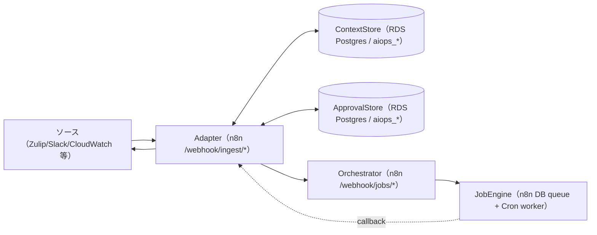

# apps/aiops_agent/docs（AIOps Agent ドキュメント）

本ディレクトリは AIOps Agent のドキュメントを「要求・仕様・設計・実装・利用方法」に分離して管理します。
意思決定（語彙/条件分岐/閾値/優先順位/フォールバック等）は `policy_context` と各プロンプト本文を正とし、ドキュメントは参照関係とデータフローの説明に留めます。

## 構成図（Mermaid / 実装対応）

`apps/aiops_agent/docs/aiops_agent_design.md` の Mermaid 図が正（詳細）です。ここでは参照用に最小構成だけを示します。

## 読み分け

- 要求（What/Why）: `apps/aiops_agent/docs/app_requirements.md`
- 仕様（契約/正式仕様）: `apps/aiops_agent/docs/aiops_agent_specification.md`
- 設計（アーキテクチャ/責務/フロー）: `apps/aiops_agent/docs/aiops_agent_design.md`
- 実装（このリポジトリの参照実装/配置/テストスタブ）: `apps/aiops_agent/docs/aiops_agent_implementation.md`
- 利用方法（運用/デプロイ/同期/設定）: `apps/aiops_agent/docs/aiops_agent_usage.md`
- Zulip Bot（要求/仕様/実装）: `apps/aiops_agent/docs/zulip_chat_bot.md`
- 適格性確認（DQ/IQ/OQ/PQ）: `apps/aiops_agent/docs/dq/dq.md`, `apps/aiops_agent/docs/iq/iq.md`, `apps/aiops_agent/docs/oq/oq.md`, `apps/aiops_agent/docs/pq/pq.md`
- OQ 個別（ユースケース別）: `apps/aiops_agent/docs/oq/oq_usecase_10_zulip_primary_hello.md`, `apps/aiops_agent/docs/oq/oq_usecase_25_smalltalk_free_chat.md`（他は `apps/aiops_agent/docs/oq/oq_usecase_*.md`）

## Single Source of Truth（SSoT）

- ルール/語彙/閾値/テンプレート: `apps/aiops_agent/data/default/policy/*.json`
- プロンプト本文: `apps/aiops_agent/data/default/prompt/*.txt`
  - レルム別上書き（任意）: `apps/aiops_agent/data/<realm>/{policy,prompt}/*`
- 事実データ/Seed/スキーマ: `apps/aiops_agent/data/*`, `apps/aiops_agent/sql/*`
- プロンプト注入の正: `apps/aiops_agent/scripts/deploy_workflows.sh` の `prompt_map`（`prompt_key` と prompt ファイル名は一致しない場合があります）
