# AI Ops Agent 設計（Design）

本書は AIOps Agent の設計（アーキテクチャ/責務/データフロー）を示します。

- 要求: `apps/aiops_agent/docs/app_requirements.md`
- 仕様: `apps/aiops_agent/docs/aiops_agent_specification.md`
- 実装: `apps/aiops_agent/docs/aiops_agent_implementation.md`
- 利用方法: `apps/aiops_agent/docs/aiops_agent_usage.md`

意思決定（語彙/条件分岐/閾値/優先順位/フォールバック等）は `policy_context` と各プロンプト本文を正とし、本書は参照関係とデータフローの説明に留めます。

## 7. コンポーネント別仕様（正式仕様の参照）

運用・監査・LLM・実行制御の正式仕様は `apps/aiops_agent/docs/aiops_agent_specification.md` に集約します。  
本書は設計（アーキテクチャ/責務分離/データフロー/実装観点の補足）に限定し、仕様の重複記載は行いません。

## 1. 全体構成（論理アーキテクチャ）

```mermaid
flowchart LR
  Source[ソース（Slack/Zulip/Mattermost 等 / CloudWatch 等）] --> Adapter[アダプター（n8n）]
  Adapter <--> ContextStore[(コンテキストストア（n8n Postgres（RDS）/Redis）)]
  Adapter <--> ApprovalStore[(承認履歴/評価ストア)]
  Adapter <--> EscalationTable[(エスカレーション表（GitLab MD + Cache）)]
  Adapter --> Orchestrator[オーケストレーター（n8n）]
  Orchestrator <--> ContextStore
  Orchestrator <--> ApprovalStore
  Orchestrator --> IdP[IdP/IAM]
  Orchestrator --> CatalogCache[(ワークフローカタログ（GitLab MD + Cache）)]
  Adapter --> External[周辺情報収集（ログ/API）]
  Adapter --> CMDB[(CMDB（Postgres（RDS））)]
  GitLab[(GitLab サービス管理プロジェクト)] --> EscalationTable
  GitLab --> CatalogCache
  GitLab --> CMDB
	  CMDB_UI[CMDB UI（任意）] -. sync .-> CMDB
  Orchestrator --> JobEngine[AI Ops ジョブ実行エンジン（ワークフロー API、n8n Queue）]
  JobEngine -->|callback| Adapter
  Adapter --> Source
```

### 1.1 概念マッピング（Signal Fusion / Change Guard / Agent Actions）

広報/画面上の表現は、本設計では次の責務に対応付けます（独立した別コンポーネントは設けません）。

- **Signal Fusion**: アダプターが `normalized_event` に正規化し、`trace_id`/`context_id` を付与して ContextStore に集約する。周辺情報や RAG 結果を `jobs.Preview` に渡し、オーケストレーターが facts を統合して要約/候補に落とす。
- **Change Guard**: `jobs.Preview` がカタログ/承認ポリシー/IAM/CMDB/KEDB を参照して候補を生成し、`next_action`/`required_confirm`/`missing_params` を確定する。変更点は `job_plan.summary`/`confirmation_summary` として提示し、最終判断は `orchestrator.preview.v1` を正とする。
- **Agent Actions**: 承認後に `jobs.enqueue` がトークン/IAM を検証し、AI Ops ジョブ実行エンジンが `job_plan` を実行する。完了は callback でアダプターへ戻し、結果通知と評価は既存フローで行う。

## 2. コンポーネント別設計

### 2.1 全体（概略）

#### 2.1.1 シーケンス（決定主体の固定）

### 2.2 アダプター（設計の要点）

詳細な責務・入出力制約は `apps/aiops_agent/docs/aiops_agent_specification.md` を正とし、本節では n8n 実装を前提とした設計上の焦点のみ記載します。

* 受信/正規化/周辺情報収集/ルーティング/プレビュー/初動返信を用途別ノードに分割し、`policy_context` による意思決定を貫く。
* ディスパッチは `next_action` の出力だけで 1 回行い、追加の閾値・優先順位はコードに持ち込まない。
* LLM 失敗時は最小限のハード制約として手動トリアージへ寄せ、推測で埋めない。
* 承認/評価入力は `adapter.interaction_parse.v1` の抽出結果を正とし、コード側はトークン検証に集中する。
* CMDB のソース・オブ・トゥルースは、AIOps Agent n8n が所属するレルムに対応する GitLab グループのサービス管理プロジェクト内 CMDB とし、外部 CMDB（Postgres 等）は参照/同期先として扱う。
* CMDB は単一 MD に限定せず、GitLab リポジトリ内の CMDB ディレクトリ（例: `cmdb/`）配下の複数ファイルを取得して扱えること（上限あり）。
* CMDB に Runbook の場所（MD パス/リンク）がある場合、該当 Runbook を複数取得し、後段（要約/プレビュー）へ証拠として渡せること。

#### 2.2.1 n8n 実装メモ（設計観点）

処理手順・制約の詳細は `apps/aiops_agent/docs/aiops_agent_specification.md` を正とし、ここではノード分割の観点のみ示します。

* 受信/プレビュー/返信/承認/評価/コールバックはワークフローを分割し、責務境界を明確にする。
* LLM 呼び出しは用途別プロンプトごとに Chat ノードを分け、入出力スキーマは仕様書に合わせる。
* `jobs.Preview`/`jobs.enqueue`/RAG/DB 参照は Tool/HTTP/DB ノードで統一し、facts を後段へ渡す。
* ContextStore/承認/評価は Postgres/Redis に寄せ、冪等性と永続化を担保する。
* ソース別の投稿・認証はサブフロー化し、チャット基盤ごとの差異を局所化する。
* エスカレーション表とワークフローカタログは GitLab MD を正とし、n8n static data にキャッシュしてレート制限と遅延を抑える。

### 2.3 オーケストレーター（設計の要点）

詳細な制約・入出力要件は `apps/aiops_agent/docs/aiops_agent_specification.md` に集約します。

* IAM/カタログ/RAG などの facts 収集はコードで行い、判断は `orchestrator.preview.v1` に集約する。
* `jobs.enqueue` は承認トークン検証と IAM 再照合（構成に応じて）を行い、LLM は使わない。
* 承認トークンの生成・保留中承認の永続化は ContextStore と連動させ、アダプターと整合を取る。

### 2.4 AI Ops ジョブ実行エンジン（仕様/設計）

詳細は `apps/aiops_agent/docs/aiops_agent_specification.md` に集約する。

### 2.5 設計フロー（Mermaid）

処理フローは Mermaid（GitLab 同梱 Mermaid v10.7.0 想定）で管理します。

### 3.0 詳細は仕様/実装へ

データ項目の詳細、インターフェース仕様、運用ポリシー、参照実装の構成は以下へ移管しています。

- 仕様: `apps/aiops_agent/docs/aiops_agent_specification.md`
- 実装: `apps/aiops_agent/docs/aiops_agent_implementation.md`
