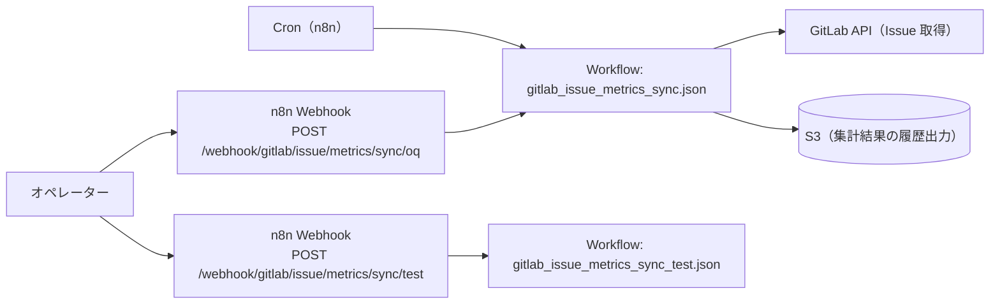

# OQ（運用適格性確認）: GitLab Issue Metrics Sync

## 目的

GitLab Issue のメトリクス集計が成立し、結果が S3 に出力されることを確認します。

## 構成図（Mermaid / 現行実装）

## 前提

- n8n に次のワークフローが同期済みであること
  - `apps/gitlab_issue_metrics_sync/workflows/gitlab_issue_metrics_sync.json`
- 連携用の環境変数（GitLab/AWS(S3) など）が設定済みであること

## OQ ケース

| case_id | 実行内容 | 期待結果 |
| --- | --- | --- |
| OQ-GIMS-001 | `GitLab Issue Metrics Sync` を n8n から手動実行（または `scripts/run_oq.sh` で実行） | S3 に出力される（互換: シナリオ2/3/7の代表） |
| OQ-GIMS-S1-001 | Cron 実行ログを確認（実行日時と `dt` を照合） | `dt` が前日（UTC）になっている（シナリオ1） |
| OQ-GIMS-S2-001 | `apps/gitlab_issue_metrics_sync/scripts/run_oq.sh` | S3 にオブジェクトが出力される（シナリオ2） |
| OQ-GIMS-S2-002 | `N8N_METRICS_TARGET_DATE=YYYY-MM-DD` を設定して実行 | 指定日付のキー配下に出力される（シナリオ2） |
| OQ-GIMS-S3-001 | 実行後に S3 のオブジェクトキーを確認 | 期待のキーが存在する（シナリオ3） |
| OQ-GIMS-S3-002 | `metrics.json` を取得して JSON として parse | 文字化けなく parse できる（シナリオ3） |
| OQ-GIMS-S3-003 | `gitlab_issues.jsonl` を取得して各行を JSON として parse | 文字化けなく parse できる（シナリオ3） |
| OQ-GIMS-S4-001 | `metrics.json` のスキーマ確認 | 期待するキーが存在する（シナリオ4） |
| OQ-GIMS-S4-002 | `metrics.json` の型確認 | 期待する型（number/null）で格納されている（シナリオ4） |
| OQ-GIMS-S5-001 | `N8N_GITLAB_LABEL_FILTERS` を変更して実行 | 対象が条件に沿って変化する（シナリオ5） |
| OQ-GIMS-S5-002 | `N8N_GITLAB_ISSUE_STATE` を変更して実行 | 対象が条件に沿って変化する（シナリオ5） |
| OQ-GIMS-S6-001 | `DRY_RUN=true apps/gitlab_issue_metrics_sync/scripts/deploy_workflows.sh` | 変更なしで計画が表示される（シナリオ6） |
| OQ-GIMS-S6-002 | `apps/gitlab_issue_metrics_sync/scripts/deploy_workflows.sh` | 同期が成功し、n8n 上に反映される（シナリオ6） |
| OQ-GIMS-S6-003 | （任意）同期後に `apps/gitlab_issue_metrics_sync/scripts/run_oq.sh` | スモークとして S3 へ出力される（シナリオ6） |
| OQ-GIMS-S7-001 | `apps/gitlab_issue_metrics_sync/scripts/run_oq.sh` 実行 | GitLab API を参照して集計し、S3 に出力される（シナリオ7） |

## 詳細 OQ

- `apps/gitlab_issue_metrics_sync/docs/oq/oq_gitlab_issue_metrics_sync_s1_daily_cron_prev_day_utc.md`
- `apps/gitlab_issue_metrics_sync/docs/oq/oq_gitlab_issue_metrics_sync_s2_manual_run_and_target_date.md`
- `apps/gitlab_issue_metrics_sync/docs/oq/oq_gitlab_issue_metrics_sync_s3_s3_output_keys.md`
- `apps/gitlab_issue_metrics_sync/docs/oq/oq_gitlab_issue_metrics_sync_s4_metrics_calculation.md`
- `apps/gitlab_issue_metrics_sync/docs/oq/oq_gitlab_issue_metrics_sync_s5_issue_filters.md`
- `apps/gitlab_issue_metrics_sync/docs/oq/oq_gitlab_issue_metrics_sync_s6_deploy_workflows.md`
- `apps/gitlab_issue_metrics_sync/docs/oq/oq_gitlab_issue_metrics_sync_s7_gitlab_api_sources.md`

## 証跡（evidence）

- n8n 実行ログ（GitLab/S3 の成功）
- S3 の出力オブジェクト（キー、サイズ、更新時刻、メタデータ）

<!-- OQ_SCENARIOS_BEGIN -->
## OQ シナリオ（詳細）

このセクションは `docs/oq/oq_*.md` から自動生成されます（更新: `scripts/generate_oq_md.sh`）。
個別シナリオを追加/修正した場合は、まず `oq_*.md` を更新し、最後に本スクリプトで `oq.md` を更新してください。

### 一覧
- [oq_gitlab_issue_metrics_sync_s1_daily_cron_prev_day_utc.md](oq_gitlab_issue_metrics_sync_s1_daily_cron_prev_day_utc.md)
- [oq_gitlab_issue_metrics_sync_s2_manual_run_and_target_date.md](oq_gitlab_issue_metrics_sync_s2_manual_run_and_target_date.md)
- [oq_gitlab_issue_metrics_sync_s3_s3_output_keys.md](oq_gitlab_issue_metrics_sync_s3_s3_output_keys.md)
- [oq_gitlab_issue_metrics_sync_s4_metrics_calculation.md](oq_gitlab_issue_metrics_sync_s4_metrics_calculation.md)
- [oq_gitlab_issue_metrics_sync_s5_issue_filters.md](oq_gitlab_issue_metrics_sync_s5_issue_filters.md)
- [oq_gitlab_issue_metrics_sync_s6_deploy_workflows.md](oq_gitlab_issue_metrics_sync_s6_deploy_workflows.md)
- [oq_gitlab_issue_metrics_sync_s7_gitlab_api_sources.md](oq_gitlab_issue_metrics_sync_s7_gitlab_api_sources.md)

---

### OQ: GitLab Issue Metrics Sync - シナリオ1（定期実行: 前日集計）（source: `oq_gitlab_issue_metrics_sync_s1_daily_cron_prev_day_utc.md`）

#### 目的

定期実行で「前日（UTC）」の `dt` が決まり、日次集計が実行されることを確認します。

#### 受け入れ基準（AC）

- Cron 実行時に、`dt` は「実行時刻の UTC 日付に対して前日」の日付になる
- `N8N_METRICS_TARGET_DATE` が未設定の場合でも、`dt` の決定がタイムゾーンに依存しない

#### テストケース（TC）

| case_id | 実行内容 | 期待結果 |
| --- | --- | --- |
| OQ-GIMS-S1-001 | n8n の Cron 実行ログを確認（実行日時と `dt` を照合） | `dt` が前日（UTC）になっている |

---

### OQ: GitLab Issue Metrics Sync - シナリオ2（手動実行/OQ）（source: `oq_gitlab_issue_metrics_sync_s2_manual_run_and_target_date.md`）

#### 目的

n8n の手動実行（または `apps/gitlab_issue_metrics_sync/scripts/run_oq.sh`）で集計が実行され、S3 に出力されることを確認します。

#### 受け入れ基準（AC）

- 手動実行でメトリクス集計が走り、S3 に出力される
- `N8N_METRICS_TARGET_DATE=YYYY-MM-DD` を n8n 側の環境変数として設定した場合、任意日付の集計ができる

#### テストケース（TC）

| case_id | 実行内容 | 期待結果 |
| --- | --- | --- |
| OQ-GIMS-S2-001 | `apps/gitlab_issue_metrics_sync/scripts/run_oq.sh` | S3 にオブジェクトが出力される |
| OQ-GIMS-S2-002 | `N8N_METRICS_TARGET_DATE=YYYY-MM-DD` を設定して実行 | 指定日付のキー配下に出力される |

---

### OQ: GitLab Issue Metrics Sync - シナリオ3（S3 出力: メトリクス + events）（source: `oq_gitlab_issue_metrics_sync_s3_s3_output_keys.md`）

#### 目的

S3 に出力されるキー/形式が期待通りであることを確認します。

#### 受け入れ基準（AC）

- `N8N_S3_BUCKET` / `N8N_S3_PREFIX` に従って、以下のキーへ出力される
  - `.../daily_metrics/dt=<YYYY-MM-DD>/realm=<realm>/metrics.json`
  - `.../events/dt=<YYYY-MM-DD>/realm=<realm>/gitlab_issues.jsonl`
- `metrics.json` は JSON（UTF-8）として読める
- `gitlab_issues.jsonl` は 1 行 1 JSON の JSONL（UTF-8）として読める

#### テストケース（TC）

| case_id | 実行内容 | 期待結果 |
| --- | --- | --- |
| OQ-GIMS-S3-001 | 実行後に S3 のオブジェクトキーを確認 | 期待のキーが存在する |
| OQ-GIMS-S3-002 | `metrics.json` を取得して JSON として parse | 文字化けなく parse できる |
| OQ-GIMS-S3-003 | `gitlab_issues.jsonl` を取得して各行を JSON として parse | 文字化けなく parse できる |

---

### OQ: GitLab Issue Metrics Sync - シナリオ4（メトリクス算出）（source: `oq_gitlab_issue_metrics_sync_s4_metrics_calculation.md`）

#### 目的

期待するメトリクスが JSON に含まれ、欠落せずに算出されることを確認します。

#### 受け入れ基準（AC）

- `metrics.json` に以下のキーが存在する
  - `request_count`
  - `first_response_p50_minutes` / `first_response_p95_minutes`
  - `resolution_p50_minutes` / `resolution_p95_minutes`
  - `backlog_count`
  - `first_contact_resolution_rate`
  - `reopen_rate`
  - `escalated_count`
- 各値は JSON の `number` または `null`（取得不能/対象なし）であり、パースに失敗しない

#### テストケース（TC）

| case_id | 実行内容 | 期待結果 |
| --- | --- | --- |
| OQ-GIMS-S4-001 | `metrics.json` のスキーマ確認 | 期待するキーが存在する |
| OQ-GIMS-S4-002 | `metrics.json` を JSON として parse し、型（number/null）を確認 | 期待する型で格納されている |

---

### OQ: GitLab Issue Metrics Sync - シナリオ5（Issue 対象のフィルタ）（source: `oq_gitlab_issue_metrics_sync_s5_issue_filters.md`）

#### 目的

GitLab Issue の取得・集計対象が、環境変数により意図通り制御できることを確認します。

#### 受け入れ基準（AC）

- `N8N_GITLAB_LABEL_FILTERS`（既定 `チャネル：Zulip`）に従って issues を取得する
- `N8N_GITLAB_ISSUE_STATE` に従って issues を取得する

#### テストケース（TC）

| case_id | 実行内容 | 期待結果 |
| --- | --- | --- |
| OQ-GIMS-S5-001 | `N8N_GITLAB_LABEL_FILTERS` を変更して実行 | `gitlab_issues.jsonl` の `gitlab_labels` と件数が、変更した条件に沿って変化する |
| OQ-GIMS-S5-002 | `N8N_GITLAB_ISSUE_STATE` を `opened` / `closed` / `all` に切り替えて実行 | `gitlab_issue_state` と件数が、変更した条件に沿って変化する |

---

### OQ: GitLab Issue Metrics Sync - シナリオ6（ワークフロー同期）（source: `oq_gitlab_issue_metrics_sync_s6_deploy_workflows.md`）

#### 目的

`apps/gitlab_issue_metrics_sync/scripts/deploy_workflows.sh` により、`workflows/` が n8n Public API へ upsert されることを確認します。

#### 受け入れ基準（AC）

- `DRY_RUN=true` の場合、API へ変更を加えず差分確認ができる
- `DRY_RUN=false` の場合、ワークフローが upsert される
- 同期後に n8n 上でワークフロー（`GitLab Issue Metrics Sync`）が存在し、有効化/実行できる状態である

#### テストケース（TC）

| case_id | 実行内容 | 期待結果 |
| --- | --- | --- |
| OQ-GIMS-S6-001 | `DRY_RUN=true apps/gitlab_issue_metrics_sync/scripts/deploy_workflows.sh` | 変更なしで計画が表示される |
| OQ-GIMS-S6-002 | `apps/gitlab_issue_metrics_sync/scripts/deploy_workflows.sh` | 同期が成功し、n8n 上に `GitLab Issue Metrics Sync` が反映される |
| OQ-GIMS-S6-003 | （任意）同期後に `apps/gitlab_issue_metrics_sync/scripts/run_oq.sh` を実行 | 実行が成功し、S3 へ出力される（スモーク） |

---

### OQ: GitLab Issue Metrics Sync - シナリオ7（GitLab Issue メトリクス→S3 出力）（source: `oq_gitlab_issue_metrics_sync_s7_gitlab_api_sources.md`）

#### 目的

GitLab API（Issues / Notes / Resource state events）を参照して集計し、メトリクス + events が S3 へ出力されることを確認します。

#### 受け入れ基準（AC）

- GitLab API を参照して集計される
  - Issues
  - Notes（初回応答算出）
  - Resource state events（reopen 算出）
- 出力（メトリクス + events）が S3 に保存される

#### テストケース（TC）

| case_id | 実行内容 | 期待結果 |
| --- | --- | --- |
| OQ-GIMS-S7-001 | `apps/gitlab_issue_metrics_sync/scripts/run_oq.sh` 実行 | S3 に `metrics.json` / `gitlab_issues.jsonl` が出力される |

---
<!-- OQ_SCENARIOS_END -->
