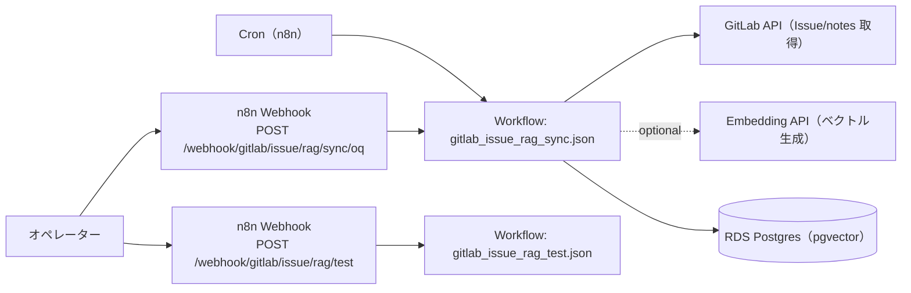

# コンピュータ化システムバリデーション（CSV）
## 最小ドキュメントセット
### GitLab Issue RAG Sync（n8n） / GAMP® 5 第2版（2022, CSA ベース, IQ/oq/PQ を含む）

---

## 1. CSV / CSA ポリシー
**目的**
`apps/README.md` の共通フォーマットに従い、リスクベース（CSA）で最小限の成果物として本 README と検証証跡を維持する。

**内容**
- 本アプリの仕様・運用・検証の入口を README に集約し、詳細は `apps/gitlab_issue_rag/docs/oq/` / `apps/gitlab_issue_rag/scripts/` を参照する。
- 秘密情報（GitLab/OpenAI/DB 等のトークン類）は tfvars に平文で置かず、SSM/Secrets Manager → n8n 環境変数注入を前提とする。

---

## 2. バリデーション計画（VP）
**目的**
対象範囲（スコープ）と検証戦略を定義する。

**内容**
- システム名: GitLab Issue RAG Sync
- 対象: GitLab の Issue + コメント（notes）を取得し、チャンク化→ embedding → RDS PostgreSQL（pgvector）へ upsert して RAG 用データソースを生成する n8n ワークフロー
- 非対象: GitLab/DB/Embedding API 自体の製品バリデーション、ネットワーク/認証基盤（Terraform/IaC 側）全般
- バリデーション成果物（最小）:
  - 本 README
  - OQ 文書: `apps/gitlab_issue_rag/docs/oq/oq.md` および `apps/gitlab_issue_rag/docs/oq/oq_*.md`（整備: `scripts/generate_oq_md.sh`）
  - OQ 実行補助: `apps/gitlab_issue_rag/scripts/run_oq.sh`

---

## 3. 意図した使用（Intended Use）とシステム概要
**目的**
GitLab 上の Issue/議論を検索可能な知識ベース（pgvector）として整備し、運用/問い合わせ対応の参照（RAG）に使える形にする。

**内容**
- Intended Use（意図した使用）
  - 複数の GitLab プロジェクトから Issue/notes を取得し、テキストをチャンク化して embedding を生成し、pgvector に upsert する。
  - dry-run/embedding skip 等で検証・運用の安全性を確保し、必要に応じて system notes の含有も制御する。
- 高レベル構成
  - n8n（Cron / Webhook）→ GitLab API →（chunk + embedding）→ PostgreSQL（pgvector）
- スケジュール（既定）
  - 2 時間ごと（cron: `0 */2 * * *`）
- Webhook（OQ / テスト）
  - n8n の Webhook ベース URL を `https://n8n.example.com/webhook` とした場合:
    - OQ: `POST /webhook/gitlab/issue/rag/sync/oq`
    - テスト: `POST /webhook/gitlab/issue/rag/test`

### 構成図（Mermaid / 現行実装）

### 接続通信表（GitLab Issue RAG Sync ⇄ ソース）
#### GitLab Issue RAG Sync → ソース名（送信/参照）
| ソース名 | 主目的 | 方式/エンドポイント例 | 認証（例） | 伝達内容（サマリ） |
|---|---|---|---|---|
| `gitlab` | Issue/notes 取得 | GitLab API（例: `GET /projects/:id/issues`、`GET /projects/:id/issues/:iid/notes`） | read-only API token | Issue/コメント本文、作成者、更新時刻、ラベル、URL など |
| `embedding_api` | ベクトル生成（任意） | Embedding API（プロバイダ依存） | API key | チャンク化テキストの embedding（ベクトル） |
| `postgres` | RAG データ格納 | PostgreSQL（pgvector） | DB 資格情報 | チャンク本文、メタデータ、embedding の upsert |

#### ソース名 → GitLab Issue RAG Sync（受信）
| ソース名 | 方式/エンドポイント例 | 認証/検証（例） | 伝達内容（サマリ） |
|---|---|---|---|
| `client` | `POST /webhook/gitlab/issue/rag/test` | なし（運用で制御） | 接続検証用のテスト入力（pgvector/環境変数の健全性確認） |
| `scheduler` | Cron（n8n 内部） | なし | 定期同期の起動トリガ |

### ディレクトリ構成
- `apps/gitlab_issue_rag/workflows/`: n8n ワークフロー（JSON）
- `apps/gitlab_issue_rag/scripts/`: n8n 同期（アップロード）・OQ 実行スクリプト
- `apps/gitlab_issue_rag/sql/`: pgvector テーブル/インデックス定義
- `apps/gitlab_issue_rag/docs/cs/`: CS（Configuration Specification: 設計・構成定義）
- `apps/gitlab_issue_rag/docs/oq/`: OQ（運用適格性確認）

### セットアップ手順（最短）
1. pgvector のテーブルを作成（初回のみ）:
   - `psql ... -f apps/gitlab_issue_rag/sql/gitlab_issue_rag.sql`
2. n8n に Postgres 資格情報を作成（ワークフローの Postgres ノードに紐付くよう設定）
3. ワークフローを n8n に同期:
   - `apps/gitlab_issue_rag/scripts/deploy_issue_rag_workflows.sh`
4. テスト webhook（`/gitlab/issue/rag/test`）が `ok` を返すことを確認

### デプロイ用（同期スクリプト）の環境変数
**必須**
- `N8N_API_KEY`（未指定なら `terraform output -raw n8n_api_key`）

**任意**
- `N8N_PUBLIC_API_BASE_URL`（未指定なら `terraform output service_urls.n8n`）
- `WORKFLOW_DIR`（既定 `apps/gitlab_issue_rag/workflows`）
- `ACTIVATE=true`（既定 false）
- `DRY_RUN=true`（既定 false）

### ワークフローの環境変数（GitLab + embeddings）
#### GitLab
- `GITLAB_API_BASE_URL`（`https://gitlab.example.com/api/v4` など）
- `N8N_GITLAB_TOKEN` または `GITLAB_TOKEN`（read-only）
- `N8N_GITLAB_WEB_BASE_URL`（既定: API base から `/api/v4` を除去）

#### 対象プロジェクト（project path）
- `N8N_GITLAB_ISSUE_RAG_GENERAL_PROJECT_PATH`
- `N8N_GITLAB_ISSUE_RAG_SERVICE_PROJECT_PATH`
- `N8N_GITLAB_ISSUE_RAG_TECH_PROJECT_PATH`

#### Issue 取得（任意）
- `N8N_GITLAB_ISSUE_RAG_STATE`（`opened`/`closed`/`all`、既定 `all`）
- `N8N_GITLAB_ISSUE_RAG_MAX_ISSUES`（既定 `1000`）
- `N8N_GITLAB_ISSUE_RAG_MAX_NOTES_PER_ISSUE`（既定 `200`）
- `N8N_GITLAB_ISSUE_RAG_INCLUDE_SYSTEM_NOTES=true`（既定 false）
- `N8N_GITLAB_ISSUE_RAG_FORCE_FULL_SYNC=true`（既定 false）
- `N8N_GITLAB_ISSUE_RAG_DRY_RUN=true`（既定 false）

#### Chunking（任意）
- `N8N_GITLAB_ISSUE_RAG_CHUNK_SIZE`（既定 `1200`）
- `N8N_GITLAB_ISSUE_RAG_CHUNK_OVERLAP`（既定 `120`）

#### Embeddings（任意）
- `N8N_EMBEDDING_API_BASE_URL`（既定 `https://api.openai.com/v1`）
- `N8N_EMBEDDING_API_KEY` または `OPENAI_API_KEY`
- `N8N_EMBEDDING_MODEL`（既定 `text-embedding-3-small`）
- `N8N_EMBEDDING_DIMENSION`（既定 `1536`）
- `N8N_EMBEDDING_SKIP=true`（embedding を完全にスキップして null vector を保存）

### ルーティング用ラベル（ドメイン判定）
各ドキュメントには `metadata.management_domain` として以下の値が入り、AI が参照領域を判断するために利用する（`metadata.management_domain_label_ja` も併記）。

- `general_management`（一般管理）
- `service_management`（サービス管理）
- `technical_management`（技術管理）

---

## 4. GxP 影響評価とリスクアセスメント
**目的**
患者安全・製品品質・データ完全性の観点で、重大なリスクのみを識別し、対策を明記する。

**内容（例: critical のみ）**
- データ完全性（誤ったプロジェクト/領域を取り込む）→ project path を領域ごとに分離し、OQ で検証
- 情報漏えい（Issue/notes の取り扱い）→ 参照トークンは read-only、保存先 DB のアクセス制御（RDS/IAM/SG）で担保
- 外部API依存（embedding 失敗・暴走）→ `*_DRY_RUN` / `N8N_EMBEDDING_SKIP`、リトライ/観測性（OQ で確認）

---

## 5. 検証戦略（Verification Strategy）
**目的**
Intended Use に適合することを、最小の検証で示す。

**内容**
- OQ を中心に、取得→整形→（任意）embedding→upsert の成立を確認する。
- 代表ケースは `apps/gitlab_issue_rag/docs/oq/oq.md` とシナリオ別 OQ 文書で定義する。

---

## 6. 設置時適格性確認（IQ）
**目的**
対象環境にワークフローが正しく設置されていることを確認する。

**文書/手順（最小）**
- 同期: `apps/gitlab_issue_rag/scripts/deploy_issue_rag_workflows.sh`（`DRY_RUN=true` で差分確認）
- 初期 DB: `apps/gitlab_issue_rag/sql/gitlab_issue_rag.sql` の適用

---

## 7. 運転時適格性確認（OQ）
**目的**
重要機能（取得/チャンク/embedding/DB upsert/差分同期/観測性）が意図どおり動作することを確認する。

**文書**
- OQ（概要）: `apps/gitlab_issue_rag/docs/oq/oq.md`
- シナリオ別: `apps/gitlab_issue_rag/docs/oq/oq_*.md`

**実行**
- `apps/gitlab_issue_rag/scripts/run_oq.sh`

補足:
- OQ 実行前に `scripts/generate_oq_md.sh --app apps/gitlab_issue_rag` を実行し、`oq.md` の生成領域を最新化する

---

## 8. 稼働性能適格性確認（PQ）
**目的**
対象データ量・スケジュール・コスト（embedding）に対する成立性を確認する。

**文書/方針（最小）**
- 本アプリ固有の PQ 文書は現状未整備（N/A）。
- 性能評価はプラットフォーム（n8n/ECS/DB/外部API）の監視・ログで代替する。

---

## 9. バリデーションサマリレポート（VSR）
**目的**
本アプリのバリデーション結論を最小で残す。

**内容（最小）**
- 実施した OQ の一覧、結果サマリ、逸脱と対処、運用開始可否の判断
- 証跡は `evidence/` 配下に日付付きで保存する（例: `evidence/oq/gitlab_issue_rag_YYYYMMDD.../`）

---

## 10. 継続的保証（運用フェーズ）
**目的**
バリデート状態を維持する。

**内容**
- 変更は Git の差分 + OQ 再実施（必要最小限）で追跡する（変更管理は `docs/change-management.md` を参照）。
- embedding モデル/次元/チャンク条件の変更は出力互換性に影響するため、OQ の再実施と必要に応じた再同期（full sync）を行う。
