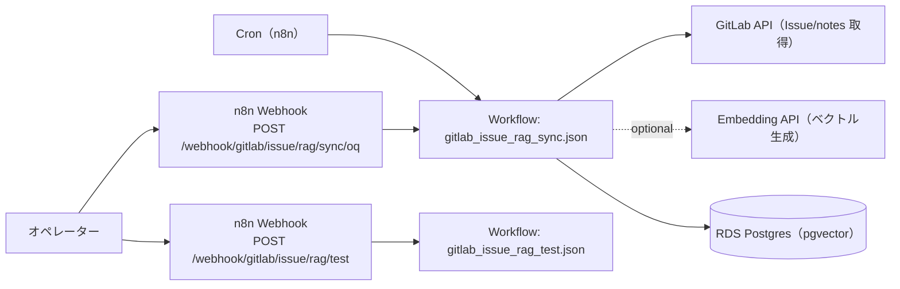

# OQ（運用適格性確認）: GitLab Issue RAG Sync

## 目的

GitLab API からの取得、embedding API 呼び出し、RDS Postgres（pgvector）への upsert までの外部接続を確認します。

## 構成図（Mermaid / 現行実装）

## シナリオ別 OQ

- シナリオ1（Issue + notes 取得/整形）: `apps/gitlab_issue_rag/docs/oq/oq_s1_fetch_format.md`
- シナリオ2（チャンク化 + embedding + pgvector upsert）: `apps/gitlab_issue_rag/docs/oq/oq_s2_chunk_embed_upsert.md`
- シナリオ3（定期実行 + updated_at 差分同期 + 強制フル同期）: `apps/gitlab_issue_rag/docs/oq/oq_s3_scheduled_diff_sync.md`
- シナリオ4（embedding スキップ/ドライラン）: `apps/gitlab_issue_rag/docs/oq/oq_s4_embedding_skip_dryrun.md`
- シナリオ5（system notes の含有切り替え）: `apps/gitlab_issue_rag/docs/oq/oq_s5_system_notes_toggle.md`
- シナリオ6（管理ドメインメタデータ付与）: `apps/gitlab_issue_rag/docs/oq/oq_s6_metadata_domain_routing.md`
- シナリオ7（テスト用 webhook で pgvector 健全性確認）: `apps/gitlab_issue_rag/docs/oq/oq_s7_webhook_test_pgvector.md`
- シナリオ8（部分失敗の可観測性 + 再実行で復旧）: `apps/gitlab_issue_rag/docs/oq/oq_s8_observability_and_retry.md`

## 接続パターン（外部アクセス）

- 入力 → n8n Webhook: `POST /webhook/gitlab/issue/rag/test`
- n8n → GitLab API: Issue/notes 取得
- n8n → Embedding API: ベクトル生成（任意）
- n8n → Postgres: pgvector へ upsert

## 前提

- n8n に次のワークフローが同期済みであること
  - `apps/gitlab_issue_rag/workflows/gitlab_issue_rag_sync.json`
  - `apps/gitlab_issue_rag/workflows/gitlab_issue_rag_test.json`
- `apps/gitlab_issue_rag/sql/gitlab_issue_rag.sql` が適用済みであること
- 環境変数（`apps/gitlab_issue_rag/README.md` 記載）が設定済みであること

## OQ ケース（接続パターン別）

| case_id | 接続パターン | 実行内容 | 期待結果 |
| --- | --- | --- | --- |
| OQ-GIR-001 | n8n → Postgres | `/webhook/gitlab/issue/rag/test` を実行 | `pgvector=true` |
| OQ-GIR-002 | n8n → GitLab API | Sync を手動実行（issue 上限を小さく） | GitLab API の `200`、upsert 成功 |
| OQ-GIR-003 | n8n → Embedding API | Embedding を有効化して実行 | `embedding` が非 null |

## 実行手順（例）

1. `POST /webhook/gitlab/issue/rag/test` を実行し、pgvector が有効であることを確認する。
2. `N8N_GITLAB_ISSUE_RAG_MAX_ISSUES=1`、`N8N_GITLAB_ISSUE_RAG_MAX_NOTES_PER_ISSUE=1` を設定し、`gitlab_issue_rag_sync` を手動実行する。
3. Embedding を検証する場合は `N8N_EMBEDDING_SKIP=false` にして再実行する。

## 証跡（evidence）

- `/webhook/gitlab/issue/rag/test` の応答 JSON
- n8n 実行ログ（GitLab/Embedding API の成功）
- `itsm_gitlab_issue_documents` のレコード（`embedding` の有無を確認）

<!-- OQ_SCENARIOS_BEGIN -->
## OQ シナリオ（詳細）

このセクションは `docs/oq/oq_*.md` から自動生成されます（更新: `scripts/generate_oq_md.sh`）。
個別シナリオを追加/修正した場合は、まず `oq_*.md` を更新し、最後に本スクリプトで `oq.md` を更新してください。

### 一覧
- [oq_s1_fetch_format.md](oq_s1_fetch_format.md)
- [oq_s2_chunk_embed_upsert.md](oq_s2_chunk_embed_upsert.md)
- [oq_s3_scheduled_diff_sync.md](oq_s3_scheduled_diff_sync.md)
- [oq_s4_embedding_skip_dryrun.md](oq_s4_embedding_skip_dryrun.md)
- [oq_s5_system_notes_toggle.md](oq_s5_system_notes_toggle.md)
- [oq_s6_metadata_domain_routing.md](oq_s6_metadata_domain_routing.md)
- [oq_s7_webhook_test_pgvector.md](oq_s7_webhook_test_pgvector.md)
- [oq_s8_observability_and_retry.md](oq_s8_observability_and_retry.md)

---

### OQ: シナリオ1（Issue + notes 取得/整形）（source: `oq_s1_fetch_format.md`）

#### 目的

一般管理/サービス管理/技術管理の複数 GitLab プロジェクトから Issue 本文 + コメント（notes）を取得し、RAG 参照用ソース文書として扱える形式（メタデータ付きテキスト）に整形できることを確認します。

#### 対象

- n8n workflow: `apps/gitlab_issue_rag/workflows/gitlab_issue_rag_sync.json`
  - Code node: `Fetch GitLab Issues`

#### 前提（最低限）

- GitLab API 設定
  - `GITLAB_API_BASE_URL`（または `GITLAB_API_BASE_URL`）
  - `N8N_GITLAB_TOKEN`（または `GITLAB_TOKEN`）
  - `N8N_GITLAB_WEB_BASE_URL`（未指定なら API base から導出）
- 対象プロジェクト
  - `N8N_GITLAB_ISSUE_RAG_GENERAL_PROJECT_PATH`
  - `N8N_GITLAB_ISSUE_RAG_SERVICE_PROJECT_PATH`
  - `N8N_GITLAB_ISSUE_RAG_TECH_PROJECT_PATH`

#### 受け入れ基準（AC）

- 3 ドメイン（general/service/technical）の project path を指定すると、それぞれの Issue を取得して処理対象にできる
- 取得した本文が 1 つのソース文書として整形され、先頭にメタ情報（management_domain 等）が含まれる
- notes は `created_at` 昇順で並び、author と本文が保持される
- `N8N_GITLAB_ISSUE_RAG_MAX_ISSUES` / `N8N_GITLAB_ISSUE_RAG_MAX_NOTES_PER_ISSUE` により上限を制御できる

#### テストケース

| case_id | 手順 | 期待結果 |
|---|---|---|
| OQ-GIR-S1-001 | 各 project path を設定し、Sync を手動実行する | project ごとに Issue が取得される |
| OQ-GIR-S1-002 | `N8N_GITLAB_ISSUE_RAG_MAX_ISSUES=1` で実行する | 対象は各 project 最大 1 issue まで |
| OQ-GIR-S1-003 | `N8N_GITLAB_ISSUE_RAG_MAX_NOTES_PER_ISSUE=1` で実行する | 各 issue の comments が最大 1 note まで |
| OQ-GIR-S1-004 | 生成された content を確認する | `---` 区切りの header と `## Description` / `## Comments` が期待通りに含まれる |

#### 証跡（evidence）

- n8n 実行ログ（Fetch GitLab Issues の出力 items）
- DB に upsert される場合は `itsm_gitlab_issue_documents.content`（header/本文の確認）

---

### OQ: シナリオ2（チャンク化 + embedding + pgvector upsert）（source: `oq_s2_chunk_embed_upsert.md`）

#### 目的

取得したテキストをチャンク化し、embedding を生成して RDS PostgreSQL（pgvector）へ upsert できることを確認します。

#### 対象

- n8n workflow: `apps/gitlab_issue_rag/workflows/gitlab_issue_rag_sync.json`
  - Code node: `Chunk Issue Content`
  - Code node: `Embed Chunks`
  - Code node: `Build Upsert Items`
  - Postgres node: `Upsert Issue Chunks`
- SQL: `apps/gitlab_issue_rag/sql/gitlab_issue_rag.sql`

#### 前提（最低限）

- Postgres（pgvector）に `apps/gitlab_issue_rag/sql/gitlab_issue_rag.sql` が適用済み
- n8n の Postgres 資格情報 `RDS Postgres` が疎通できる
- embedding を有効化する場合
  - `N8N_EMBEDDING_API_KEY`（または `OPENAI_API_KEY`）

#### 受け入れ基準（AC）

- `N8N_GITLAB_ISSUE_RAG_CHUNK_SIZE` / `N8N_GITLAB_ISSUE_RAG_CHUNK_OVERLAP` でチャンク粒度が調整できる
- embedding を有効化した場合、`embedding` が non-null で保存される
- `document_id` が安定（同じ issue/chunk なら同一 ID）で、upsert が効く
- `itsm_gitlab_issue_documents` に、content/metadata/source_updated_at が保存される

#### テストケース

| case_id | 手順 | 期待結果 |
|---|---|---|
| OQ-GIR-S2-001 | `N8N_GITLAB_ISSUE_RAG_CHUNK_SIZE=400` `N8N_GITLAB_ISSUE_RAG_CHUNK_OVERLAP=40` で実行 | 1 issue が複数行（複数 chunk）に分割される |
| OQ-GIR-S2-002 | embedding を有効化して実行（`N8N_EMBEDDING_SKIP=false`） | `embedding` が non-null で保存される |
| OQ-GIR-S2-003 | 同じ issue を再実行 | `document_id` が一致し、重複 insert ではなく更新（upsert）になる |

#### 証跡（evidence）

- DB クエリ例:
  - `SELECT document_id, chunk_index, source_url, source_updated_at, embedding IS NOT NULL AS has_embedding FROM itsm_gitlab_issue_documents ORDER BY updated_at DESC LIMIT 10;`
- n8n 実行ログ（Upsert Issue Chunks の成功）

---

### OQ: シナリオ3（定期実行 + updated_at 差分同期 + 強制フル同期）（source: `oq_s3_scheduled_diff_sync.md`）

#### 目的

既定 2 時間ごとの定期実行で同期を回し、`updated_at` ベースの差分同期で負荷/コストを抑えつつインデックス鮮度を保てることを確認します。必要に応じて強制フル同期ができることも確認します。

#### 対象

- n8n workflow: `apps/gitlab_issue_rag/workflows/gitlab_issue_rag_sync.json`
  - Cron node: `Daily Trigger`（cron: `0 */2 * * *`）
  - Code node: `Fetch GitLab Issues`（staticData に `updated_at` キャッシュ）
- 環境変数:
  - `N8N_GITLAB_ISSUE_RAG_FORCE_FULL_SYNC`

#### 受け入れ基準（AC）

- cron が `0 */2 * * *` である（既定 2 時間ごと）
- `N8N_GITLAB_ISSUE_RAG_FORCE_FULL_SYNC` が false のとき、同一 issue の `updated_at` が変化していない場合は再処理をスキップする
- `N8N_GITLAB_ISSUE_RAG_FORCE_FULL_SYNC=true` のとき、キャッシュを無視して再処理できる

#### テストケース

| case_id | 手順 | 期待結果 |
|---|---|---|
| OQ-GIR-S3-001 | workflow JSON の cron を確認する | `0 */2 * * *` である |
| OQ-GIR-S3-002 | force_full_sync=false で連続 2 回手動実行（GitLab 側で issue を更新しない） | 2 回目は同一 issue がスキップされる（ログ/処理件数が減る） |
| OQ-GIR-S3-003 | `N8N_GITLAB_ISSUE_RAG_FORCE_FULL_SYNC=true` で手動実行 | スキップされず再処理される |

#### 証跡（evidence）

- n8n 実行ログ（処理件数やスキップ判定）
- Postgres の `updated_at` 更新有無（差分同期の挙動確認）

---

### OQ: シナリオ4（embedding スキップ/ドライラン）（source: `oq_s4_embedding_skip_dryrun.md`）

#### 目的

embedding API の検証/一時停止のために、embedding を完全スキップまたはドライラン（null vector 保存）で同期できることを確認します。

#### 対象

- n8n workflow: `apps/gitlab_issue_rag/workflows/gitlab_issue_rag_sync.json`
  - Code node: `Embed Chunks`
- 環境変数:
  - `N8N_EMBEDDING_SKIP=true`
  - `N8N_GITLAB_ISSUE_RAG_DRY_RUN=true`

#### 受け入れ基準（AC）

- `N8N_EMBEDDING_SKIP=true` の場合、embedding API を呼ばずに `embedding` を null のまま upsert できる
- `N8N_GITLAB_ISSUE_RAG_DRY_RUN=true` の場合も同様に `embedding` を null のまま upsert できる
- embedding API の認証情報が未設定でも、skip/dry-run 設定時は失敗しない

#### テストケース

| case_id | 手順 | 期待結果 |
|---|---|---|
| OQ-GIR-S4-001 | `N8N_EMBEDDING_SKIP=true` で実行 | `embedding` が null のレコードが保存される |
| OQ-GIR-S4-002 | `N8N_GITLAB_ISSUE_RAG_DRY_RUN=true` で実行 | `embedding` が null のレコードが保存される |
| OQ-GIR-S4-003 | embedding API key 未設定で `N8N_EMBEDDING_SKIP=true` で実行 | ワークフローが失敗せず完走する |

#### 証跡（evidence）

- DB: `SELECT COUNT(*) FILTER (WHERE embedding IS NULL) AS null_embeddings FROM itsm_gitlab_issue_documents;`
- n8n 実行ログ（embedding API を呼んでいない/エラーが発生していない）

---

### OQ: シナリオ5（system notes の含有切り替え）（source: `oq_s5_system_notes_toggle.md`）

#### 目的

system notes を含める/含めないを運用方針で切り替え、RAG のノイズと網羅性のバランスを取れることを確認します。

#### 対象

- n8n workflow: `apps/gitlab_issue_rag/workflows/gitlab_issue_rag_sync.json`
  - Code node: `Fetch GitLab Issues`（notes のフィルタ）
- 環境変数:
  - `N8N_GITLAB_ISSUE_RAG_INCLUDE_SYSTEM_NOTES=true|false`

#### 受け入れ基準（AC）

- `N8N_GITLAB_ISSUE_RAG_INCLUDE_SYSTEM_NOTES=false`（既定）で system notes が除外される
- `N8N_GITLAB_ISSUE_RAG_INCLUDE_SYSTEM_NOTES=true` で system notes も本文に含まれる

#### テストケース

| case_id | 手順 | 期待結果 |
|---|---|---|
| OQ-GIR-S5-001 | include=false で実行 | system note 由来のコメントが content に含まれない |
| OQ-GIR-S5-002 | include=true で実行 | system note 由来のコメントが content に含まれる |

#### 証跡（evidence）

- n8n 実行ログ（Fetch GitLab Issues の出力 item.content）
- DB: `itsm_gitlab_issue_documents.content`（comments セクションの比較）

---

### OQ: シナリオ6（管理ドメインメタデータ付与）（source: `oq_s6_metadata_domain_routing.md`）

#### 目的

各ドキュメントに管理ドメイン（general/service/technical）等のメタデータを付与し、AIOps Agent 側の RAG ルーティング/権限境界で絞り込み可能にすることを確認します。

#### 対象

- n8n workflow: `apps/gitlab_issue_rag/workflows/gitlab_issue_rag_sync.json`
  - Code node: `Load GitLab Issue RAG Config`
  - Code node: `Build Upsert Items`
- DB: `itsm_gitlab_issue_documents.metadata`（jsonb）

#### 受け入れ基準（AC）

- `metadata.management_domain` が `general_management` / `service_management` / `technical_management` のいずれかで保存される
- `metadata.management_domain_label_ja` が併記される
- `metadata.project_path` / `metadata.issue_iid` / `metadata.source_url` が保存される

#### テストケース

| case_id | 手順 | 期待結果 |
|---|---|---|
| OQ-GIR-S6-001 | 3 ドメインの project path を設定して実行 | ドメイン別に metadata が保存される |
| OQ-GIR-S6-002 | DB で jsonb を参照する | `metadata->>'management_domain'` でフィルタできる |

#### 証跡（evidence）

- DB クエリ例:
  - `SELECT metadata->>'management_domain' AS domain, COUNT(*) FROM itsm_gitlab_issue_documents GROUP BY 1 ORDER BY 1;`

---

### OQ: シナリオ7（テスト用 webhook で pgvector 健全性確認）（source: `oq_s7_webhook_test_pgvector.md`）

#### 目的

テスト用 webhook（`/webhook/gitlab/issue/rag/test`）で Postgres（pgvector）接続の健全性を確認し、OQ の証跡を残せることを確認します。

#### 対象

- n8n workflow: `apps/gitlab_issue_rag/workflows/gitlab_issue_rag_test.json`
  - Webhook node: `Webhook Trigger`
  - Postgres node: `Check pgvector`

#### 受け入れ基準（AC）

- `POST /webhook/gitlab/issue/rag/test` が `{"ok":true,"pgvector":true}` を返す
- pgvector が未導入の環境では `{"ok":false,"pgvector":false,"error":"pgvector_not_installed"}` を返す

#### テストケース

| case_id | 手順 | 期待結果 |
|---|---|---|
| OQ-GIR-S7-001 | `POST /webhook/gitlab/issue/rag/test` を実行 | `pgvector=true` |

#### 証跡（evidence）

- webhook 応答 JSON（実行日時が分かる形で保存）
- n8n 実行ログ（Check pgvector の結果）

---

### OQ: シナリオ8（部分失敗の可観測性 + 再実行で復旧）（source: `oq_s8_observability_and_retry.md`）

#### 目的

GitLab API/DB/embedding API の外部接続が部分的に失敗しても、原因（不足設定やエラー）を特定できる形で失敗を可観測にし、再実行で復旧できることを確認します。

#### 対象

- n8n workflow: `apps/gitlab_issue_rag/workflows/gitlab_issue_rag_sync.json`
  - Code node: `Load GitLab Issue RAG Config`（不足設定の検知）
  - Code node: `Fetch GitLab Issues`（GitLab/notes の取得）
  - Code node: `Embed Chunks`（embedding エラーの捕捉）
  - Postgres node: `Upsert Issue Chunks`（DB 失敗の可観測性）

#### 受け入れ基準（AC）

- 不足設定（GitLab base/token/target）時に、原因が分かるエラーとして出力される
- notes 取得に失敗した場合、失敗が検知できる（ログまたは metadata にエラー情報が残る）
- embedding 呼び出しが失敗した場合、`embedding_error` が記録される（再実行で復旧可能）
- 一部プロジェクトが失敗しても、他プロジェクトの同期は継続できる（可能な範囲で）

#### テストケース

| case_id | 手順 | 期待結果 |
|---|---|---|
| OQ-GIR-S8-001 | `N8N_GITLAB_TOKEN` を空にして実行 | `missing_gitlab_config` が出力される |
| OQ-GIR-S8-002 | embedding API key を誤値にして実行 | `embedding_error` が残り、レコードは upsert される（embedding は null） |
| OQ-GIR-S8-003 | 後から設定を正して再実行 | `embedding_error` が解消し、embedding が保存される |

#### 証跡（evidence）

- n8n 実行ログ（エラーの箇所と原因）
- DB: `metadata` 内のエラーフィールド（設計により）や、embedding の null/non-null の遷移

---
<!-- OQ_SCENARIOS_END -->
