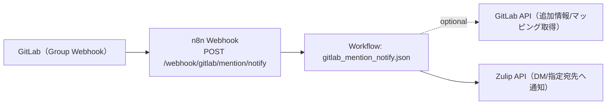

# コンピュータ化システムバリデーション（CSV）
## 最小ドキュメントセット
### GitLab Mention Notify（n8n） / GAMP® 5 第2版（2022, CSA ベース, IQ/OQ/PQ を含む）

---

## 1. CSV / CSA ポリシー
**目的**
`apps/README.md` の共通フォーマットに従い、リスクベース（CSA）で最小限の成果物として本 README と検証証跡を維持する。

**内容**
- 本 README を「運用/検証の入口」とし、詳細は `apps/gitlab_mention_notify/docs/` 配下（CS/OQ/PQ）へ分離する。
- 秘密情報は tfvars に平文で置かず、SSM/Secrets Manager → n8n 環境変数注入を前提とする。

---

## 2. バリデーション計画（VP）
**目的**
対象範囲（スコープ）と検証戦略を定義する。

**内容**
- システム名: GitLab Mention Notify
- 対象: GitLab Webhook（Push/Issue/Note/Wiki 等）を受信し、本文中の `@mention` を検出して Zulip DM（または指定宛先）へ通知する n8n ワークフロー
- 非対象: GitLab/Zulip 自体の製品バリデーション、ネットワーク/認証基盤（Terraform/IaC 側）全般
- バリデーション成果物（最小）:
  - 本 README（CSV 最小ドキュメントセット）
  - CS: `apps/gitlab_mention_notify/docs/cs/`
  - OQ: `apps/gitlab_mention_notify/docs/oq/oq.md` および `apps/gitlab_mention_notify/docs/oq/oq_*.md`（整備: `scripts/generate_oq_md.sh`）
  - PQ: `apps/gitlab_mention_notify/docs/pq/pq.md`
  - OQ 実行補助: `apps/gitlab_mention_notify/scripts/run_oq.sh`

---

## 3. 意図した使用（Intended Use）とシステム概要
**目的**
GitLab 上の議論（Issue/コメント/Push/Wiki 等）で発生した `@mention` を拾い、担当者への到達性（DM 等）を高めて対応遅延を抑制する。

**内容**
- Intended Use（意図した使用）
  - GitLab Webhook のイベント本文を受け取り、本文中の `@mention` を抽出して通知する。
  - （任意）GitLab API を参照し、差分/本文などの補足情報を取得して通知に添付する。
  - 例外（除外語、未マップユーザー等）はルール化し、誤検知/過通知を抑制する。
- 高レベル構成
  - GitLab（Group Webhook）→ n8n Webhook →（解析/補足取得）→ Zulip API（DM/指定宛先）
- 対象イベント（Webhook）
  - Push event（Markdown 変更の検知）
  - Wiki page event（Wiki 作成/更新/削除）
  - Issue event（Issue 本文更新）
  - Note event（Issue コメント等の本文更新）
- Webhook エンドポイント
  - n8n の Webhook ベース URL を `https://n8n.example.com/webhook` とした場合:
    - メイン: `POST /webhook/gitlab/mention/notify`

### 構成図（Mermaid / 現行実装）

### 接続通信表（GitLab Mention Notify ⇄ ソース）
#### GitLab Mention Notify → ソース名（送信/参照）
| ソース名 | 主目的 | 方式/エンドポイント例 | 認証（例） | 伝達内容（サマリ） |
|---|---|---|---|---|
| `zulip` | 通知投稿（DM/指定宛先） | Zulip API（例: `POST /api/v1/messages`） | Bot のメール+APIキー | @mention 検出結果、元イベント要約、該当行/リンク、関連メタデータ |
| `gitlab` | 追加情報取得（任意） | GitLab API（ファイル/差分/本文取得等） | read-only API token | push/issue/note などの補足情報（本文/差分/ファイル） |

#### ソース名 → GitLab Mention Notify（受信）
| ソース名 | 方式/エンドポイント例 | 認証/検証（例） | 伝達内容（サマリ） |
|---|---|---|---|
| `gitlab` | `POST /webhook/gitlab/mention/notify` | `GITLAB_WEBHOOK_SECRET`（`x-gitlab-token`） | GitLab Webhook（Push/Issue/Note/Wiki 等）のイベント本文 |

### ディレクトリ構成
- `apps/gitlab_mention_notify/workflows/`: n8n ワークフロー（JSON）
- `apps/gitlab_mention_notify/scripts/`: n8n 同期・GitLab group webhook 登録の補助スクリプト
- `apps/gitlab_mention_notify/data/`: サンプル（除外語、ユーザーマッピング JSON 等）
- `apps/gitlab_mention_notify/docs/cs/`: CS（Configuration Specification: 設計・構成定義）
- `apps/gitlab_mention_notify/docs/oq/`: OQ（運用適格性確認）
- `apps/gitlab_mention_notify/docs/pq/`: PQ（性能適格性確認）

### セットアップ手順（最短）
1. ワークフローを n8n に同期: `apps/gitlab_mention_notify/scripts/deploy_workflows.sh`
2. GitLab 側 webhook を登録（自動化・任意）: `apps/gitlab_mention_notify/scripts/setup_gitlab_group_webhook.sh`
3. GitLab 側 webhook の送信先 URL が `.../webhook/gitlab/mention/notify` になっていることを確認
4. n8n 側にワークフロー用環境変数（Zulip/GitLab/Secret/マッピング）を設定

### 環境変数（ワークフロー実行時）
#### 必須
- `GITLAB_WEBHOOK_SECRET`: GitLab webhook の Secret Token（未設定の場合は `424` で fail-fast）
- `ZULIP_BASE_URL`
- `ZULIP_BOT_EMAIL`
- `ZULIP_BOT_API_KEY`

#### 任意
- `GITLAB_API_BASE_URL`: 例 `https://gitlab.example.com/api/v4`
- `GITLAB_TOKEN`: GitLab API トークン（read-only）
- `GITLAB_REF`: ファイル取得時の既定 ref（既定 `main`）
- `GITLAB_MENTION_MAPPING_PATH`: GitLab 内のマッピング MD（既定 `docs/mention_user_mapping.md`）
- `GITLAB_MENTION_EXCLUDE_WORDS`: 除外語（既定 `all,group,here,channel,everyone`）
- `GITLAB_MAX_FILES`: Push イベント時の取得ファイル上限（既定 `5`）
- `GITLAB_MENTION_NOTIFY_DRY_RUN=true`: Zulip 送信をスキップし、受信/整形だけ確認
- `ZULIP_USER_MAP_JSON`: マッピングの上書き（例 `{\"gitlab_user\":{\"zulip_user_id\":123}}`）

### GitLab webhook 登録（自動化）
`apps/gitlab_mention_notify/scripts/setup_gitlab_group_webhook.sh` は Terraform の出力を参照して、複数レルムの group webhook を作成/更新する。

### マッピングの正（SSoT）
GitLab の「サービス管理」プロジェクト内 `docs/mention_user_mapping.md` を正とする（テンプレート: `scripts/itsm/gitlab/templates/service-management/docs/mention_user_mapping.md.tpl`）。

---

## 4. GxP 影響評価とリスクアセスメント
**目的**
患者安全・製品品質・データ完全性の観点で、重大なリスクのみを識別し、対策を明記する。

**内容（critical のみ）**
- なりすまし/改ざん（Webhook への不正送信）→ `GITLAB_WEBHOOK_SECRET` 検証（不一致は拒否）、未設定は fail-fast
- 誤検知/過通知（誤った mention 検出/宛先解決）→ 除外語/マッピング/上限制御、`GITLAB_MENTION_NOTIFY_DRY_RUN` による事前確認
- 情報漏えい（本文に秘匿情報が含まれる）→ GitLab からの取得範囲最小化、通知本文の最小化、秘密情報は環境変数/SSM 管理

---

## 5. 検証戦略（Verification Strategy）
**目的**
Intended Use に適合することを、最小の検証で示す。

**内容**
- OQ を中心に、Webhook 検証（secret）/ mention 抽出 / Zulip 通知 /（任意）GitLab API 参照の成立を確認する。
- 代表ケースは `apps/gitlab_mention_notify/docs/oq/oq.md` と個別 OQ 文書で定義する。
- 性能面は PQ（`apps/gitlab_mention_notify/docs/pq/pq.md`）の最小手順で補う。

---

## 6. 設置時適格性確認（IQ）
**目的**
対象環境にワークフローが正しく設置されていることを確認する。

**文書/手順（最小）**
- 同期: `apps/gitlab_mention_notify/scripts/deploy_workflows.sh`（`DRY_RUN=true` で差分確認）
- （任意）GitLab webhook セットアップ: `apps/gitlab_mention_notify/scripts/setup_gitlab_group_webhook.sh`

---

## 7. 運転時適格性確認（OQ）
**目的**
重要機能（Webhook 検証、mention 抽出、通知整形、Zulip 投稿）が意図どおり動作することを確認する。

**文書**
- `apps/gitlab_mention_notify/docs/oq/oq.md`（`oq_*.md` から生成）
- 個別シナリオ: `apps/gitlab_mention_notify/docs/oq/oq_*.md`

**実行**
- `apps/gitlab_mention_notify/scripts/run_oq.sh`

補足:
- OQ 実行前に `scripts/generate_oq_md.sh --app apps/gitlab_mention_notify` を実行し、`oq.md` の生成領域を最新化する

---

## 8. 稼働性能適格性確認（PQ）
**目的**
イベント量の増加や外部 API 制約に対して、通知が滞留せず運用上成立することを確認する。

**文書/手順（最小）**
- `apps/gitlab_mention_notify/docs/pq/pq.md`

---

## 9. バリデーションサマリレポート（VSR）
**目的**
本アプリのバリデーション結論を最小で残す。

**内容（最小）**
- 実施した OQ/PQ の一覧、結果サマリ、逸脱と対処、運用開始可否の判断
- 証跡は `evidence/` 配下に日付付きで保存する（例: `evidence/oq/gitlab_mention_notify_YYYYMMDD.../`）

---

## 10. 継続的保証（運用フェーズ）
**目的**
バリデート状態を維持する。

**内容**
- 変更は Git の差分 + OQ/PQ 再実施（必要最小限）で追跡する（変更管理は `docs/change-management.md` を参照）。
- マッピング/除外語の変更は誤検知に直結するため、`*_DRY_RUN` を用いた事前確認と OQ の再実施を行う。
