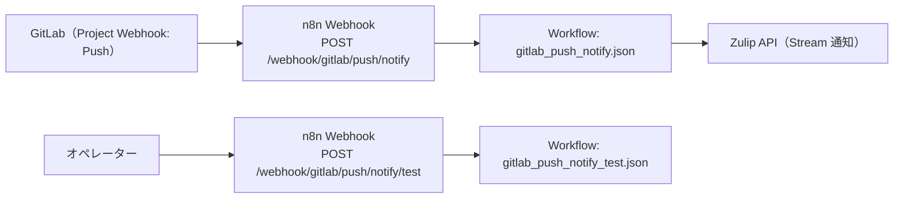

# コンピュータ化システムバリデーション（CSV）
## 最小ドキュメントセット
### GitLab Push Notify（n8n） / GAMP® 5 第2版（2022, CSA ベース, IQ/oq/PQ を含む）

---

## 1. CSV / CSA ポリシー
**目的**
`apps/README.md` の共通フォーマットに従い、リスクベース（CSA）で最小限の成果物として本 README と検証証跡を維持する。

**内容**
- 本アプリの仕様・運用・検証の入口を README に集約し、詳細は `apps/gitlab_push_notify/docs/oq/` / `apps/gitlab_push_notify/scripts/` を参照する。
- 秘密情報は tfvars に平文で置かず、SSM/Secrets Manager → n8n 環境変数注入を前提とする。

---

## 2. バリデーション計画（VP）
**目的**
対象範囲（スコープ）と検証戦略を定義する。

**内容**
- システム名: GitLab Push Notify
- 対象: GitLab Project Webhook（Push）を受信し、Zulip へ要約通知する n8n ワークフロー
- 非対象: GitLab/Zulip 自体の製品バリデーション、ネットワーク/認証基盤（Terraform/IaC 側）全般
- バリデーション成果物（最小）:
  - 本 README
  - OQ 文書: `apps/gitlab_push_notify/docs/oq/oq.md` および `apps/gitlab_push_notify/docs/oq/oq_*.md`（整備: `scripts/generate_oq_md.sh`）
  - OQ 実行補助: `apps/gitlab_push_notify/scripts/run_oq.sh`

---

## 3. 意図した使用（Intended Use）とシステム概要
**目的**
GitLab の Push イベントを ITSM/開発運用の通知として取り込み、関係者が「何が起きたか」を迅速に共有できるようにする。

**内容**
- Intended Use（意図した使用）
  - GitLab の Push イベントを受け取り、必要な情報（project/branch/user/commit 抜粋、compare URL 等）に整形し、Zulip のストリームへ通知する。
  - 通知先やフィルタは環境変数で制御し、誤通知リスクを低減する（対象プロジェクト限定、dry-run 等）。
- 高レベル構成
  - GitLab（Project Webhook）→ n8n Webhook →（整形）→ Zulip API
- Webhook
  - n8n の Webhook ベース URL を `https://n8n.example.com/webhook` とした場合:
    - メイン: `POST /webhook/gitlab/push/notify`
    - テスト: `POST /webhook/gitlab/push/notify/test`
      - `apps/gitlab_push_notify/scripts/deploy_workflows.sh` が、同期後に（`TEST_WEBHOOK=true` の場合）呼び出す

### 構成図（Mermaid / 現行実装）

### 接続通信表（GitLab Push Notify ⇄ ソース）
#### GitLab Push Notify → ソース名（送信/参照）
| ソース名 | 主目的 | 方式/エンドポイント例 | 認証（例） | 伝達内容（サマリ） |
|---|---|---|---|---|
| `zulip` | Push 要約の通知投稿 | Zulip API（例: `POST /api/v1/messages`） | Bot のメール+APIキー | push の要約（project/branch/user/commit抜粋、compare URL 等） |

#### ソース名 → GitLab Push Notify（受信）
| ソース名 | 方式/エンドポイント例 | 認証/検証（例） | 伝達内容（サマリ） |
|---|---|---|---|
| `gitlab` | `POST /webhook/gitlab/push/notify` | `GITLAB_WEBHOOK_SECRET`（`x-gitlab-token`） | GitLab Push webhook ペイロード（project/ref/commits/compare 等） |
| `client` | `POST /webhook/gitlab/push/notify/test` | なし（運用で制御） | 接続検証用のテスト入力（必須 env の健全性確認） |

### ディレクトリ構成
- `apps/gitlab_push_notify/workflows/`: n8n ワークフロー（JSON）
- `apps/gitlab_push_notify/scripts/`: n8n 同期・GitLab webhook 登録の補助スクリプト
- `apps/gitlab_push_notify/docs/cs/`: CS（Configuration Specification: 設計・構成定義）
- `apps/gitlab_push_notify/docs/oq/`: OQ（運用適格性確認）

### セットアップ手順（最短）
0. レルム用の GitLab グループ/プロジェクトを準備: `scripts/itsm/gitlab/itsm_bootstrap_realms.sh`
1. ワークフローを n8n に同期: `apps/gitlab_push_notify/scripts/deploy_workflows.sh`
2. GitLab のプロジェクト webhook を登録（自動化）: `apps/gitlab_push_notify/scripts/setup_gitlab_project_webhook.sh`
3. GitLab 側 webhook の送信先 URL が `.../webhook/gitlab/push/notify` になっていることを確認
4. n8n 側にワークフロー用環境変数（Zulip/GitLab フィルタ/Secret）を設定

### 必須の環境変数（ワークフロー実行時）
- `GITLAB_WEBHOOK_SECRET`: GitLab webhook の Secret Token（未設定の場合は `424` で fail-fast）
- `ZULIP_BASE_URL`: Zulip のレルム別 URL（例: `https://tenant-a.zulip.example.com`）
- `ZULIP_BOT_EMAIL`
- `ZULIP_BOT_API_KEY`
- `GITLAB_PROJECT_ID` または `GITLAB_PROJECT_PATH`: 対象プロジェクトのフィルタ（意図しない通知の防止）

### 任意の環境変数（ワークフロー実行時）
- `ZULIP_STREAM`: 通知先ストリーム（既定 `itsm-oncall`）
- `ZULIP_TOPIC`: トピック固定（未指定なら project path 等）
- `GITLAB_PUSH_MAX_COMMITS`: 本文に列挙するコミット数上限（既定 `5`）
- `GITLAB_PUSH_NOTIFY_DRY_RUN=true`: Zulip 送信をスキップし整形結果だけ確認（入力に `dry_run=true` でも可）

### デプロイ用（同期スクリプト）の環境変数
- `N8N_API_KEY`（未指定なら `terraform output -raw n8n_api_key`）
- `N8N_PUBLIC_API_BASE_URL`（未指定なら `terraform output service_urls.n8n`）
- `ACTIVATE=true`: 同期後にワークフローを有効化
- `DRY_RUN=true`: 作成/更新を行わず計画だけ表示
- `TEST_WEBHOOK=true`: 同期後にテスト webhook を実行（既定 true）
- `TEST_WEBHOOK_ENV_OVERRIDES_FROM_TERRAFORM=true`: 自己テストの webhook 実行時に、Zulip 接続情報を terraform output/SSM から解決して `x-aiops-env-*` ヘッダで一時注入（既定 false）
  - 注意: `x-aiops-env-zulip-bot-api-key` に秘密値が載る可能性があるため、必要に応じて無効化する（既定は無効）
- `TEST_WEBHOOK_ALLOW_TF_OUTPUT_SECRETS=true`: SSM 参照ができない場合に、`terraform output -raw N8N_ZULIP_BOT_TOKEN`/`zulip_mess_bot_tokens_yaml` の YAML マップへフォールバック（既定 false）

### GitLab webhook 登録用（自動化）の環境変数
- `GITLAB_TOKEN`: hook を作成/更新できるトークン（未指定なら `terraform output -raw gitlab_admin_token`）
- `GITLAB_PROJECT_ID` または `GITLAB_PROJECT_PATH`（`{realm}` 置換対応）
- `GITLAB_WEBHOOK_SECRET`: webhook secret（未指定なら `terraform output -raw gitlab_webhook_secrets_yaml` から解決）
- `GITLAB_API_BASE_URL`: 例 `https://gitlab.example.com/api/v4`（未指定なら `terraform output service_urls.gitlab` から導出）
- `N8N_PUBLIC_API_BASE_URL`: n8n の公開 URL（未指定なら `terraform output n8n_realm_urls[realm]` など）
- `N8N_WEBHOOK_PATH`: 送信先パス（既定 `gitlab/push/notify`）
- `REALMS`: 対象レルム（未指定なら `terraform output realms`）
- `DRY_RUN=true`: 変更を行わず計画だけ表示

---

## 4. GxP 影響評価とリスクアセスメント
**目的**
患者安全・製品品質・データ完全性の観点で、重大なリスクのみを識別し、対策を明記する。

**内容（例: critical のみ）**
- 誤通知/誤配信（誤ったプロジェクトから通知・別ストリームへ送信）→ `GITLAB_PROJECT_*` フィルタ、通知先固定、dry-run
- なりすまし/改ざん（Webhook への不正送信）→ `GITLAB_WEBHOOK_SECRET` による検証、fail-fast
- 情報漏えい（本文に秘匿情報が含まれる）→ 通知本文の最小化、秘密情報は環境変数/SSM 管理

---

## 5. 検証戦略（Verification Strategy）
**目的**
Intended Use に適合することを、最小の検証で示す。

**内容**
- OQ を中心に実施し、Webhook 受信→整形→Zulip 通知の成立を確認する。
- 代表ケースは `apps/gitlab_push_notify/docs/oq/oq.md` と個別 OQ 文書で定義する。

---

## 6. 設置時適格性確認（IQ）
**目的**
対象環境にワークフローが正しく設置されていることを確認する。

**文書/手順（最小）**
- 同期: `apps/gitlab_push_notify/scripts/deploy_workflows.sh`（`DRY_RUN=true` で差分確認）
- （任意）GitLab webhook セットアップ: `apps/gitlab_push_notify/scripts/setup_gitlab_project_webhook.sh`

---

## 7. 運転時適格性確認（OQ）
**目的**
重要機能（Webhook 検証、通知整形、Zulip 投稿）が意図どおり動作することを確認する。

**文書**
- `apps/gitlab_push_notify/docs/oq/oq.md`（`oq_*.md` から生成）
- 個別シナリオ: `apps/gitlab_push_notify/docs/oq/oq_*.md`

**実行**
- `apps/gitlab_push_notify/scripts/run_oq.sh`

補足:
- OQ 実行前に `scripts/generate_oq_md.sh --app apps/gitlab_push_notify` を実行し、`oq.md` の生成領域を最新化する

---

## 8. 稼働性能適格性確認（PQ）
**目的**
運用負荷・イベント量に対する成立性を確認する。

**文書/方針（最小）**
- 本アプリ固有の PQ 文書は現状未整備（N/A）。
- 性能評価はプラットフォーム（n8n/ECS/外部API）の監視・ログで代替する。

---

## 9. バリデーションサマリレポート（VSR）
**目的**
本アプリのバリデーション結論を最小で残す。

**内容（最小）**
- 実施した OQ の一覧、結果サマリ、逸脱と対処、運用開始可否の判断
- 証跡は `evidence/` 配下に日付付きで保存する（例: `evidence/oq/gitlab_push_notify_YYYYMMDD.../`）

---

## 10. 継続的保証（運用フェーズ）
**目的**
バリデート状態を維持する。

**内容**
- 変更は Git の差分 + OQ 再実施（必要最小限）で追跡する（変更管理は `docs/change-management.md` を参照）。
- 秘密情報のローテーション時は、OQ（テスト webhook / 実運用 webhook）の再確認を行う。
