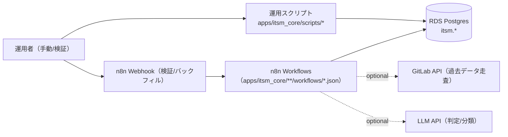

# コンピュータ化システムバリデーション（CSV）
## 最小ドキュメントセット
### ITSM Core（SoR: System of Record） / GAMP® 5 第2版（2022, CSA ベース, IQ/OQ/PQ を含む）

---

## 1. CSV / CSA ポリシー
**目的**
`apps/README.md` の共通フォーマットに従い、リスクベース（CSA）で最小限の成果物として本 README と検証証跡を維持する。

**内容**
- ITSM の “正（SoR）” を PostgreSQL（共有 RDS）上の `itsm.*` スキーマとして提供し、関連する運用スクリプト（DDL 適用、RLS、保持/削除、匿名化、監査アンカー、バックフィル等）を集約する。
- SoR の仕様・運用・検証の入口を本 README に集約し、詳細は `apps/itsm_core/docs/`（Requirements/DQ/IQ/OQ/PQ）を参照する。
- 秘密情報（DB 資格情報、API キー等）は tfvars に平文で置かず、SSM/Secrets Manager → 環境変数注入を前提とする。

---

## 2. バリデーション計画（VP）
**目的**
対象範囲（スコープ）と検証戦略を定義する。

**内容**
- システム名: ITSM Core（SoR）
- 対象:
  - DB（RDS Postgres）の `itsm.*` スキーマ（SoR）
  - SoR を運用するためのスクリプト群（DDL/RLS/保持/削除/匿名化/監査アンカー/バックフィル等）
  - SoR へ投入する n8n ワークフロー群（バックフィル/検証/スモークテスト）
- 非対象:
  - PostgreSQL/RDS 自体の製品バリデーション
  - GitLab/Zulip/LLM API 等の外部サービス自体の製品バリデーション
  - ネットワーク/認証基盤（Terraform/IaC 側）全般
- バリデーション成果物（最小）:
  - 本 README
  - Requirements: `apps/itsm_core/docs/app_requirements.md`
  - CS（AIS）: `apps/itsm_core/docs/cs/ai_behavior_spec.md`
  - DQ/IQ/OQ/PQ:
    - `apps/itsm_core/docs/dq/dq.md`
    - `apps/itsm_core/docs/iq/iq.md`
    - `apps/itsm_core/docs/oq/oq.md`
    - `apps/itsm_core/docs/pq/pq.md`

---

## 3. 意図した使用（Intended Use）とシステム概要
**目的**
ITSM の監査・決定・承認を「正（SoR）」へ集約し、横断検索・追跡・保持/削除・改ざん耐性（監査要件）を成立させる。

**内容**
- SoR を `itsm.*` スキーマとして提供し、他アプリの記録先として利用できる状態にする。
- 運用スクリプトにより、DDL 適用、RLS、保持/削除、匿名化、監査アンカー、バックフィルを安全に実行できるようにする。
- n8n ワークフローにより、GitLab の過去データ（Issue/決定）を SoR に投入し、最小の検証（スモークテスト/テスト投入）で成立性を確認できるようにする。

### 構成図（Mermaid / 現行実装）



### ディレクトリ構成
- `apps/itsm_core/sql/`: SoR スキーマ（正）/RLS
- `apps/itsm_core/scripts/`: DDL/RLS/保持/削除/匿名化/監査アンカー/検証の補助
- `apps/itsm_core/workflows/`: SoR コアの n8n ワークフロー群（スモークテスト等）
- `apps/itsm_core/docs/`: Requirements、DQ/IQ/OQ/PQ、AIS
- `apps/itsm_core/integrations/`: ITSM 運用の周辺連携（n8n ワークフロー + OQ/CS/PQ 等）を統合したアプリ群
  - `aiops_approval_history_backfill_to_sor`
  - `cloudwatch_event_notify`
  - `gitlab_backfill_to_sor`
  - `gitlab_issue_metrics_sync`
  - `gitlab_issue_rag`
  - `gitlab_mention_notify`
  - `gitlab_push_notify`
  - `zulip_backfill_to_sor`
  - `zulip_gitlab_issue_sync`
  - `zulip_stream_sync`

---

## 主要ファイル（SSoT）

- スキーマ（正）: `apps/itsm_core/sql/itsm_sor_core.sql`
- RLS: `apps/itsm_core/sql/itsm_sor_rls.sql`
- RLS FORCE（強化）: `apps/itsm_core/sql/itsm_sor_rls_force.sql`
- RLS 運用補助: `itsm.set_rls_context(...)`（`apps/itsm_core/sql/itsm_sor_core.sql` 内。n8n/autocommit の “SQL 文内で app.* をセット” を想定）
- AIOpsAgent SoR 書き込み（SoR 直SQLの置き換え）: `itsm.aiops_*`（`apps/itsm_core/sql/itsm_sor_core.sql`）

---

## 運用スクリプト（主要）

- DDL 適用: `apps/itsm_core/scripts/import_itsm_sor_core_schema.sh`
- スキーマ依存チェック: `apps/itsm_core/scripts/check_itsm_sor_schema.sh`
- RLS コンテキスト既定値: `apps/itsm_core/scripts/configure_itsm_sor_rls_context.sh`
- 保持/削除: `apps/itsm_core/scripts/apply_itsm_sor_retention.sh`
- PII 疑似化: `apps/itsm_core/scripts/anonymize_itsm_principal.sh`
- 監査アンカー（S3）: `apps/itsm_core/scripts/anchor_itsm_audit_event_hash.sh`
- GitLab backfill 起動（n8n Webhook 呼び出し）: `apps/itsm_core/integrations/gitlab_backfill_to_sor/scripts/backfill_gitlab_issues_to_sor.sh`, `apps/itsm_core/integrations/gitlab_backfill_to_sor/scripts/backfill_gitlab_decisions_to_sor.sh`
- Zulip backfill（GitLab を経由しない）: `apps/itsm_core/integrations/zulip_backfill_to_sor/scripts/backfill_zulip_decisions_to_sor.sh`
- AIOps 承認履歴 backfill: `apps/itsm_core/integrations/aiops_approval_history_backfill_to_sor/scripts/backfill_itsm_sor_from_aiops_approval_history.sh`

---

## n8n ワークフロー（代表）

- SoR への書き込みスモークテスト: `apps/itsm_core/workflows/itsm_sor_audit_event_test.json`（Webhook: `POST /webhook/itsm/sor/audit_event/test`）
- AIOps SoR 書き込み（互換 Webhook / 任意）: `apps/itsm_core/workflows/itsm_sor_aiops_*.json`（例: `POST /webhook/itsm/sor/aiops/auto_enqueue`）
- AIOps SoR 書き込み（スモークテスト）: `apps/itsm_core/workflows/itsm_sor_aiops_write_test.json`（Webhook: `POST /webhook/itsm/sor/aiops/write/test`）
- GitLab Issue → SoR レコード backfill（全件走査）: `apps/itsm_core/integrations/gitlab_backfill_to_sor/workflows/gitlab_issue_backfill_to_sor.json`（Webhook: `POST /webhook/gitlab/issue/backfill/sor`）
- GitLab Issue → SoR レコード backfill（テスト投入）: `apps/itsm_core/integrations/gitlab_backfill_to_sor/workflows/gitlab_issue_backfill_to_sor_test.json`（Webhook: `POST /webhook/gitlab/issue/backfill/sor/test`）
- GitLab 決定 backfill（全件走査・LLM 判定）: `apps/itsm_core/integrations/gitlab_backfill_to_sor/workflows/gitlab_decision_backfill_to_sor.json`（Webhook: `POST /webhook/gitlab/decision/backfill/sor`）
- GitLab 決定 backfill（テスト投入）: `apps/itsm_core/integrations/gitlab_backfill_to_sor/workflows/gitlab_decision_backfill_to_sor_test.json`（Webhook: `POST /webhook/gitlab/decision/backfill/sor/test`）

同期（n8n Public API へ upsert）:
```bash
apps/itsm_core/scripts/deploy_workflows.sh
```

環境変数（任意）:
- `ITSM_SOR_WEBHOOK_TOKEN`: SoR 書き込み系 Webhook を簡易保護するための Bearer トークン（未設定なら検証なし）

GitLab backfill workflows の同期:
```bash
apps/itsm_core/integrations/gitlab_backfill_to_sor/scripts/deploy_workflows.sh
```

---

## 4. GxP 影響評価とリスクアセスメント
**目的**
患者安全・製品品質・データ完全性の観点で、重大なリスクのみを識別し、対策を明記する。

**内容（critical のみ）**
- データ完全性（改ざん/欠落/重複）→ append-only 監査イベント、冪等キー、監査アンカー（S3）で低減
- テナント混在（realm 越境）→ RLS/コンテキスト（`app.*`）運用、スクリプトで既定値を投入
- 個人情報（PII）取り扱い → 匿名化（疑似化）スクリプト、保持ポリシーで低減

---

## 5. 検証戦略（Verification Strategy）
**目的**
Intended Use に適合することを、最小の検証で示す。

**内容**
- IQ: DDL 適用 + 依存チェック +（任意）ワークフロー同期が成立すること
- OQ: SoR への書き込み（スモークテスト）と、代表的なバックフィル投入（テスト）で DB 書き込みが成立すること
- PQ: 実運用データ量/頻度に対する成立性（最小）

---

## 6. 設置時適格性確認（IQ）
**目的**
対象環境に SoR が正しく設置されていることを確認する。

**文書**
- `apps/itsm_core/docs/iq/iq.md`

---

## 7. 運転時適格性確認（OQ）
**目的**
重要機能（SoR 書き込み、バックフィル投入、ワークフロー同期、冪等性）が意図どおり動作することを確認する。

**文書**
- `apps/itsm_core/docs/oq/oq.md`（`oq_*.md` から生成）
- 個別シナリオ: `apps/itsm_core/docs/oq/oq_*.md`

**実行**
- OQ 実行補助: `apps/itsm_core/scripts/run_oq.sh`

補足:
- OQ 文書を更新した場合は `scripts/generate_oq_md.sh --app apps/itsm_core` で `oq.md` を更新する。

---

## 8. 稼働性能適格性確認（PQ）
**目的**
データ量・実行頻度・外部 API 制約（GitLab/LLM）に対する成立性を確認する。

**文書**
- `apps/itsm_core/docs/pq/pq.md`

---

## 9. バリデーションサマリレポート（VSR）
**目的**
本アプリのバリデーション結論を最小で残す。

**内容（最小）**
- 実施した IQ/OQ/PQ の一覧、結果サマリ、逸脱と対処、運用開始可否の判断
- 証跡は `evidence/` 配下に日付付きで保存する（例: `evidence/oq/itsm_core_YYYYMMDD.../`）

---

## 10. 継続的保証（運用フェーズ）
**目的**
バリデート状態を維持する。

**内容**
- 変更は Git の差分 + OQ 再実施（必要最小限）で追跡する（変更管理は `docs/change-management.md` を参照）。
- DDL/RLS/保持/削除/匿名化/監査アンカー/バックフィルの変更は SoR の監査性に直結するため、影響範囲に応じて IQ/OQ/PQ を再実施する。
