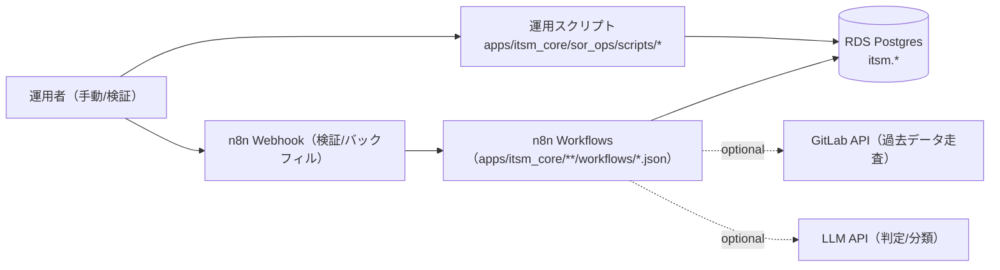

# コンピュータ化システムバリデーション（CSV）
## 最小ドキュメントセット
### ITSM Core（SoR: System of Record） / GAMP® 5 第2版（2022, CSA ベース, IQ/OQ/PQ を含む）

---

## 1. CSV / CSA ポリシー
**目的**
`apps/README.md` の共通フォーマットに従い、リスクベース（CSA）で最小限の成果物として本 README と検証証跡を維持する。

**内容**
- ITSM の “正（SoR）” を PostgreSQL（共有 RDS）上の `itsm.*` スキーマとして提供し、関連する運用スクリプト（DDL 適用、RLS、保持/削除、匿名化、監査アンカー、バックフィル等）を集約する。
- SoR の仕様・運用・検証の入口を本 README に集約し、詳細は `apps/itsm_core/docs/`（Requirements/DQ/IQ/OQ/PQ）を参照する。
- 秘密情報（DB 資格情報、API キー等）は tfvars に平文で置かず、SSM/Secrets Manager → 環境変数注入を前提とする。

---

## 2. バリデーション計画（VP）
**目的**
対象範囲（スコープ）と検証戦略を定義する。

**内容**
- システム名: ITSM Core（SoR）
- 対象:
  - DB（RDS Postgres）の `itsm.*` スキーマ（SoR）
  - SoR を運用するためのスクリプト群（DDL/RLS/保持/削除/匿名化/監査アンカー/バックフィル等）
  - SoR へ投入する n8n ワークフロー群（バックフィル/検証/スモークテスト）
- 非対象:
  - PostgreSQL/RDS 自体の製品バリデーション
  - GitLab/Zulip/LLM API 等の外部サービス自体の製品バリデーション
  - ネットワーク/認証基盤（Terraform/IaC 側）全般
- バリデーション成果物（最小）:
  - 本 README
  - Requirements: `apps/itsm_core/docs/app_requirements.md`
  - CS（AIS）: `apps/itsm_core/docs/cs/ai_behavior_spec.md`
- DQ/IQ/OQ/PQ:
  - `apps/itsm_core/docs/dq/dq.md`
  - `apps/itsm_core/docs/iq/iq.md`
  - `apps/itsm_core/docs/oq/oq.md`
  - `apps/itsm_core/docs/pq/pq.md`

---

## 3. 意図した使用（Intended Use）とシステム概要
**目的**
ITSM の監査・決定・承認を「正（SoR）」へ集約し、横断検索・追跡・保持/削除・改ざん耐性（監査要件）を成立させる。

**内容**
- SoR を `itsm.*` スキーマとして提供し、他アプリの記録先として利用できる状態にする。
- 運用スクリプトにより、DDL 適用、RLS、保持/削除、匿名化、監査アンカー、バックフィルを安全に実行できるようにする。
- n8n ワークフローにより、GitLab の過去データ（Issue/決定）を SoR に投入し、最小の検証（スモークテスト/テスト投入）で成立性を確認できるようにする。

### 構成図（Mermaid / 現行実装）



### ディレクトリ構成
- `apps/itsm_core/sql/`: SoR スキーマ（SSoT）/RLS
- `apps/itsm_core/scripts/`: ITSM Core 配下の **統合オーケストレータ**（一括 deploy / 一括 OQ）
- `apps/itsm_core/docs/`: ITSM Core の横断ドキュメント（Requirements/DQ/IQ/OQ/PQ/AIS）
- `apps/itsm_core/<sub_app>/`: サブアプリ（個別の workflows/scripts/docs/data/sql を保持）

### サブアプリ一覧（正）
各サブアプリは原則として以下を保持する（統一インタフェース）:
- 中心プロンプト: `apps/itsm_core/<sub_app>/data/default/prompt/system.md`
- デプロイ: `apps/itsm_core/<sub_app>/scripts/deploy_workflows.sh`
- OQ: `apps/itsm_core/<sub_app>/scripts/run_oq.sh`

| sub_app | 種別 | 役割（概要） | デプロイ | OQ |
|---|---|---|---|---|
| `sor_ops` | hybrid | SoR 運用（DDL/RLS/保持/匿名化/監査アンカー等）+ 定期ジョブ（保持/PII redaction） | `apps/itsm_core/sor_ops/scripts/deploy_workflows.sh` | `apps/itsm_core/sor_ops/scripts/run_oq.sh` |
| `sor_webhooks` | n8n | SoR コア Webhook（スモークテスト/互換 Webhook 等） | `apps/itsm_core/sor_webhooks/scripts/deploy_workflows.sh` | `apps/itsm_core/sor_webhooks/scripts/run_oq.sh` |
| `gitlab_backfill_to_sor` | n8n | GitLab 過去データ（Issue/決定）→ SoR | `apps/itsm_core/gitlab_backfill_to_sor/scripts/deploy_workflows.sh` | `apps/itsm_core/gitlab_backfill_to_sor/scripts/run_oq.sh` |
| `zulip_backfill_to_sor` | hybrid | Zulip 過去メッセージ（決定）→ SoR（状態保持・定期バックフィル） | `apps/itsm_core/zulip_backfill_to_sor/scripts/deploy_workflows.sh` | `apps/itsm_core/zulip_backfill_to_sor/scripts/run_oq.sh` |
| `aiops_approval_history_backfill_to_sor` | hybrid | legacy `aiops_approval_history` → SoR（状態保持・定期バックフィル） | `apps/itsm_core/aiops_approval_history_backfill_to_sor/scripts/deploy_workflows.sh` | `apps/itsm_core/aiops_approval_history_backfill_to_sor/scripts/run_oq.sh` |
| `cloudwatch_event_notify` | n8n | CloudWatch/SNS 等の通知を整形し Zulip/GitLab/Grafana へ連携 | `apps/itsm_core/cloudwatch_event_notify/scripts/deploy_workflows.sh` | `apps/itsm_core/cloudwatch_event_notify/scripts/run_oq.sh` |
| `gitlab_issue_metrics_sync` | n8n | GitLab issue メトリクス集計（S3 出力） | `apps/itsm_core/gitlab_issue_metrics_sync/scripts/deploy_workflows.sh` | `apps/itsm_core/gitlab_issue_metrics_sync/scripts/run_oq.sh` |
| `gitlab_issue_rag` | n8n | GitLab issue/notes → pgvector（RAG 用） | `apps/itsm_core/gitlab_issue_rag/scripts/deploy_workflows.sh` | `apps/itsm_core/gitlab_issue_rag/scripts/run_oq.sh` |
| `gitlab_mention_notify` | n8n | GitLab mention を Zulip へ通知 | `apps/itsm_core/gitlab_mention_notify/scripts/deploy_workflows.sh` | `apps/itsm_core/gitlab_mention_notify/scripts/run_oq.sh` |
| `gitlab_push_notify` | n8n | GitLab push を Zulip へ通知 | `apps/itsm_core/gitlab_push_notify/scripts/deploy_workflows.sh` | `apps/itsm_core/gitlab_push_notify/scripts/run_oq.sh` |
| `zulip_gitlab_issue_sync` | n8n | Zulip ↔ GitLab Issue 同期 | `apps/itsm_core/zulip_gitlab_issue_sync/scripts/deploy_workflows.sh` | `apps/itsm_core/zulip_gitlab_issue_sync/scripts/run_oq.sh` |
| `zulip_stream_sync` | n8n | Zulip stream の作成/アーカイブ同期 | `apps/itsm_core/zulip_stream_sync/scripts/deploy_workflows.sh` | `apps/itsm_core/zulip_stream_sync/scripts/run_oq.sh` |

注: Cron の既定スケジュールは各サブアプリの `workflows/*.json` と `README.md` を正とする（必要なら n8n UI で調整する）。Cron の時刻は n8n のタイムゾーン設定に依存し、ECS 既定は `GENERIC_TIMEZONE=Asia/Tokyo`。

### 統合オーケストレータ（推奨）
```bash
# ワークフロー同期（全サブアプリ）
apps/itsm_core/scripts/deploy_workflows.sh --dry-run

# OQ（一括）
apps/itsm_core/scripts/run_oq.sh --realm default --dry-run
```

---

## 主要ファイル（SSoT）

- スキーマ（正）: `apps/itsm_core/sql/itsm_sor_core.sql`
- RLS: `apps/itsm_core/sql/itsm_sor_rls.sql`
- RLS FORCE（強化）: `apps/itsm_core/sql/itsm_sor_rls_force.sql`
- RLS 運用補助: `itsm.set_rls_context(...)`（`apps/itsm_core/sql/itsm_sor_core.sql` 内。n8n/autocommit の “SQL 文内で app.* をセット” を想定）
- AIOpsAgent SoR 書き込み（SoR 直SQLの置き換え）: `itsm.aiops_*`（`apps/itsm_core/sql/itsm_sor_core.sql`）

---

## 運用スクリプト（主要）

- 運用スクリプトの正は `apps/itsm_core/sor_ops/` に集約する（一覧・用途・OQ は `apps/itsm_core/sor_ops/README.md` を参照）。
- サブアプリの実行スクリプト（バックフィル等）は各サブアプリの README に整理する（例: `apps/itsm_core/gitlab_backfill_to_sor/README.md`）。

---

## n8n ワークフロー（代表）

- ワークフロー定義（JSON）は各サブアプリの `workflows/` に配置する（例: SoR コアは `apps/itsm_core/sor_webhooks/README.md`、GitLab backfill は `apps/itsm_core/gitlab_backfill_to_sor/README.md`）。
- デプロイは ITSM Core 統合オーケストレータ（`apps/itsm_core/scripts/deploy_workflows.sh`）または各サブアプリの `scripts/deploy_workflows.sh` で行う。
- OQ は `apps/itsm_core/scripts/run_oq.sh`（一括）または各サブアプリの `scripts/run_oq.sh` で行う。

---

## 4. GxP 影響評価とリスクアセスメント
**目的**
患者安全・製品品質・データ完全性の観点で、重大なリスクのみを識別し、対策を明記する。

**内容（critical のみ）**
- データ完全性（改ざん/欠落/重複）→ append-only 監査イベント、冪等キー、監査アンカー（S3）で低減
- テナント混在（realm 越境）→ RLS/コンテキスト（`app.*`）運用、スクリプトで既定値を投入
- 個人情報（PII）取り扱い → 匿名化（疑似化）スクリプト、保持ポリシーで低減

---

## 5. 検証戦略（Verification Strategy）
**目的**
Intended Use に適合することを、最小の検証で示す。

**内容**
- IQ: DDL 適用 + 依存チェック +（任意）ワークフロー同期が成立すること
- OQ: SoR への書き込み（スモークテスト）と、代表的なバックフィル投入（テスト）で DB 書き込みが成立すること
- PQ: 実運用データ量/頻度に対する成立性（最小）

---

## 6. 設置時適格性確認（IQ）
**目的**
対象環境に SoR が正しく設置されていることを確認する。

**文書**
- `apps/itsm_core/docs/iq/iq.md`

---

## 7. 運転時適格性確認（OQ）
**目的**
重要機能（SoR 書き込み、バックフィル投入、ワークフロー同期、冪等性）が意図どおり動作することを確認する。

**文書**
- OQ（入口）: `apps/itsm_core/docs/oq/oq.md`
- OQ（SoR core / Webhook）: `apps/itsm_core/sor_webhooks/docs/oq/oq.md`（`oq_*.md` から生成）

**実行**
- OQ 実行補助（ITSM Core 配下一括）: `apps/itsm_core/scripts/run_oq.sh`
- OQ 実行補助（SoR core / Webhook のみ）: `apps/itsm_core/sor_webhooks/scripts/run_oq.sh`

補足:
- OQ 文書を更新した場合は `scripts/generate_oq_md.sh --app apps/itsm_core/<app>` を実行して、各アプリの `docs/oq/oq.md` を更新する。

---

## 8. 稼働性能適格性確認（PQ）
**目的**
データ量・実行頻度・外部 API 制約（GitLab/LLM）に対する成立性を確認する。

**文書**
- `apps/itsm_core/docs/pq/pq.md`

---

## 9. バリデーションサマリレポート（VSR）
**目的**
本アプリのバリデーション結論を最小で残す。

**内容（最小）**
- 実施した IQ/OQ/PQ の一覧、結果サマリ、逸脱と対処、運用開始可否の判断
- 証跡は `evidence/` 配下に日付付きで保存する（例: `evidence/oq/itsm_core_YYYYMMDD.../`）

---

## 10. 継続的保証（運用フェーズ）
**目的**
バリデート状態を維持する。

**内容**
- 変更は Git の差分 + OQ 再実施（必要最小限）で追跡する（変更管理は `docs/change-management.md` を参照）。
- DDL/RLS/保持/削除/匿名化/監査アンカー/バックフィルの変更は SoR の監査性に直結するため、影響範囲に応じて IQ/OQ/PQ を再実施する。
