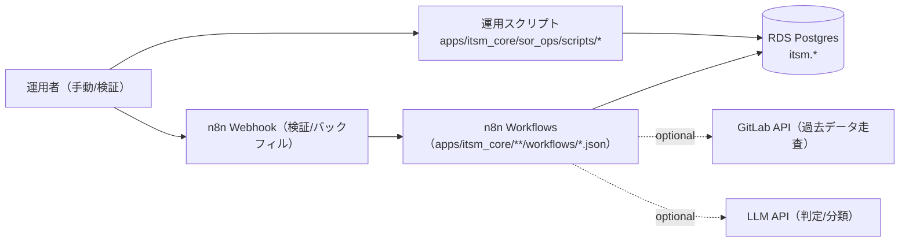

# コンピュータ化システムバリデーション（CSV）
## 最小ドキュメントセット
### ITSM Core（SoR: System of Record） / GAMP® 5 第2版（2022, CSA ベース, IQ/OQ/PQ を含む）

---

## 1. CSV / CSA ポリシー
**目的**
`apps/README.md` の共通フォーマットに従い、リスクベース（CSA）で最小限の成果物として本 README と検証証跡を維持する。

**内容**
- ITSM の “正（SoR）” を PostgreSQL（共有 RDS）上の `itsm.*` スキーマとして提供し、関連する運用スクリプト（DDL 適用、RLS、保持/削除、匿名化、監査アンカー、バックフィル等）を集約する。
- SoR の仕様・運用・検証の入口を本 README に集約し、横断ドキュメントは `apps/itsm_core/sor_ops/docs/itsm_core/`（Requirements/DQ/IQ/OQ/PQ/AIS）を参照する。
- 組織（realm）ごとの拡張が必要な Requirements/DQ は、共通ベース（`apps/itsm_core/**/docs/`）を編集せず、`vendor/<name_prefix>/apps/itsm_core/**/realms/<realm_key>/docs/` へ **realm overlay** として追記する（`name_prefix` は `terraform output -raw name_prefix` を正とする）。
- 秘密情報（DB 資格情報、API キー等）は tfvars に平文で置かず、SSM/Secrets Manager → 環境変数注入を前提とする。

---

## 2. バリデーション計画（VP）
**目的**
対象範囲（スコープ）と検証戦略を定義する。

**内容**
- システム名: ITSM Core（SoR）
- 対象:
  - DB（RDS Postgres）の `itsm.*` スキーマ（SoR）
  - SoR を運用するためのスクリプト群（DDL/RLS/保持/削除/匿名化/監査アンカー/バックフィル等）
  - SoR へ投入する n8n ワークフロー群（バックフィル/検証/スモークテスト）
- 非対象:
  - PostgreSQL/RDS 自体の製品バリデーション
  - GitLab/Zulip/LLM API 等の外部サービス自体の製品バリデーション
  - ネットワーク/認証基盤（Terraform/IaC 側）全般
- バリデーション成果物（最小）:
  - 本 README
  - Requirements: `apps/itsm_core/sor_ops/docs/itsm_core/app_requirements.md`
  - CS（AIS）: `apps/itsm_core/sor_ops/docs/itsm_core/cs/ai_behavior_spec.md`
- DQ/IQ/OQ/PQ:
  - `apps/itsm_core/sor_ops/docs/itsm_core/dq/dq.md`
  - `apps/itsm_core/sor_ops/docs/itsm_core/iq/iq.md`
  - `apps/itsm_core/sor_ops/docs/itsm_core/oq/oq.md`
  - `apps/itsm_core/sor_ops/docs/itsm_core/pq/pq.md`
- 全サブApp統合IQ/PQ: `apps/itsm_core/scripts/run_all_iq.sh`, `apps/itsm_core/scripts/run_all_pq.sh`（共通基準: `docs/validation/apps-iq-oq-pq.md`）

---

## 3. 意図した使用（Intended Use）とシステム概要
**目的**
ITSM の監査・決定・承認を「正（SoR）」へ集約し、横断検索・追跡・保持/削除・改ざん耐性（監査要件）を成立させる。

**内容**
- SoR を `itsm.*` スキーマとして提供し、他アプリの記録先として利用できる状態にする。
- 運用スクリプトにより、DDL 適用、RLS、保持/削除、匿名化、監査アンカー、バックフィルを安全に実行できるようにする。
- n8n ワークフローにより、GitLab の過去データ（Issue/決定）を SoR に投入し、最小の検証（スモークテスト/テスト投入）で成立性を確認できるようにする。

### 関連資料（変更管理対象 / 比較資料）
- プロンプト（変更管理対象）: `ai/prompts/itsm/itsm_usecase_enrichment.md`（ITSM ユースケース集の拡張）
- 比較/設計:
  - `docs/itsm/features_comparison.md`（市販ITSM との機能対照表・未提供時の実装案）
  - `apps/itsm_core/bootstrap/docs/data-model.md`（統合データモデル：テーブル/参照/ACL の設計）
  - `apps/itsm_core/bootstrap/docs/data-retention.md`（アーカイブ/保持期間/削除/匿名化（MVP 方針））
  - `apps/itsm_core/bootstrap/docs/itsm-core-feature-status.md`（ITSM コア（SoR）機能一覧と実装状況）
  - `apps/itsm_core/bootstrap/docs/cir_continual_improvement_flow.md`（CIR（継続的改善）運用フロー（半自律/自律拡張））

### ITSM Bootstrap（GitLab）
- レルム用のグループ/初期プロジェクト作成: `apps/itsm_core/bootstrap/scripts/ensure_realm_groups.sh`
- ITSM テンプレ/運用資材の投入（既定: 全体）: `apps/itsm_core/bootstrap/scripts/itsm_bootstrap_realms.sh`
  - 変更箇所だけ反映（labels/boards/wiki 等は触らない）: `apps/itsm_core/bootstrap/scripts/itsm_bootstrap_realms.sh --files-only`
- テンプレ/ドキュメント（SSoT）: `apps/itsm_core/bootstrap/`（`docs/` と `data/templates/`）
- 注: `scripts/apps/deploy_all_workflows.sh --with-tests` を使う場合、事前に bootstrap が完了していること。

### ユースケース（Usecase）
- ユースケース抽出（CIR）: `apps/itsm_core/cir_usecase_list/`（CIR の `状態/Approved` Issue から `UC-*` を抽出）
- Grafana（ユースケース用ダッシュボード同期）: `apps/itsm_core/bootstrap/scripts/sync_usecase_dashboards.sh`

#### Grafana のユースケース用ダッシュボード同期（例）

基本の使い方（全 realm を対象に同期）:

```bash
aws sso login --profile "$(terraform output -raw aws_profile)"
bash apps/itsm_core/bootstrap/scripts/sync_usecase_dashboards.sh
```

特定 realm のみ対象にする例:

```bash
GRAFANA_TARGET_REALM="prod" \
  bash apps/itsm_core/bootstrap/scripts/sync_usecase_dashboards.sh
```

Terraform output を使わずに直接指定する例（Grafana URL と管理者認証を直指定）:

```bash
GRAFANA_ADMIN_URL="https://grafana.example.com" \
GRAFANA_ADMIN_USER="admin" \
GRAFANA_ADMIN_PASSWORD="***" \
  bash apps/itsm_core/bootstrap/scripts/sync_usecase_dashboards.sh
```

API を叩かずに実行内容だけ確認する例:

```bash
GRAFANA_DRY_RUN="true" \
  bash apps/itsm_core/bootstrap/scripts/sync_usecase_dashboards.sh
```

### SoR の適用/バックフィル（推奨）
- スキーマ適用: `apps/itsm_core/sor_ops/scripts/import_itsm_sor_core_schema.sh`
- 既存の承認履歴バックフィル（一次/手動）: `apps/itsm_core/aiops_approval_history_backfill_to_sor/scripts/backfill_itsm_sor_from_aiops_approval_history.sh`
  - 継続運用（差分・定期）: `apps/itsm_core/aiops_approval_history_backfill_to_sor/workflows/itsm_aiops_approval_history_backfill_job.json`（Cron 既定: 毎時 35分。Cron の時刻は n8n のタイムゾーン設定に依存し、ECS 既定は `GENERIC_TIMEZONE=Asia/Tokyo`）
  - スモーク: `apps/itsm_core/aiops_approval_history_backfill_to_sor/workflows/itsm_aiops_approval_history_backfill_test.json`（Webhook: `POST /webhook/itsm/sor/aiops/approval_history/backfill/test`）
- GitLab Issue 全件 → SoR レコード backfill（n8n）: `apps/itsm_core/gitlab_backfill_to_sor/workflows/gitlab_issue_backfill_to_sor.json`（Webhook: `POST /webhook/gitlab/issue/backfill/sor`）
  - 起動スクリプト: `apps/itsm_core/gitlab_backfill_to_sor/scripts/backfill_gitlab_issues_to_sor.sh`
- GitLab の過去決定（Issue 本文/Note）バックフィル（n8n）: `apps/itsm_core/gitlab_backfill_to_sor/workflows/gitlab_decision_backfill_to_sor.json`（Webhook: `POST /webhook/gitlab/decision/backfill/sor`）
  - LLM 判定のみで「取り漏れ最小化」を優先し、`decision.recorded` に加えて `decision.candidate_detected` / `decision.classification_failed` を SoR に残して後からレビュー可能にする
- Zulip の過去決定メッセージバックフィル（一次/手動, GitLab を経由しない）: `apps/itsm_core/zulip_backfill_to_sor/scripts/backfill_zulip_decisions_to_sor.sh`
  - `--dry-run-scan` で走査のみ、`--execute` で投入。DM は既定除外で必要なら `--include-private`。決定マーカーは `--decision-prefixes`（または `ZULIP_DECISION_PREFIXES`）で上書き可能
  - 継続運用（差分・定期）: `apps/itsm_core/zulip_backfill_to_sor/workflows/itsm_zulip_backfill_decisions_job.json`（Cron 既定: 毎時 25分。Cron の時刻は n8n のタイムゾーン設定に依存し、ECS 既定は `GENERIC_TIMEZONE=Asia/Tokyo`）
  - スモーク: `apps/itsm_core/zulip_backfill_to_sor/workflows/itsm_zulip_backfill_decisions_test.json`（Webhook: `POST /webhook/itsm/sor/zulip/backfill/decisions/test`）
  - 状態保持: SoR の `itsm.integration_state` に処理済み範囲（カーソル）を保存し、未処理分のみを小分けに実行
  - 注: 定期運用の保持/匿名化（retention/PII redaction）も `apps/itsm_core/sor_ops/workflows/` で Cron 実行できる（既定: retention 毎日 03:10 / PII redaction 毎時 15分。Cron の時刻は n8n のタイムゾーン設定に依存し、ECS 既定は `GENERIC_TIMEZONE=Asia/Tokyo`）

### RLS（Row Level Security）導入（段階適用推奨）
- RLS ポリシー適用: `apps/itsm_core/sor_ops/scripts/import_itsm_sor_core_schema.sh --schema apps/itsm_core/sor_ops/sql/itsm_sor_rls.sql`
- （n8n が DB 直叩きの場合はほぼ必須）RLS コンテキスト（app.*）の既定値投入: `apps/itsm_core/sor_ops/scripts/configure_itsm_sor_rls_context.sh`
- （強化/任意）RLS の FORCE（テーブル所有者バイパスを禁止）: `apps/itsm_core/sor_ops/scripts/import_itsm_sor_core_schema.sh --schema apps/itsm_core/sor_ops/sql/itsm_sor_rls_force.sql`
- `apps/itsm_core/scripts/deploy_all_workflows.sh`（ITSM Core 配下を一括。必要なら `scripts/apps/deploy_all_workflows.sh` で全アプリ一括）から有効化する場合は、環境変数 `N8N_APPLY_ITSM_SOR_RLS=true`（必要なら `N8N_APPLY_ITSM_SOR_RLS_FORCE=true`）を使用
  - 依存関係チェック（推奨）: `N8N_CHECK_ITSM_SOR_SCHEMA=true`（デフォルト有効）
  - RLS コンテキスト既定値（任意）: `N8N_CONFIGURE_ITSM_SOR_RLS_CONTEXT=true`（`ALTER ROLE ... SET app.*` を投入）
  - 注意: RLS を有効化すると、`itsm.*` へのアクセスは `app.realm_key`（または `app.realm_id`）が必須になります（未設定は fail close / エラー）。
  - n8n の SQL では、各 SQL 文の先頭で `itsm.set_rls_context(...)` を呼ぶ形（statement 内で `app.*` をセット）を推奨します（複数 statement の場合は各 statement で呼ぶ）。

### 監査イベントの改ざん耐性（推奨）
- DB 側: `apps/itsm_core/sor_ops/sql/itsm_sor_core.sql` で `itsm.audit_event` を append-only + ハッシュチェーン化（INSERT 時に `integrity.prev_hash/hash` を自動付与）
- 外部アンカー（WORM）: Terraform で `itsm_audit_event_anchor_enabled=true` を有効化し、`apps/itsm_core/sor_ops/scripts/anchor_itsm_audit_event_hash.sh` を定期実行してチェーン先頭を S3 Object Lock に固定
- 監査チェック: `itsm.audit_event_verify_hash_chain(realm_id)` で `ok=false` が無いことを確認

### Sulu admin での参照（決定一覧の検索/フィルタ）
Sulu admin には、SoR（`itsm.*`）を read-only で参照するためのメニュー/ページがあります。

- メニュー: `ITSM > 決定一覧`（ほかに Incident / SRQ / Problem / Change の一覧もあります）
- URL 例: `https://<realm>.sulu.smic-aiops.jp/admin/#/itsm/decisions`
- 前提: Sulu は通常 DB（`sulu_db_name`）とは別に、SoR 用 DB 接続 `ITSM_SOR_DATABASE_URL` が必要です（Terraform が SSM SecureString `/${name_prefix}/itsm_sor/database_url` を作成して Sulu へ注入します）。
- RLS を有効化している場合、Sulu 側は各 API リクエストで `app.realm_key` / `app.principal_id` を設定して参照します（未設定だと参照できません）。

### 構成図（Mermaid / 現行実装）


```mermaid
flowchart LR
  Operator[運用者（手動/検証）] --> Scripts["運用スクリプト<br/>apps/itsm_core/sor_ops/scripts/*"]
  Scripts --> DB[(RDS Postgres<br/>itsm.*)]

  Operator --> Webhook["n8n Webhook（検証/バックフィル）"]
  Webhook --> WF[n8n Workflows（apps/itsm_core/**/workflows/*.json）]
  WF --> DB
  WF -. optional .-> GitLab[GitLab API（過去データ走査）]
  WF -. optional .-> LLM[LLM API（判定/分類）]
```

### ディレクトリ構成
- `apps/itsm_core/sor_ops/sql/`: SoR スキーマ（SSoT）/RLS
- `apps/itsm_core/scripts/`: ITSM Core 配下の **統合オーケストレータ**（一括 deploy / 一括 OQ）
- `apps/itsm_core/sor_ops/docs/itsm_core/`: ITSM Core の横断ドキュメント（Requirements/DQ/IQ/OQ/PQ/AIS）（共通ベース）
- `vendor/<name_prefix>/apps/itsm_core/realms/<realm_key>/docs/`: （任意）共通ベース docs への **realm overlay**（組織別拡張）
- `apps/itsm_core/<sub_app>/`: サブアプリ（個別の workflows/scripts/docs/data/sql を保持）
  - `apps/itsm_core/<sub_app>/docs/`: サブアプリ docs（共通ベース）
  - `vendor/<name_prefix>/apps/itsm_core/<sub_app>/realms/<realm_key>/docs/`: （任意）サブアプリ docs の realm overlay（CIR 同期で追記する Requirements/DQ はここへ書く）

### サブアプリ一覧（正）
各サブアプリは原則として以下を保持する（統一インタフェース）:
- 要求: `apps/itsm_core/<sub_app>/docs/app_requirements.md`
- 中心プロンプト: `apps/itsm_core/<sub_app>/data/default/prompt/system.md`
- デプロイ: `apps/itsm_core/<sub_app>/scripts/deploy_workflows.sh`
- OQ: `apps/itsm_core/<sub_app>/scripts/run_oq.sh`

| sub_app | 種別 | 役割（概要） | 要求 | デプロイ | OQ |
|---|---|---|---|---|---|
| `sor_ops` | hybrid | SoR 運用（DDL/RLS/保持/匿名化/監査アンカー等）+ 定期ジョブ（保持/PII redaction） | `apps/itsm_core/sor_ops/docs/app_requirements.md` | `apps/itsm_core/sor_ops/scripts/deploy_workflows.sh` | `apps/itsm_core/sor_ops/scripts/run_oq.sh` |
| `sor_webhooks` | n8n | SoR コア Webhook（スモークテスト/互換 Webhook 等） | `apps/itsm_core/sor_webhooks/docs/app_requirements.md` | `apps/itsm_core/sor_webhooks/scripts/deploy_workflows.sh` | `apps/itsm_core/sor_webhooks/scripts/run_oq.sh` |
| `gitlab_backfill_to_sor` | n8n | GitLab 過去データ（Issue/決定）→ SoR | `apps/itsm_core/gitlab_backfill_to_sor/docs/app_requirements.md` | `apps/itsm_core/gitlab_backfill_to_sor/scripts/deploy_workflows.sh` | `apps/itsm_core/gitlab_backfill_to_sor/scripts/run_oq.sh` |
| `zulip_backfill_to_sor` | hybrid | Zulip 過去メッセージ（決定）→ SoR（状態保持・定期バックフィル） | `apps/itsm_core/zulip_backfill_to_sor/docs/app_requirements.md` | `apps/itsm_core/zulip_backfill_to_sor/scripts/deploy_workflows.sh` | `apps/itsm_core/zulip_backfill_to_sor/scripts/run_oq.sh` |
| `aiops_approval_history_backfill_to_sor` | hybrid | legacy `aiops_approval_history` → SoR（状態保持・定期バックフィル） | `apps/itsm_core/aiops_approval_history_backfill_to_sor/docs/app_requirements.md` | `apps/itsm_core/aiops_approval_history_backfill_to_sor/scripts/deploy_workflows.sh` | `apps/itsm_core/aiops_approval_history_backfill_to_sor/scripts/run_oq.sh` |
| `cloudwatch_event_notify` | n8n | CloudWatch/SNS 等の通知を整形し Zulip/GitLab/Grafana へ連携 | `apps/itsm_core/cloudwatch_event_notify/docs/app_requirements.md` | `apps/itsm_core/cloudwatch_event_notify/scripts/deploy_workflows.sh` | `apps/itsm_core/cloudwatch_event_notify/scripts/run_oq.sh` |
| `gitlab_issue_metrics_sync` | n8n | GitLab Issue メトリクス集計（S3 出力） | `apps/itsm_core/gitlab_issue_metrics_sync/docs/app_requirements.md` | `apps/itsm_core/gitlab_issue_metrics_sync/scripts/deploy_workflows.sh` | `apps/itsm_core/gitlab_issue_metrics_sync/scripts/run_oq.sh` |
| `gitlab_dora_metrics_sync` | n8n | GitLab DORA 指標（デプロイ頻度/変更リードタイム/変更失敗率）の集計（S3 出力） | `apps/itsm_core/gitlab_dora_metrics_sync/docs/app_requirements.md` | `apps/itsm_core/gitlab_dora_metrics_sync/scripts/deploy_workflows.sh` | `apps/itsm_core/gitlab_dora_metrics_sync/scripts/run_oq.sh` |
| `itsm_sla_metrics_sync` | n8n | ITSM SoR の SLA 計測（日次集計 / S3 出力） | `apps/itsm_core/itsm_sla_metrics_sync/docs/app_requirements.md` | `apps/itsm_core/itsm_sla_metrics_sync/scripts/deploy_workflows.sh` | `apps/itsm_core/itsm_sla_metrics_sync/scripts/run_oq.sh` |
| `gitlab_issue_rag` | n8n | GitLab Issue/notes → pgvector（RAG 用） | `apps/itsm_core/gitlab_issue_rag/docs/app_requirements.md` | `apps/itsm_core/gitlab_issue_rag/scripts/deploy_workflows.sh` | `apps/itsm_core/gitlab_issue_rag/scripts/run_oq.sh` |
| `cir_usecase_list` | n8n | CIR（一般管理/継続的改善）で `状態/Approved` の Issue を一覧し、ユースケース機能ID（`UC-*`）を抽出して返す | `apps/itsm_core/cir_usecase_list/docs/app_requirements.md` | `apps/itsm_core/cir_usecase_list/scripts/deploy_workflows.sh` | `apps/itsm_core/cir_usecase_list/scripts/run_oq.sh` |
| `cir_auto_label` | n8n | CIR テンプレ起票時に `ITSM/継続的改善` / `状態/New` を自動付与（Issue Hook） | `apps/itsm_core/cir_auto_label/docs/app_requirements.md` | `apps/itsm_core/cir_auto_label/scripts/deploy_workflows.sh` | `apps/itsm_core/cir_auto_label/scripts/run_oq.sh` |
| `cir_status_notify` | n8n | CIR Issue の `状態/Approved` / `状態/Closed` ラベル付与を検知し、起票者へ Zulip DM を送信（SoR による冪等） | `apps/itsm_core/cir_status_notify/docs/app_requirements.md` | `apps/itsm_core/cir_status_notify/scripts/deploy_workflows.sh` | `apps/itsm_core/cir_status_notify/scripts/run_oq.sh` |
| `cir_issue_close` | n8n | system.md 実行完了後に CIR Issue を `状態/Closed` + close し、結果サマリ note を追記（重複抑止） | `apps/itsm_core/cir_issue_close/docs/app_requirements.md` | `apps/itsm_core/cir_issue_close/scripts/deploy_workflows.sh` | `apps/itsm_core/cir_issue_close/scripts/run_oq.sh` |
| `gitlab_mention_notify` | n8n | GitLab mention を Zulip へ通知 | `apps/itsm_core/gitlab_mention_notify/docs/app_requirements.md` | `apps/itsm_core/gitlab_mention_notify/scripts/deploy_workflows.sh` | `apps/itsm_core/gitlab_mention_notify/scripts/run_oq.sh` |
| `gitlab_push_notify` | n8n | GitLab push を Zulip へ通知 | `apps/itsm_core/gitlab_push_notify/docs/app_requirements.md` | `apps/itsm_core/gitlab_push_notify/scripts/deploy_workflows.sh` | `apps/itsm_core/gitlab_push_notify/scripts/run_oq.sh` |
| `zulip_gitlab_issue_sync` | n8n | Zulip ↔ GitLab Issue 同期 | `apps/itsm_core/zulip_gitlab_issue_sync/docs/app_requirements.md` | `apps/itsm_core/zulip_gitlab_issue_sync/scripts/deploy_workflows.sh` | `apps/itsm_core/zulip_gitlab_issue_sync/scripts/run_oq.sh` |
| `zulip_stream_sync` | n8n | Zulip stream の作成/アーカイブ同期 | `apps/itsm_core/zulip_stream_sync/docs/app_requirements.md` | `apps/itsm_core/zulip_stream_sync/scripts/deploy_workflows.sh` | `apps/itsm_core/zulip_stream_sync/scripts/run_oq.sh` |

注: Cron の既定スケジュールは各サブアプリの `workflows/*.json` と `README.md` を正とする（必要なら n8n UI で調整する）。Cron の時刻は n8n のタイムゾーン設定に依存し、ECS 既定は `GENERIC_TIMEZONE=Asia/Tokyo`。

### 統合オーケストレータ（推奨）
```bash
# ワークフロー同期（全サブアプリ）
apps/itsm_core/scripts/deploy_all_workflows.sh --dry-run

# OQ（一括）
apps/itsm_core/scripts/run_all_oq.sh --realm default --dry-run
```

---

## 主要ファイル（SSoT）

- スキーマ（正）: `apps/itsm_core/sor_ops/sql/itsm_sor_core.sql`
- RLS: `apps/itsm_core/sor_ops/sql/itsm_sor_rls.sql`
- RLS FORCE（強化）: `apps/itsm_core/sor_ops/sql/itsm_sor_rls_force.sql`
- RLS 運用補助: `itsm.set_rls_context(...)`（`apps/itsm_core/sor_ops/sql/itsm_sor_core.sql` 内。n8n/autocommit の “SQL 文内で app.* をセット” を想定）
- AIOpsAgent SoR 書き込み（SoR 直SQLの置き換え）: `itsm.aiops_*`（`apps/itsm_core/sor_ops/sql/itsm_sor_core.sql`）

---

## 運用スクリプト（主要）

- 運用スクリプトの正は `apps/itsm_core/sor_ops/` に集約する（一覧・用途・OQ は `apps/itsm_core/sor_ops/README.md` を参照）。
- サブアプリの実行スクリプト（バックフィル等）は各サブアプリの README に整理する（例: `apps/itsm_core/gitlab_backfill_to_sor/README.md`）。

---

## n8n ワークフロー（代表）

- ワークフロー定義（JSON）は各サブアプリの `workflows/` に配置する（例: SoR コアは `apps/itsm_core/sor_webhooks/README.md`、GitLab backfill は `apps/itsm_core/gitlab_backfill_to_sor/README.md`）。
- デプロイは ITSM Core 統合オーケストレータ（`apps/itsm_core/scripts/deploy_all_workflows.sh`）または各サブアプリの `apps/itsm_core/<sub_app>/scripts/deploy_workflows.sh` で行う。
- OQ は `apps/itsm_core/scripts/run_all_oq.sh`（一括）または各サブアプリの `apps/itsm_core/<sub_app>/scripts/run_oq.sh` で行う。

---

## 4. GxP 影響評価とリスクアセスメント
**目的**
患者安全・製品品質・データ完全性の観点で、重大なリスクのみを識別し、対策を明記する。

**内容（critical のみ）**
- データ完全性（改ざん/欠落/重複）→ append-only 監査イベント、冪等キー、監査アンカー（S3）で低減
- テナント混在（realm 越境）→ RLS/コンテキスト（`app.*`）運用、スクリプトで既定値を投入
- 個人情報（PII）取り扱い → 匿名化（疑似化）スクリプト、保持ポリシーで低減

---

## 5. 検証戦略（Verification Strategy）
**目的**
Intended Use に適合することを、最小の検証で示す。

**内容**
- IQ: DDL 適用 + 依存チェック +（任意）ワークフロー同期が成立すること
- OQ: SoR への書き込み（スモークテスト）と、代表的なバックフィル投入（テスト）で DB 書き込みが成立すること
- PQ: 実運用データ量/頻度に対する成立性（最小）

---

## 6. 設置時適格性確認（IQ）
**目的**
対象環境に SoR が正しく設置されていることを確認する。

**文書**
- `apps/itsm_core/sor_ops/docs/itsm_core/iq/iq.md`

---

## 7. 運転時適格性確認（OQ）
**目的**
重要機能（SoR 書き込み、バックフィル投入、ワークフロー同期、冪等性）が意図どおり動作することを確認する。

**文書**
- OQ（入口）: `apps/itsm_core/sor_ops/docs/itsm_core/oq/oq.md`
- OQ（SoR core / Webhook）: `apps/itsm_core/sor_webhooks/docs/oq/oq.md`（`oq_*.md` から生成）

**実行**
- OQ 実行補助（ITSM Core 配下一括）: `apps/itsm_core/scripts/run_all_oq.sh`
- OQ 実行補助（SoR core / Webhook のみ）: `apps/itsm_core/sor_webhooks/scripts/run_oq.sh`

補足:
- OQ 文書を更新した場合は `scripts/generate_oq_md.sh --app apps/itsm_core/<app>` を実行して、各サブアプリの `apps/itsm_core/<app>/docs/oq/oq.md` を更新する。

---

## 8. 稼働性能適格性確認（PQ）
**目的**
データ量・実行頻度・外部 API 制約（GitLab/LLM）に対する成立性を確認する。

**文書**
- `apps/itsm_core/sor_ops/docs/itsm_core/pq/pq.md`

---

## 9. バリデーションサマリレポート（VSR）
**目的**
本アプリのバリデーション結論を最小で残す。

**内容（最小）**
- 実施した IQ/OQ/PQ の一覧、結果サマリ、逸脱と対処、運用開始可否の判断
- 証跡は `evidence/` 配下に日付付きで保存する（例: `evidence/oq/itsm_core_YYYYMMDD.../`）

---

## 10. 継続的保証（運用フェーズ）
**目的**
バリデート状態を維持する。

**内容**
- 変更は Git の差分 + OQ 再実施（必要最小限）で追跡する（変更管理は `docs/change-management.md` を参照）。
- DDL/RLS/保持/削除/匿名化/監査アンカー/バックフィルの変更は SoR の監査性に直結するため、影響範囲に応じて IQ/OQ/PQ を再実施する。
