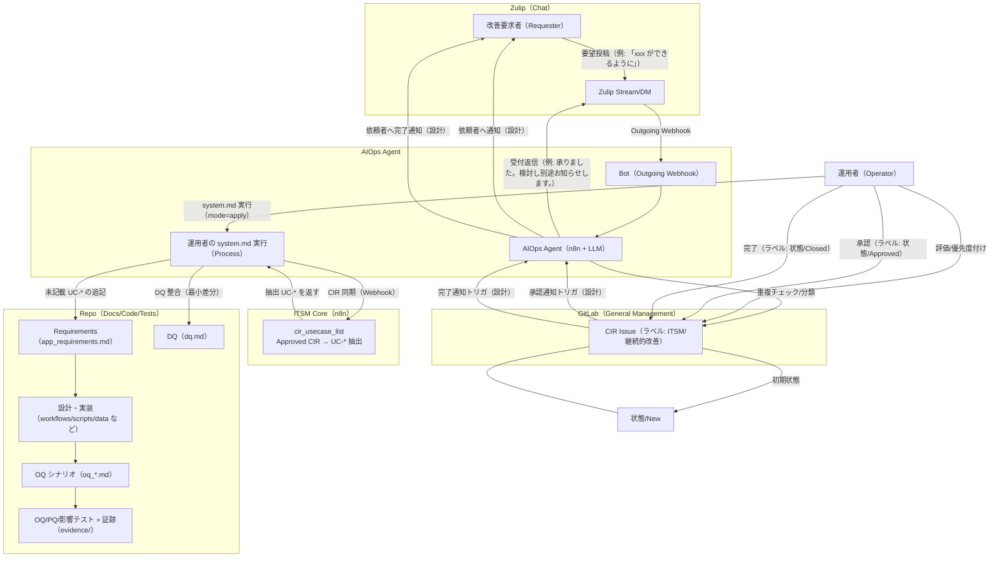
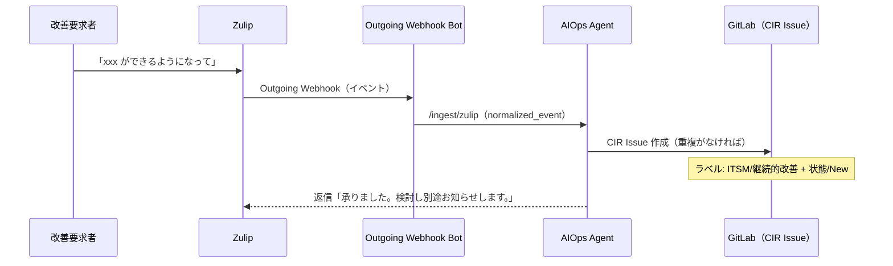
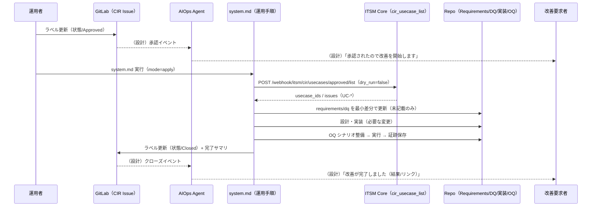

# CIR（継続的改善レジスター）運用フロー（半自律 / 自律拡張）

本書は「**改善要求 → CIR（GitLab Issue） → 承認 → 要求/設計/検証ドキュメント更新 → 実装/検証 → クローズ → 依頼者へ通知**」の一連を、
**半自律（human-in-the-loop）**な運用として定義します。

前提:
- CIR（継続的改善レジスター）＝ **GitLab 一般管理プロジェクトの Issue** とする。
- CIR の状態（ステータス）は、Issue のラベル `状態/*` で管理する（例: `状態/New`）。
- CIR であることの識別ラベルは `ITSM/継続的改善` とする。

---

## 1. 登場人物（役割）

- 改善要求者（Requester）: 「xxx ができるようになって」等の要望を投稿する
- Zulip（Chat）: 要望/通知の媒体
- Bot（Zulip Outgoing Webhook）: Zulip → AIOps Agent への受信口
- AIOps Agent（n8n + LLM）: 受付返信、CIR 起票、承認/クローズ通知、（運用者の system.md 実行時に）CIR→Docs 同期を支援
- 運用者（Operator）: 評価・承認・実装作業・検証・クローズの責任者
- GitLab（General Management）: CIR Issue の保管庫（台帳）
- ITSM Core（n8n）: CIR Approved Issue の一覧・ユースケース抽出（`cir_usecase_list`）

---

## 2. CIR ステータス（最小 8 状態）

ラベル（例）:
- `状態/New`: 受付直後（未評価）
- `状態/Assess`: 評価中（情報収集中）
- `状態/Approved`: 実施決定
- `状態/Implement`: 実施中（設計/実装/展開）
- `状態/Review`: 効果確認中
- `状態/Closed`: 完了（レビューまで終了）
- `状態/On Hold`: 保留（前提待ち）
- `状態/Rejected`: 却下（現時点で実施しない）

状態遷移（推奨）:

```mermaid
stateDiagram-v2
  [*] --> New
  New --> Assess
  Assess --> Approved
  Assess --> Rejected
  Assess --> "On Hold"
  Approved --> Implement
  Implement --> Review
  Review --> Closed
  Review --> Implement
  "On Hold" --> Assess
```

---

## 3. 全体フロー（エンドツーエンド）



注:
- 「承認通知/完了通知」は運用設計上の要件であり、実装は Bot/Agent の通知経路（Zulip DM など）に依存します。
- `system.md` は「まず CIR 同期→requirements/dq 更新→その後デプロイ」をプロセス先頭で実施する方針です。

---

## 4. チャット〜CIR 起票（受付）シーケンス



---

## 5. 承認〜Docs 同期〜実装〜クローズ シーケンス



---

## 6. 半自律（human-in-the-loop）としての設計ポイント

「自律化したいこと」と「人が責任を持つこと」を分離し、暴走を防ぎます。

| フェーズ | 自律/半自律の範囲 | 人の責任点（必須） |
|---|---|---|
| 受付（要望→CIR） | 受付返信、重複候補の提示、CIR 起票（案） | 依頼の意図確認（必要時） |
| 評価（Assess） | 情報不足の指摘、見積/リスク項目の雛形生成 | 優先度・実施可否の決定 |
| 承認（Approved） | 承認イベントに連動した依頼者通知 | 承認（ラベル付与） |
| 同期（CIR→Docs） | Approved CIR から UC-* を抽出し、requirements/DQ の不足を最小差分で補完 | 追記内容のレビュー（必要な場合） |
| 実装/検証 | 影響範囲の推定、OQ シナリオ整備、実行結果の集約 | 実装/リリース判断、逸脱時の対応 |
| クローズ | 完了サマリ作成、依頼者通知（結果リンク） | クローズ（ラベル付与） |

---

## 7. トレーサビリティ（構成品目）

### GitLab（一般管理）
- CIR Issue テンプレ（台帳項目）: `apps/itsm_core/bootstrap/data/templates/general-management/issue_templates/continual_improvement_register.md.tpl`
- CIR ステータス定義（運用文書）: `apps/itsm_core/bootstrap/data/templates/general-management/docs/usecases/04_continual_improvement.md.tpl`

### ITSM Core（n8n）
- Approved CIR → UC-* 抽出（Webhook）: `apps/itsm_core/cir_usecase_list/workflows/itsm_cir_approved_usecases_list.json`
- テスト Webhook（環境不足チェック）: `apps/itsm_core/cir_usecase_list/workflows/itsm_cir_approved_usecases_list_test.json`

### CIR→Docs 同期（運用）
- 同期プロンプトテンプレ: `apps/itsm_core/cir_usecase_list/docs/cs/cir_usecase_docs_sync_prompt.md`
- 各アプリの運用プロンプト: `apps/*/data/default/prompt/system.md`（`## Process` 先頭で CIR 同期を実施）

