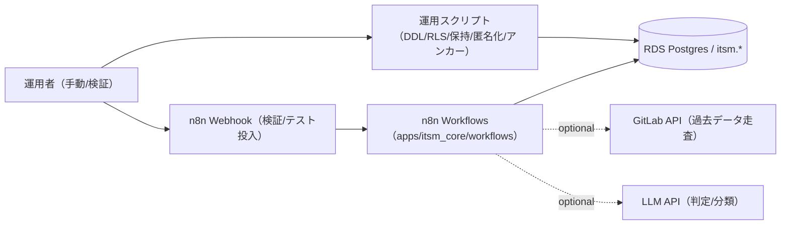

# OQ（運用適格性確認）: ITSM Core（SoR）

## 目的

SoR（`itsm.*`）への代表的な投入（監査イベント、バックフィルのテスト投入）と、ワークフロー同期の成立を確認します。

## 構成図（Mermaid / 現行実装）



## 接続パターン（外部アクセス）

- オペレーター → n8n Webhook（検証/テスト投入）
  - `POST /webhook/itsm/sor/audit_event/test`
  - `POST /webhook/gitlab/decision/backfill/sor/test`
  - `POST /webhook/gitlab/issue/backfill/sor/test`
- オペレーター → n8n Public API（同期）
  - `apps/itsm_core/scripts/deploy_workflows.sh`

## 前提

- SoR の DDL が適用済みであること（`apps/itsm_core/sql/itsm_sor_core.sql`）
- ワークフローが n8n に同期済みであること（`apps/itsm_core/scripts/deploy_workflows.sh`）

## OQ ケース（接続パターン別）

| case_id | 接続パターン | 実行内容 | 期待結果 |
| --- | --- | --- | --- |
| OQ-ITSM-001 | オペレーター → n8n / DB | `itsm.audit_event` スモークテスト投入 | `HTTP 200`、`ok=true` 等が返る |
| OQ-ITSM-002 | オペレーター → n8n / DB | GitLab 決定バックフィル（テスト投入） | `HTTP 200`、`ok=true` 等が返る |
| OQ-ITSM-003 | オペレーター → n8n / DB | GitLab Issue バックフィル（テスト投入） | `HTTP 200`、`attempted/upserted` が返る |
| OQ-ITSM-004 | オペレーター → n8n Public API | ワークフロー群を upsert（dry-run→本番） | 差分が確認でき、同期が完了して active になる |

<!-- OQ_SCENARIOS_BEGIN -->
## OQ シナリオ（詳細）

このセクションは `docs/oq/oq_*.md` から自動生成されます（更新: `scripts/generate_oq_md.sh`）。
個別シナリオを追加/修正した場合は、まず `oq_*.md` を更新し、最後に本スクリプトで `oq.md` を更新してください。

### 一覧
- [oq_gitlab_decision_backfill_sor_test.md](oq_gitlab_decision_backfill_sor_test.md)
- [oq_gitlab_issue_backfill_sor_test.md](oq_gitlab_issue_backfill_sor_test.md)
- [oq_sor_audit_event_smoke_test.md](oq_sor_audit_event_smoke_test.md)
- [oq_workflow_sync_deploy.md](oq_workflow_sync_deploy.md)

---

### OQ: GitLab 決定バックフィル（テスト投入）（source: `oq_gitlab_decision_backfill_sor_test.md`）

#### 目的

`POST /webhook/gitlab/decision/backfill/sor/test` により、SoR（`itsm.audit_event`）へ決定関連の監査イベント（`decision.recorded` 等）が投入できることを確認する。

#### 受け入れ基準

- `POST /webhook/gitlab/decision/backfill/sor/test` が `HTTP 200` を返す
- 応答 JSON が `ok=true` を含む（または同等の成功シグナルを返す）

#### テスト手順（例）

```bash
N8N_BASE_URL="$(terraform output -json service_urls | jq -r '.n8n')"
curl -sS -H 'Content-Type: application/json' \
  -d "{\"realm\":\"$(terraform output -raw default_realm)\",\"message\":\"OQ test: gitlab decision backfill\"}" \
  "${N8N_BASE_URL%/}/webhook/gitlab/decision/backfill/sor/test" | jq .
```


---

### OQ: GitLab Issue バックフィル（テスト投入）（source: `oq_gitlab_issue_backfill_sor_test.md`）

#### 目的

`POST /webhook/gitlab/issue/backfill/sor/test` により、SoR レコード（incident/srq/problem/change）と `itsm.external_ref` の upsert が成立することを確認する。

#### 受け入れ基準

- `POST /webhook/gitlab/issue/backfill/sor/test` が `HTTP 200` を返す
- 応答 JSON に `attempted`（投入試行数）と `upserted`（参照 upsert 数）等が含まれる

#### テスト手順（例）

```bash
N8N_BASE_URL="$(terraform output -json service_urls | jq -r '.n8n')"
curl -sS -H 'Content-Type: application/json' \
  -d "{\"realm\":\"$(terraform output -raw default_realm)\",\"message\":\"OQ test: gitlab issue backfill\"}" \
  "${N8N_BASE_URL%/}/webhook/gitlab/issue/backfill/sor/test" | jq .
```


---

### OQ: SoR 監査イベント（スモークテスト）（source: `oq_sor_audit_event_smoke_test.md`）

#### 目的

`POST /webhook/itsm/sor/audit_event/test` により、SoR（`itsm.audit_event`）へ最小の書き込みが成立することを確認する。

#### 受け入れ基準

- `POST /webhook/itsm/sor/audit_event/test` が `HTTP 200` を返す
- 応答 JSON が `ok=true` を含む（または同等の成功シグナルを返す）

#### テスト手順（例）

```bash
N8N_BASE_URL="$(terraform output -json service_urls | jq -r '.n8n')"
curl -sS -H 'Content-Type: application/json' \
  -d "{\"realm\":\"$(terraform output -raw default_realm)\",\"message\":\"OQ test: audit_event smoke\"}" \
  "${N8N_BASE_URL%/}/webhook/itsm/sor/audit_event/test" | jq .
```


---

### OQ: ワークフロー同期（n8n Public API upsert）（source: `oq_workflow_sync_deploy.md`）

#### 目的

`apps/itsm_core/workflows/` のワークフロー群が n8n Public API へ upsert されることを確認する（dry-run の差分確認も含む）。

#### 受け入れ基準

- `DRY_RUN=true` で差分（計画）が表示され、API 書き込みなしで終了できる
- 実行時（dry-run なし）に upsert が完了し、必要なワークフローが active になる

#### テスト手順（例）

```bash
# dry-run
DRY_RUN=true \
apps/itsm_core/scripts/deploy_workflows.sh

# 実行（必要なら有効化も）
ACTIVATE=true \
apps/itsm_core/scripts/deploy_workflows.sh
```


---
<!-- OQ_SCENARIOS_END -->

## 証跡（evidence）

- スモークテスト/テスト投入の応答 JSON
- n8n 実行履歴（必要に応じて）
- ワークフロー同期（dry-run の差分、upsert 完了ログ）

