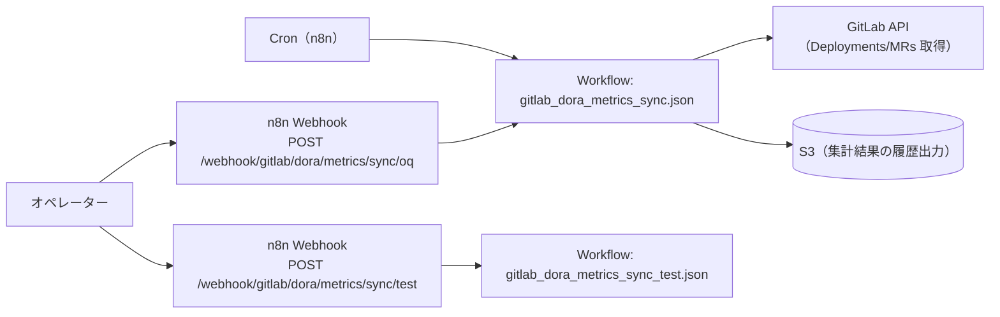

# OQ（運用適格性確認）: GitLab DORA Metrics Sync

## 目的

GitLab Deployments / Merge Requests の集計が成立し、日次 DORA 指標（デプロイ頻度/変更リードタイム/変更失敗率）が S3 に出力されることを確認します。

## 構成図（Mermaid / 現行実装）

## 前提

- n8n に次のワークフローが同期済みであること
  - `apps/itsm_core/gitlab_dora_metrics_sync/workflows/gitlab_dora_metrics_sync.json`
- 連携用の環境変数（GitLab/AWS(S3) など）が設定済みであること

## OQ ケース

| case_id | 実行内容 | 期待結果 |
| --- | --- | --- |
| OQ-GDMS-001 | `apps/itsm_core/gitlab_dora_metrics_sync/scripts/run_oq.sh` 実行 | S3 に `metrics.json` / `gitlab_dora_events.jsonl` が出力される |
| OQ-GDMS-S1-001 | Cron 実行ログを確認（実行日時と `dt` を照合） | `dt` が前日（UTC）になっている |
| OQ-GDMS-S2-001 | `N8N_METRICS_TARGET_DATE=YYYY-MM-DD` を設定して実行 | 指定日付のキー配下に出力される |
| OQ-GDMS-S3-001 | S3 のオブジェクトキーを確認 | 期待のキーが存在する |
| OQ-GDMS-S3-002 | `metrics.json` を JSON として parse | 文字化けなく parse できる |
| OQ-GDMS-S3-003 | `gitlab_dora_events.jsonl` を各行 JSON として parse | 文字化けなく parse できる |
| OQ-GDMS-S4-001 | `metrics.json` のスキーマ確認 | 期待するキーが存在する |
| OQ-GDMS-S4-002 | `metrics.json` の型確認 | 期待する型（number/null）で格納されている |
| OQ-GDMS-S5-001 | `N8N_GITLAB_ENVIRONMENT` を変更して実行 | `metrics.environment` が一致する |
| OQ-GDMS-S6-001 | `DRY_RUN=true apps/itsm_core/gitlab_dora_metrics_sync/scripts/deploy_workflows.sh` | 変更なしで計画が表示される |
| OQ-GDMS-S7-001 | GitLab API 参照の成立性 | 必要エンドポイントへのアクセスが成立する |

## 証跡（evidence）

- n8n 実行ログ（GitLab/S3 の成功）
- S3 の出力オブジェクト（キー、サイズ、更新時刻、メタデータ）

<!-- OQ_SCENARIOS_BEGIN -->
## OQ シナリオ（詳細）

このセクションは同一ディレクトリ内の `oq_*.md` から自動生成されます（更新: `scripts/generate_oq_md.sh`）。
個別シナリオを追加/修正した場合は、まず `oq_*.md` を更新し、最後に本スクリプトで `oq.md` を更新してください。

### 一覧
- [oq_gitlab_dora_metrics_sync_s1_daily_cron_prev_day_utc.md](oq_gitlab_dora_metrics_sync_s1_daily_cron_prev_day_utc.md)
- [oq_gitlab_dora_metrics_sync_s2_manual_run_and_target_date.md](oq_gitlab_dora_metrics_sync_s2_manual_run_and_target_date.md)
- [oq_gitlab_dora_metrics_sync_s3_s3_output_keys.md](oq_gitlab_dora_metrics_sync_s3_s3_output_keys.md)
- [oq_gitlab_dora_metrics_sync_s4_metrics_calculation.md](oq_gitlab_dora_metrics_sync_s4_metrics_calculation.md)
- [oq_gitlab_dora_metrics_sync_s5_environment_filter.md](oq_gitlab_dora_metrics_sync_s5_environment_filter.md)
- [oq_gitlab_dora_metrics_sync_s6_deploy_workflows.md](oq_gitlab_dora_metrics_sync_s6_deploy_workflows.md)
- [oq_gitlab_dora_metrics_sync_s7_gitlab_api_sources.md](oq_gitlab_dora_metrics_sync_s7_gitlab_api_sources.md)

---

### OQ: GitLab DORA Metrics Sync - シナリオ1（定期実行: 前日集計）（source: `oq_gitlab_dora_metrics_sync_s1_daily_cron_prev_day_utc.md`）

#### 目的

定期実行で「前日（UTC）」の `dt` が決まり、日次集計が実行されることを確認します。

#### 受け入れ基準（AC）

- Cron 実行時に、`dt` は「実行時刻の UTC 日付に対して前日」の日付になる
- `N8N_METRICS_TARGET_DATE` が未設定の場合でも、`dt` の決定がタイムゾーンに依存しない

#### テストケース（TC）

| case_id | 実行内容 | 期待結果 |
| --- | --- | --- |
| OQ-GDMS-S1-001 | n8n の Cron 実行ログを確認（実行日時と `dt` を照合） | `dt` が前日（UTC）になっている |

---

### OQ: GitLab DORA Metrics Sync - シナリオ2（手動実行/OQ）（source: `oq_gitlab_dora_metrics_sync_s2_manual_run_and_target_date.md`）

#### 目的

n8n の手動実行（または `apps/itsm_core/gitlab_dora_metrics_sync/scripts/run_oq.sh`）で集計が実行され、S3 に出力されることを確認します。

#### 受け入れ基準（AC）

- 手動実行でメトリクス集計が走り、S3 に出力される
- `N8N_METRICS_TARGET_DATE=YYYY-MM-DD` を設定した場合、任意日付の集計ができる

#### テストケース（TC）

| case_id | 実行内容 | 期待結果 |
| --- | --- | --- |
| OQ-GDMS-S2-001 | `apps/itsm_core/gitlab_dora_metrics_sync/scripts/run_oq.sh` | S3 にオブジェクトが出力される |
| OQ-GDMS-S2-002 | `N8N_METRICS_TARGET_DATE=YYYY-MM-DD` を設定して実行 | 指定日付のキー配下に出力される |

---

### OQ: GitLab DORA Metrics Sync - シナリオ3（S3 出力: メトリクス + events）（source: `oq_gitlab_dora_metrics_sync_s3_s3_output_keys.md`）

#### 目的

S3 に出力されるキー/形式が期待通りであることを確認します。

#### 受け入れ基準（AC）

- `N8N_S3_BUCKET` / `N8N_S3_PREFIX` に従って、以下のキーへ出力される
  - `.../dora/daily_metrics/dt=<YYYY-MM-DD>/realm=<realm>/metrics.json`
  - `.../dora/events/dt=<YYYY-MM-DD>/realm=<realm>/gitlab_dora_events.jsonl`
- `metrics.json` は JSON（UTF-8）として読める
- `gitlab_dora_events.jsonl` は 1 行 1 JSON の JSONL（UTF-8）として読める

#### テストケース（TC）

| case_id | 実行内容 | 期待結果 |
| --- | --- | --- |
| OQ-GDMS-S3-001 | 実行後に S3 のオブジェクトキーを確認 | 期待のキーが存在する |
| OQ-GDMS-S3-002 | `metrics.json` を取得して JSON として parse | 文字化けなく parse できる |
| OQ-GDMS-S3-003 | `gitlab_dora_events.jsonl` を取得して各行を JSON として parse | 文字化けなく parse できる |

---

### OQ: GitLab DORA Metrics Sync - シナリオ4（メトリクス算出）（source: `oq_gitlab_dora_metrics_sync_s4_metrics_calculation.md`）

#### 目的

期待するメトリクスが JSON に含まれ、欠落せずに算出されることを確認します。

#### 受け入れ基準（AC）

- `metrics.json` に以下のキーが存在する
  - `deployment_frequency`
  - `change_failure_rate`
  - `lead_time_for_changes_p50_minutes` / `lead_time_for_changes_p95_minutes`
  - `lead_time_for_changes_source`
  - `environment`
- 各値は JSON の `number` / `string` / `null` のいずれかであり、パースに失敗しない

#### テストケース（TC）

| case_id | 実行内容 | 期待結果 |
| --- | --- | --- |
| OQ-GDMS-S4-001 | `metrics.json` のスキーマ確認 | 期待するキーが存在する |
| OQ-GDMS-S4-002 | `metrics.json` を JSON として parse し、型（number/string/null）を確認 | 期待する型で格納されている |

---

### OQ: GitLab DORA Metrics Sync - シナリオ5（環境フィルタ）（source: `oq_gitlab_dora_metrics_sync_s5_environment_filter.md`）

#### 目的

デプロイ対象環境（`N8N_GITLAB_ENVIRONMENT`）を切り替えても、集計が成立することを確認します。

#### 受け入れ基準（AC）

- `N8N_GITLAB_ENVIRONMENT` を設定した場合、`metrics.json` に同名の `environment` が出力される

#### テストケース（TC）

| case_id | 実行内容 | 期待結果 |
| --- | --- | --- |
| OQ-GDMS-S5-001 | `N8N_GITLAB_ENVIRONMENT` を変更して実行 | `metrics.environment` が一致する |

---

### OQ: GitLab DORA Metrics Sync - シナリオ6（ワークフロー同期）（source: `oq_gitlab_dora_metrics_sync_s6_deploy_workflows.md`）

#### 目的

`apps/itsm_core/gitlab_dora_metrics_sync/scripts/deploy_workflows.sh` により、`workflows/` が n8n Public API へ upsert されることを確認します。

#### 受け入れ基準（AC）

- dry-run で差分が表示できる
- 同期後に n8n 上に `GitLab DORA Metrics Sync` が反映される

#### テストケース（TC）

| case_id | 実行内容 | 期待結果 |
| --- | --- | --- |
| OQ-GDMS-S6-001 | `DRY_RUN=true apps/itsm_core/gitlab_dora_metrics_sync/scripts/deploy_workflows.sh` | 変更なしで計画が表示される |
| OQ-GDMS-S6-002 | `apps/itsm_core/gitlab_dora_metrics_sync/scripts/deploy_workflows.sh` | 同期が成功し、n8n 上に反映される |

---

### OQ: GitLab DORA Metrics Sync - シナリオ7（GitLab API ソース）（source: `oq_gitlab_dora_metrics_sync_s7_gitlab_api_sources.md`）

#### 目的

本ワークフローが参照する GitLab API の主要エンドポイントを明確にし、運用で必要な権限範囲が過不足ないことを確認します。

#### 参照エンドポイント（代表）

- Deployments
  - `GET /projects/:id/deployments`
- Merge Requests
  - `GET /projects/:id/merge_requests`（`state=merged`）
- Commit → Merge Requests（デプロイSHAから紐付け）
  - `GET /projects/:id/repository/commits/:sha/merge_requests`

#### 受け入れ基準（AC）

- 上記エンドポイントが API token で参照でき、集計が成立する

---
<!-- OQ_SCENARIOS_END -->

