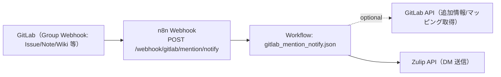

# OQ（運用適格性確認）: GitLab Mention Notify

## 目的

GitLab の webhook 受信から、Zulip DM 通知までの外部接続（GitLab→n8n、n8n→GitLab API、n8n→Zulip API）を再現性のある方法で確認します。

## 構成図（Mermaid / 現行実装）



## 接続パターン（外部アクセス）

- GitLab → n8n Webhook: `POST /webhook/gitlab/mention/notify`
- n8n → GitLab API: 追加情報/マッピング取得（任意）
- n8n → Zulip API: DM 送信

## 前提

- n8n に次のワークフローが同期済みであること
  - `apps/itsm_core/gitlab_mention_notify/workflows/gitlab_mention_notify.json`
- 環境変数（`apps/itsm_core/gitlab_mention_notify/README.md` 記載）が設定済みであること
  - `GITLAB_WEBHOOK_SECRET` が未設定の場合、Webhook は `424`（`missing`）で fail-fast します

## OQ ケース（接続パターン別）

| case_id | 接続パターン | 実行内容 | 期待結果 |
| --- | --- | --- | --- |
| OQ-GMN-001 | GitLab → n8n | GitLab の webhook テスト送信 | `2xx` 応答、n8n 実行ログが残る |
| OQ-GMN-002 | GitLab → n8n | Secret 不一致で送信 | `401`（n8n が応答した場合）。経路上の WAF/リバースプロキシ等で遮断される場合は `403` も許容 |
| OQ-GMN-003 | n8n → GitLab API | マッピング取得を有効化（`GITLAB_TOKEN` など） | GitLab API の `200`、マッピングが反映 |
| OQ-GMN-004 | n8n → Zulip API | Zulip 送信を有効化（`GITLAB_MENTION_NOTIFY_DRY_RUN=false`） | DM が投稿される |

## 実行手順（例）

1. GitLab 側の webhook で「Test」送信を行い、`/webhook/gitlab/mention/notify` に届くことを確認する。
2. `OQ-GMN-002` は、Secret を意図的に変えて `401` を確認する（経路上の遮断で `403` の場合もある）。
3. `OQ-GMN-003` は、`GITLAB_TOKEN` と `GITLAB_MENTION_MAPPING_PATH` を設定し、n8n 実行ログにマッピング取得の成功が残ることを確認する。
4. `OQ-GMN-004` は、Zulip の DM に通知が届くことを確認する（検証だけなら `GITLAB_MENTION_NOTIFY_DRY_RUN=true`）。

## 証跡（evidence）

- n8n 実行ログ（`ok`, `status_code`, `results`）
- GitLab webhook のテスト送信ログ（GitLab UI）
- GitLab API の 200 応答（n8n 実行詳細）
- Zulip DM の投稿ログ（UI または Bot API レスポンス）

<!-- OQ_SCENARIOS_BEGIN -->
## OQ シナリオ（詳細）

このセクションは同一ディレクトリ内の `oq_*.md` から自動生成されます（更新: `scripts/generate_oq_md.sh`）。
個別シナリオを追加/修正した場合は、まず `oq_*.md` を更新し、最後に本スクリプトで `oq.md` を更新してください。

### 一覧
- [oq_gitlab_mention_deploy_and_webhook_setup.md](oq_gitlab_mention_deploy_and_webhook_setup.md)
- [oq_gitlab_mention_dry_run_and_run_oq.md](oq_gitlab_mention_dry_run_and_run_oq.md)
- [oq_gitlab_mention_false_positive_filter.md](oq_gitlab_mention_false_positive_filter.md)
- [oq_gitlab_mention_issue_event.md](oq_gitlab_mention_issue_event.md)
- [oq_gitlab_mention_mapping_and_unmapped.md](oq_gitlab_mention_mapping_and_unmapped.md)
- [oq_gitlab_mention_note_event.md](oq_gitlab_mention_note_event.md)
- [oq_gitlab_mention_push_markdown_fetch.md](oq_gitlab_mention_push_markdown_fetch.md)
- [oq_gitlab_mention_webhook_secret.md](oq_gitlab_mention_webhook_secret.md)
- [oq_gitlab_mention_wiki_event.md](oq_gitlab_mention_wiki_event.md)
- [oq_usecase_coverage.md](oq_usecase_coverage.md)

---

### OQ: GitLab Mention Notify - デプロイ（ワークフロー同期・Webhook 登録）（source: `oq_gitlab_mention_deploy_and_webhook_setup.md`）

#### 対象

- アプリ: `apps/itsm_core/gitlab_mention_notify`
- スクリプト:
  - `apps/itsm_core/gitlab_mention_notify/scripts/deploy_workflows.sh`
  - `apps/itsm_core/gitlab_mention_notify/scripts/setup_gitlab_group_webhook.sh`

#### 受け入れ基準

- `deploy_workflows.sh` により n8n Public API にワークフローを同期できる（`DRY_RUN=true` の差分確認も可能）
- 必要に応じて `setup_gitlab_group_webhook.sh` により GitLab グループ Webhook（Push/Issue/Note/Wiki）を登録/更新できる

#### テストケース

##### TC-01: ワークフロー同期（dry-run）

- 実行: `DRY_RUN=true apps/itsm_core/gitlab_mention_notify/scripts/deploy_workflows.sh`
- 期待: 同期対象の差分/予定内容が出力される

##### TC-02: グループ webhook 登録（dry-run）

- 実行: `DRY_RUN=true apps/itsm_core/gitlab_mention_notify/scripts/setup_gitlab_group_webhook.sh`
- 期待: 登録/更新予定が出力される

#### 証跡（evidence）

- スクリプト実行ログ（dry-run の出力）
- n8n 側のワークフロー状態
- GitLab 側の webhook 設定


---

### OQ: GitLab Mention Notify - DRY_RUN と OQ 実行（再現性のある検証）（source: `oq_gitlab_mention_dry_run_and_run_oq.md`）

#### 対象

- アプリ: `apps/itsm_core/gitlab_mention_notify`
- ワークフロー: `apps/itsm_core/gitlab_mention_notify/workflows/gitlab_mention_notify.json`
- スクリプト: `apps/itsm_core/gitlab_mention_notify/scripts/run_oq.sh`

#### 受け入れ基準

- `GITLAB_MENTION_NOTIFY_DRY_RUN=true` で Zulip 送信を抑止しつつ、抽出/宛先解決/整形の確認ができる
- `apps/itsm_core/gitlab_mention_notify/scripts/run_oq.sh` により、webhook 疎通（OQ）を再現性のある手順で確認できる

#### テストケース

##### TC-01: dry-run で結果確認

- 前提: `GITLAB_MENTION_NOTIFY_DRY_RUN=true`
- 実行: webhook へテスト payload を送信
- 期待:
  - `results[].dry_run=true` が返る
  - Zulip への送信が行われない

##### TC-02: run_oq.sh で OQ 実行

- 実行: `apps/itsm_core/gitlab_mention_notify/scripts/run_oq.sh`
- 期待: 実行ログにより、疎通確認が再現性をもって行える

#### 証跡（evidence）

- dry-run 応答 JSON
- run_oq.sh の実行ログ


---

### OQ: GitLab Mention Notify - メンション抽出の誤検出防止（source: `oq_gitlab_mention_false_positive_filter.md`）

#### 対象

- アプリ: `apps/itsm_core/gitlab_mention_notify`
- ワークフロー: `apps/itsm_core/gitlab_mention_notify/workflows/gitlab_mention_notify.json`
- 参照: `apps/itsm_core/gitlab_mention_notify/data/mention_exclude_words.txt`（運用上の除外語）

#### 受け入れ基準

- コードブロック/インラインコード内の `@` はメンションとして扱わない
- メールアドレス/URL の一部はメンションとして扱わない
- `@group/subgroup` 形式はメンションとして扱わない
- 除外語（`all,group,here,channel,everyone` など）はメンションとして扱わない

#### テストケース

##### TC-01: コードブロック/インラインコードは除外

- 入力例:
  - ```\ncode @someone\n```
  - `` `@someone` ``
- 期待: `@someone` が `mentions` に含まれない

##### TC-02: メールアドレス/URL は除外

- 入力例:
  - `foo@bar.com`
  - `https://example.com/@someone`
- 期待: `@someone` が `mentions` に含まれない

##### TC-03: @group/subgroup 形式は除外

- 入力例: `@group/subgroup`
- 期待: `@group` が `mentions` に含まれない

##### TC-04: 除外語は除外

- 入力例: `@all @group @here @channel @everyone`
- 期待: `mentions=[]`

#### 証跡（evidence）

- dry-run（`GITLAB_MENTION_NOTIFY_DRY_RUN=true`）時の応答（`mentions`, `unmapped`, `results`）


---

### OQ: GitLab Mention Notify - Issue event（Issue 本文/タイトルの @メンション通知）（source: `oq_gitlab_mention_issue_event.md`）

#### 対象

- アプリ: `apps/itsm_core/gitlab_mention_notify`
- ワークフロー: `apps/itsm_core/gitlab_mention_notify/workflows/gitlab_mention_notify.json`
- Webhook: `POST /webhook/gitlab/mention/notify`

#### 受け入れ基準

- GitLab の Issue event を受信できる
- Issue の本文/タイトルから `@username` を抽出し、対応表に基づいて Zulip DM へ通知できる

#### テストケース

##### TC-01: Issue 本文の @username を DM 通知

- 前提: 対応表・Zulip 接続用 env が設定済み
- 実行: Issue の本文に `@username` を含めて作成/更新
- 期待: 対象ユーザーへ Zulip DM が送信される

#### 証跡（evidence）

- n8n 実行ログ
- Zulip DM の受信ログ/画面


---

### OQ: GitLab Mention Notify - 宛先解決（対応表 + unmapped）（source: `oq_gitlab_mention_mapping_and_unmapped.md`）

#### 対象

- アプリ: `apps/itsm_core/gitlab_mention_notify`
- ワークフロー: `apps/itsm_core/gitlab_mention_notify/workflows/gitlab_mention_notify.json`
- 対応表: `docs/mention_user_mapping.md`（GitLab 側の正）

#### 受け入れ基準

- 対応表から宛先（Zulip user_id または email）を解決できる
- 対応表に無い `@username` は通知せず、`unmapped` として結果/ログに残す

#### テストケース

##### TC-01: mapped は通知、unmapped は通知しない

- 前提:
  - `@mapped_user` は対応表に登録済み
  - `@unknown_user` は対応表に未登録
  - `GITLAB_MENTION_NOTIFY_DRY_RUN=true`（検証時）
- 実行: 同一本文に `@mapped_user @unknown_user` を含めて webhook を送信
- 期待:
  - `mentions` に両方が含まれる
  - `unmapped` に `@unknown_user` が含まれる
  - 通知対象（results）には `mapped_user` のみが含まれる

#### 証跡（evidence）

- 応答 JSON（`mentions`, `unmapped`, `results`）


---

### OQ: GitLab Mention Notify - Note event（コメントの @メンション通知）（source: `oq_gitlab_mention_note_event.md`）

#### 対象

- アプリ: `apps/itsm_core/gitlab_mention_notify`
- ワークフロー: `apps/itsm_core/gitlab_mention_notify/workflows/gitlab_mention_notify.json`
- Webhook: `POST /webhook/gitlab/mention/notify`

#### 受け入れ基準

- GitLab の Note event（Issue コメント等）を受信できる
- 本文から `@username` を抽出し、対応表に基づいて Zulip DM（または指定宛先）へ通知できる

#### テストケース

##### TC-01: コメント本文の @username を DM 通知

- 前提:
  - GitLab webhook が Note event を送るよう設定済み
  - 対応表（`docs/mention_user_mapping.md` 等）に `username` が登録済み
  - Zulip 接続用 env（`ZULIP_BASE_URL`, `ZULIP_BOT_EMAIL`, `ZULIP_BOT_API_KEY`）が設定済み
- 実行: Issue コメントに `@username` を含めて投稿
- 期待:
  - 対象ユーザーへ Zulip DM が送信される
  - 応答に `mentions`, `sent`, `unmapped` が含まれる

#### 証跡（evidence）

- n8n 実行ログ（抽出・宛先解決・Zulip 送信）
- Zulip DM の受信ログ/画面


---

### OQ: GitLab Mention Notify - Push event（.md 変更の @メンション通知）（source: `oq_gitlab_mention_push_markdown_fetch.md`）

#### 対象

- アプリ: `apps/itsm_core/gitlab_mention_notify`
- ワークフロー: `apps/itsm_core/gitlab_mention_notify/workflows/gitlab_mention_notify.json`
- Webhook: `POST /webhook/gitlab/mention/notify`

#### 受け入れ基準

- GitLab の Push event を受信できる
- `.md` の変更を検知し、必要に応じて GitLab API からファイル本文を取得して `@username` を抽出できる
- 対象ファイル取得は `GITLAB_MAX_FILES` 上限内で行われる
- 対応表に基づいて Zulip DM へ通知できる

#### テストケース

##### TC-01: .md の変更で本文取得→メンション抽出→通知

- 前提:
  - GitLab API 接続用 env（`GITLAB_API_BASE_URL`, `GITLAB_TOKEN`）が設定済み
  - `.md` の変更を含む push を発生させる
- 実行: `.md` に `@username` を含めて push
- 期待: 対象ユーザーへ Zulip DM が送信される

##### TC-02: 変更ファイルが上限を超える場合に上限で打ち切る

- 前提: `GITLAB_MAX_FILES=1`
- 実行: 2 ファイル以上の `.md` 変更を含む push を送る
- 期待: 取得・解析対象が 1 ファイルに制限される

#### 証跡（evidence）

- n8n 実行ログ（GitLab API のファイル取得）
- Zulip DM の受信ログ/画面


---

### OQ: GitLab Mention Notify - セキュリティ（Webhook Secret 検証）（source: `oq_gitlab_mention_webhook_secret.md`）

#### 対象

- アプリ: `apps/itsm_core/gitlab_mention_notify`
- ワークフロー: `apps/itsm_core/gitlab_mention_notify/workflows/gitlab_mention_notify.json`

#### 受け入れ基準

- `GITLAB_WEBHOOK_SECRET` が設定されている場合、`X-Gitlab-Token`（`x-gitlab-token`）が不一致のリクエストを拒否する
- 拒否時は Zulip への通知を行わない
  - 注: n8n の手前（WAF/リバースプロキシ等）で遮断される構成では `403` が返る可能性がある。その場合は n8n に到達していないため、アクセス制御層のログで拒否を確認する
- `GITLAB_WEBHOOK_SECRET` が未設定の場合は `424`（`missing=["GITLAB_WEBHOOK_SECRET"]`）で fail-fast し、通知も行わない

#### テストケース

##### TC-01: token 不一致で拒否

- 前提: `GITLAB_WEBHOOK_SECRET` が設定済み
- 実行: token を不一致にして webhook を送信
- 期待:
  - `ok=false`, `status_code=401`
  - Zulip へ通知されない

#### 証跡（evidence）

- 応答 JSON（`status_code=401`）

---

### OQ: GitLab Mention Notify - Wiki page event（Wiki の @メンション通知）（source: `oq_gitlab_mention_wiki_event.md`）

#### 対象

- アプリ: `apps/itsm_core/gitlab_mention_notify`
- ワークフロー: `apps/itsm_core/gitlab_mention_notify/workflows/gitlab_mention_notify.json`
- Webhook: `POST /webhook/gitlab/mention/notify`

#### 受け入れ基準

- GitLab の Wiki page event（作成/更新/削除）を受信できる
- Wiki の本文/タイトルから `@username` を抽出し、対応表に基づいて Zulip DM へ通知できる

#### テストケース

##### TC-01: Wiki の @username を DM 通知

- 前提: 対応表・Zulip 接続用 env が設定済み
- 実行: Wiki ページの本文/タイトルに `@username` を含めて作成/更新
- 期待: 対象ユーザーへ Zulip DM が送信される

#### 証跡（evidence）

- n8n 実行ログ
- Zulip DM の受信ログ/画面


---

### OQ: ユースケース別カバレッジ（gitlab_mention_notify）（source: `oq_usecase_coverage.md`）

#### 目的

`apps/itsm_core/gitlab_mention_notify/docs/app_requirements.md` に列挙したユースケース（SSoT: `scripts/itsm/gitlab/templates/*-management/docs/usecases/`）について、**OQ としての実施シナリオが存在する**ことを保証する。

#### 対象

- アプリ: `apps/itsm_core/gitlab_mention_notify`
- OQ 正: `apps/itsm_core/gitlab_mention_notify/docs/oq/oq.md`

#### ユースケース別 OQ シナリオ

##### 12_incident_management（12. インシデント管理）

- SSoT: `scripts/itsm/gitlab/templates/service-management/docs/usecases/12_incident_management.md.tpl`
- 実施:
  - `oq_gitlab_mention_issue_event.md`
  - `oq_gitlab_mention_note_event.md`
- 受け入れ基準:
  - 重要な @mention の見落としを抑止できる（イベント別に検出/通知が成立）
- 証跡:
  - n8n 応答/実行ログ、Zulip 通知（または dry-run 結果）

##### 14_knowledge_management（14. ナレッジ管理）

- SSoT: `scripts/itsm/gitlab/templates/service-management/docs/usecases/14_knowledge_management.md.tpl`
- 実施:
  - `oq_gitlab_mention_wiki_event.md`
  - `oq_gitlab_mention_push_markdown_fetch.md`
- 受け入れ基準:
  - Wiki/Markdown 等の更新に対する到達性を確保できる
- 証跡:
  - 通知内容（リンク/本文の取得結果）

##### 21_devops（21. DevOps（開発と運用の連携））

- SSoT: `scripts/itsm/gitlab/templates/technical-management/docs/usecases/21_devops.md.tpl`
- 実施:
  - `oq_gitlab_mention_push_markdown_fetch.md`
  - `oq_gitlab_mention_deploy_and_webhook_setup.md`
- 受け入れ基準:
  - 開発/運用の議論が途切れず、Webhook/同期が運用できる
- 証跡:
  - 同期/設定ログ、通知ログ

##### 22_automation（22. 自動化）

- SSoT: `scripts/itsm/gitlab/templates/technical-management/docs/usecases/22_automation.md.tpl`
- 実施:
  - `oq_gitlab_mention_deploy_and_webhook_setup.md`
  - `oq_gitlab_mention_dry_run_and_run_oq.md`
- 受け入れ基準:
  - ワークフロー同期と OQ 実行が再現可能である
- 証跡:
  - 同期ログ、OQ evidence

##### 30_developer_experience（30. 開発者体験（Developer Experience））

- SSoT: `scripts/itsm/gitlab/templates/technical-management/docs/usecases/30_developer_experience.md.tpl`
- 実施:
  - `oq_gitlab_mention_mapping_and_unmapped.md`
  - `oq_gitlab_mention_false_positive_filter.md`
- 受け入れ基準:
  - 過通知/誤通知を抑制しつつ、必要な通知が届く
- 証跡:
  - ルール適用結果ログ（skipped/filtered の理由が追える）


---
<!-- OQ_SCENARIOS_END -->
