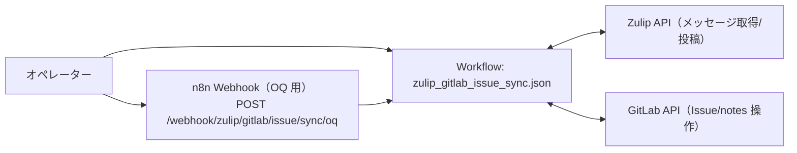

# OQ（運用適格性確認）: Zulip GitLab Issue Sync

## 目的

Zulip↔GitLab の Issue/コメント同期が成立し、結果が Zulip へ通知されることを確認します。

## 構成図（Mermaid / 現行実装）

## 前提

- n8n に次のワークフローが同期済みであること
  - `apps/itsm_core/zulip_gitlab_issue_sync/workflows/zulip_gitlab_issue_sync.json`
- 連携用の環境変数（Zulip/GitLab など）が設定済みであること
- 同期対象の Zulip stream/topic に投稿が存在すること
  - ボット投稿のみの場合、通常は同期がスキップされます
  - ただし `/oq-seed` または `/decision` で始まる投稿はボット投稿でも同期対象になります（OQ 実行用の例外）
  - ローカル実行でテスト投稿を用意する場合は `apps/itsm_core/zulip_gitlab_issue_sync/scripts/run_oq.sh --prepare-test-user --prepare-decision` を使用（realm bot で `/oq-seed` と `/decision` を投稿します）

## OQ ケース

| case_id | 実行内容 | 期待結果 |
| --- | --- | --- |
| OQ-ZGIS-001 | `Zulip GitLab Issue Sync` を n8n から手動実行（または `apps/itsm_core/zulip_gitlab_issue_sync/scripts/run_oq.sh` で直近の実行結果を確認） | Issue/コメント同期が成功し、結果が Zulip へ通知される |

## 証跡（evidence）

- n8n 実行ログ（Zulip/GitLab API の成功）
- GitLab Issue / コメントの差分（作成/更新のログ）
- Zulip の通知投稿ログ（対象 stream/topic/DM）

<!-- OQ_SCENARIOS_BEGIN -->
## OQ シナリオ（詳細）

このセクションは同一ディレクトリ内の `oq_*.md` から自動生成されます（更新: `scripts/generate_oq_md.sh`）。
個別シナリオを追加/修正した場合は、まず `oq_*.md` を更新し、最後に本スクリプトで `oq.md` を更新してください。

### 一覧
- [oq_usecase_coverage.md](oq_usecase_coverage.md)
- [oq_zulip_gitlab_issue_sync_sync.md](oq_zulip_gitlab_issue_sync_sync.md)

---

### OQ: ユースケース別カバレッジ（zulip_gitlab_issue_sync）（source: `oq_usecase_coverage.md`）

#### 目的

`apps/itsm_core/zulip_gitlab_issue_sync/docs/app_requirements.md` に列挙したユースケース（SSoT: `scripts/itsm/gitlab/templates/*-management/docs/usecases/`）について、**OQ としての実施シナリオが存在する**ことを保証する。

#### 対象

- アプリ: `apps/itsm_core/zulip_gitlab_issue_sync`
- 主要 OQ シナリオ:
  - `oq_zulip_gitlab_issue_sync_sync.md`

#### ユースケース別 OQ シナリオ

##### 12_incident_management（12. インシデント管理）

- SSoT: `scripts/itsm/gitlab/templates/service-management/docs/usecases/12_incident_management.md.tpl`
- 実施:
  - `oq_zulip_gitlab_issue_sync_sync.md`（TC-01: 手動同期）
- 受け入れ基準:
  - 会話→Issue の往復が成立し、初動が遅延しない
- 証跡:
  - Zulip 投稿/通知、GitLab Issue/コメント差分

##### 14_knowledge_management（14. ナレッジ管理）

- SSoT: `scripts/itsm/gitlab/templates/service-management/docs/usecases/14_knowledge_management.md.tpl`
- 実施:
  - `oq_zulip_gitlab_issue_sync_sync.md`（TC-02: 決定メッセージの証跡化）
- 受け入れ基準:
  - 決定が証跡として GitLab に残り、参照可能である
- 証跡:
  - GitLab コメント（決定ログ）、Zulip 側の通知

##### 09_change_decision（9. 変更判断）

- SSoT: `scripts/itsm/gitlab/templates/general-management/docs/usecases/09_change_decision.md.tpl`
- 実施:
  - `oq_zulip_gitlab_issue_sync_sync.md`（TC-02/03: 決定の相互通知）
- 受け入れ基準:
  - Zulip/GitLab のいずれに書いた決定も、相手側へ通知され証跡が残る
- 証跡:
  - Zulip 通知、GitLab コメント

##### 21_devops（21. DevOps（開発と運用の連携））

- SSoT: `scripts/itsm/gitlab/templates/technical-management/docs/usecases/21_devops.md.tpl`
- 実施:
  - `oq_zulip_gitlab_issue_sync_sync.md`（TC-01: 手動同期）
- 受け入れ基準:
  - 作業管理と会話が分断されない（同期が成立する）
- 証跡:
  - 同期の差分ログ

##### 22_automation（22. 自動化）

- SSoT: `scripts/itsm/gitlab/templates/technical-management/docs/usecases/22_automation.md.tpl`
- 実施:
  - `oq_zulip_gitlab_issue_sync_sync.md`（`apps/itsm_core/zulip_gitlab_issue_sync/scripts/run_oq.sh` または n8n 手動実行）
- 受け入れ基準:
  - 再現可能な手順で同期を実行できる
- 証跡:
  - n8n 実行ログ、Zulip/GitLab の結果

---

### OQ: Zulip↔GitLab Issue 同期（Zulip GitLab Issue Sync）（source: `oq_zulip_gitlab_issue_sync_sync.md`）

#### 対象

- アプリ: `apps/itsm_core/zulip_gitlab_issue_sync`
- ワークフロー: `apps/itsm_core/zulip_gitlab_issue_sync/workflows/zulip_gitlab_issue_sync.json`
- 実行方法: n8n 手動実行、または `apps/itsm_core/zulip_gitlab_issue_sync/scripts/run_oq.sh`

#### 受け入れ基準

- Zulip 側の投稿/スレッドと GitLab Issue/コメントが同期される（作成/更新/クローズ等の差分が反映される）
- 決定メッセージ（例: `/decision`）が GitLab Issue に「決定（Zulip）」として証跡記録される
- GitLab 側の決定（例: `[DECISION]` / `決定:`）が Zulip の該当トピックへ通知される
- 同期結果（サマリ）が Zulip へ通知される
- 実行結果として `ok=true` 相当の完了（ワークフロー失敗で終了しない）となる

#### テストケース

##### TC-01: 手動同期（OQ）

- 前提:
  - `apps/itsm_core/zulip_gitlab_issue_sync/workflows/zulip_gitlab_issue_sync.json` が n8n に同期済み
  - Zulip/GitLab の接続用環境変数が設定済み
  - 同期対象の stream/topic に、ボット以外の投稿が存在する（ボット投稿のみの場合はスキップされる）
- 実行:
  - n8n から `Zulip GitLab Issue Sync` を手動実行（または `apps/itsm_core/zulip_gitlab_issue_sync/scripts/run_oq.sh` を実行して直近の実行結果を確認）
- 期待:
  - GitLab 側で Issue/コメントの作成/更新が行われる（必要な差分があれば）
  - Zulip 側へ結果が投稿される（対象 stream/topic/DM のいずれか）
  - n8n 実行が失敗終了しない

##### TC-02: 決定メッセージの証跡化（OQ）

- 前提:
  - TC-01 と同じ
  - 同期対象の topic に対し、決定メッセージ（例: `/decision ...`）が投稿できる
- 実行:
  - Zulip に `/decision 決定内容...` を投稿（同一 topic）
  - n8n から `Zulip GitLab Issue Sync` を手動実行
- 期待:
  - GitLab Issue のコメントに `### 決定（Zulip）` が追記され、Zulip メッセージ URL が含まれる
  - Zulip 側へ「決定をGitLabへ証跡として記録しました」相当の通知が投稿される

##### TC-03: GitLab 決定の Zulip 通知（OQ）

- 前提:
  - `apps/itsm_core/zulip_gitlab_issue_sync/workflows/gitlab_decision_notify.json` が n8n に同期済み
  - GitLab の Group Webhook が `POST /webhook/gitlab/decision/notify` を指し、Issue events / Note events が有効
  - Zulip のトピック URL（`#narrow/stream/.../topic/...`）が GitLab Issue 本文に含まれている（Zulip 起票由来なら通常含まれる）
- 実行:
  - GitLab Issue のコメント先頭に `[DECISION] ...` または `決定: ...` を投稿
- 期待:
  - Zulip の該当 stream/topic へ「GitLab で決定が記載されました」相当の通知が投稿される

#### 証跡（evidence）

- n8n 実行ログ（Zulip/GitLab API 呼び出しの成功/失敗）
- GitLab Issue/コメントの差分（作成/更新/クローズ等）
- Zulip 側の通知投稿（投稿先・内容の確認）

---
<!-- OQ_SCENARIOS_END -->
