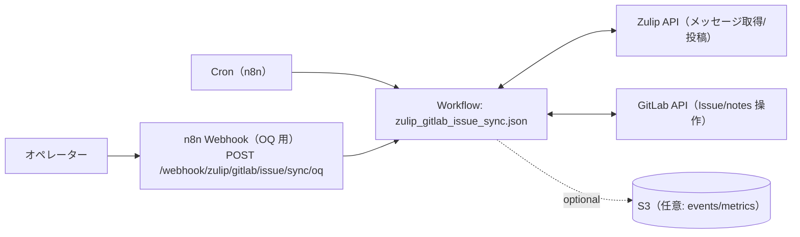

# コンピュータ化システムバリデーション（CSV）
## 最小ドキュメントセット
### Zulip GitLab Issue Sync（n8n） / GAMP® 5 第2版（2022, CSA ベース, IQ/oq/PQ を含む）

---

## 1. CSV / CSA ポリシー
**目的**
`apps/README.md` の共通フォーマットに従い、リスクベース（CSA）で最小限の成果物として本 README と検証証跡を維持する。

**内容**
- 本アプリの仕様・運用・検証の入口を README に集約し、詳細は `apps/zulip_gitlab_issue_sync/docs/oq/` / `apps/zulip_gitlab_issue_sync/scripts/` を参照する。
- 秘密情報（Zulip/GitLab/AWS 等のトークン類）は tfvars に平文で置かず、SSM/Secrets Manager → n8n 環境変数注入を前提とする。

---

## 2. バリデーション計画（VP）
**目的**
対象範囲（スコープ）と検証戦略を定義する。

**内容**
- システム名: Zulip GitLab Issue Sync
- 対象: Zulip の投稿/スレッドを GitLab Issue/コメントへ同期し、結果を Zulip へ通知する n8n ワークフロー
- 非対象: Zulip/GitLab 自体の製品バリデーション、ネットワーク/認証基盤（Terraform/IaC 側）全般
- バリデーション成果物（最小）:
  - 本 README
  - OQ 文書: `apps/zulip_gitlab_issue_sync/docs/oq/oq.md` および `apps/zulip_gitlab_issue_sync/docs/oq/oq_*.md`（整備: `scripts/generate_oq_md.sh`）
  - OQ 実行補助: `apps/zulip_gitlab_issue_sync/scripts/run_oq.sh`

---

## 3. 意図した使用（Intended Use）とシステム概要
**目的**
Zulip の会話（顧客要求/対応履歴）と GitLab Issue（記録/作業管理）を同期し、「会話→Issue」「Issue→会話」の往復を成立させる。

**内容**
- Intended Use（意図した使用）
  - Zulip の対象 stream/topic を入力として、GitLab Issue の作成/更新/クローズ/再オープンを行い、結果を Zulip へ通知する。
  - （任意）S3 へイベント/メトリクスをエクスポートし、日次の振り返り等に利用できる形にする。
- 高レベル構成
  - n8n（Cron / Webhook）→ Zulip API / GitLab API →（同期結果通知）→ Zulip
  - （任意）→ S3
- スケジュール（既定）
  - `apps/zulip_gitlab_issue_sync/workflows/zulip_gitlab_issue_sync.json` の Cron で定期実行（既定: every minute）
- Webhook（OQ）
  - n8n の Webhook ベース URL を `https://n8n.example.com/webhook` とした場合:
    - OQ: `POST /webhook/zulip/gitlab/issue/sync/oq`

### 構成図（Mermaid / 現行実装）



### 接続通信表（Zulip GitLab Issue Sync ⇄ ソース）
#### Zulip GitLab Issue Sync → ソース名（送信/参照）
| ソース名 | 主目的 | 方式/エンドポイント例 | 認証（例） | 伝達内容（サマリ） |
|---|---|---|---|---|
| `zulip` | 投稿の取得/通知 | Zulip API（例: `GET /api/v1/messages`, `POST /api/v1/messages`） | Bot のメール+APIキー | 対象 stream/topic の投稿取得、同期結果通知 |
| `gitlab` | Issue/コメントの作成/更新 | GitLab API（Issue/notes 等） | API token | Issue 作成、ラベル制御、コメント同期 |
| `s3` | イベント/メトリクス出力（任意） | S3 PutObject | AWS credential | events/metrics の JSONL/JSON 出力 |

#### ソース名 → Zulip GitLab Issue Sync（受信）
| ソース名 | 方式/エンドポイント例 | 認証/検証（例） | 伝達内容（サマリ） |
|---|---|---|---|
| `scheduler` | Cron（n8n 内部） | なし | 定期同期の起動トリガ |
| `client` | `POST /webhook/zulip/gitlab/issue/sync/oq` | なし（運用で制御） | 手動実行（OQ） |

### ディレクトリ構成
- `apps/zulip_gitlab_issue_sync/workflows/`: n8n ワークフロー（JSON）
- `apps/zulip_gitlab_issue_sync/scripts/`: n8n 同期（アップロード）・OQ 実行スクリプト
- `apps/zulip_gitlab_issue_sync/docs/cs/`: CS（Configuration Specification: 設計・構成定義）
- `apps/zulip_gitlab_issue_sync/docs/oq/`: OQ（運用適格性確認）

### 同期（n8n Public API へ upsert）
```bash
apps/zulip_gitlab_issue_sync/scripts/deploy_workflows.sh
```

**必須（同期を実行する場合）**
- `N8N_API_KEY`（未指定なら `terraform output -raw n8n_api_key`）

---

## 4. GxP 影響評価とリスクアセスメント
**目的**
患者安全・製品品質・データ完全性の観点で、重大なリスクのみを識別し、対策を明記する。

**内容（例: critical のみ）**
- 誤同期（誤った stream/topic を別 Issue に反映）→ stream 名/ID の制約、ラベル/状態のルール化、OQ で検証
- なりすまし/誤操作（強い権限トークンの誤用）→ 必要最小権限の token、運用環境の分離、証跡保存
- データ欠落（同期漏れ）→ アンカー/差分の扱いをルール化し、OQ ケースで確認

---

## 5. 検証戦略（Verification Strategy）
**目的**
Intended Use に適合することを、最小の検証で示す。

**内容**
- OQ を中心に、Zulip 取得→ GitLab 反映→ Zulip 通知（＋任意 S3 出力）の成立を確認する。
- 代表ケースは `apps/zulip_gitlab_issue_sync/docs/oq/oq.md` と個別 OQ 文書で定義する。

---

## 6. 設置時適格性確認（IQ）
**目的**
対象環境にワークフローが正しく設置されていることを確認する。

**文書/手順（最小）**
- 同期: `apps/zulip_gitlab_issue_sync/scripts/deploy_workflows.sh`（`DRY_RUN=true` で差分確認）

---

## 7. 運転時適格性確認（OQ）
**目的**
重要機能（同期の正しさ、状態/ラベル制御、通知、エクスポート）が意図どおり動作することを確認する。

**文書**
- `apps/zulip_gitlab_issue_sync/docs/oq/oq.md`（`oq_*.md` から生成）
- 個別シナリオ: `apps/zulip_gitlab_issue_sync/docs/oq/oq_*.md`

**実行**
- `apps/zulip_gitlab_issue_sync/scripts/run_oq.sh`

補足:
- OQ 実行前に `scripts/generate_oq_md.sh --app apps/zulip_gitlab_issue_sync` を実行し、`oq.md` の生成領域を最新化する

---

## 8. 稼働性能適格性確認（PQ）
**目的**
投稿量・同期頻度・外部 API 制約に対する成立性を確認する。

**文書/方針（最小）**
- 本アプリ固有の PQ 文書は現状未整備（N/A）。
- 性能評価はプラットフォーム（n8n/ECS/外部API）の監視・ログで代替する。

---

## 9. バリデーションサマリレポート（VSR）
**目的**
本アプリのバリデーション結論を最小で残す。

**内容（最小）**
- 実施した OQ の一覧、結果サマリ、逸脱と対処、運用開始可否の判断
- 証跡は `evidence/` 配下に日付付きで保存する（例: `evidence/oq/zulip_gitlab_issue_sync_YYYYMMDD.../`）

---

## 10. 継続的保証（運用フェーズ）
**目的**
バリデート状態を維持する。

**内容**
- 変更は Git の差分 + OQ 再実施（必要最小限）で追跡する（変更管理は `docs/change-management.md` を参照）。
- ラベル/状態制御の変更は同期結果に直結するため、OQ を再実施し、必要に応じてアンカー/過去データの見直しを行う。
