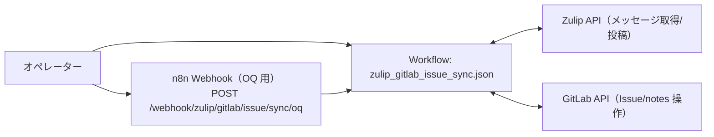

# OQ（運用適格性確認）: Zulip GitLab Issue Sync

## 目的

Zulip↔GitLab の Issue/コメント同期が成立し、結果が Zulip へ通知されることを確認します。

## 構成図（Mermaid / 現行実装）

## 前提

- n8n に次のワークフローが同期済みであること
  - `apps/zulip_gitlab_issue_sync/workflows/zulip_gitlab_issue_sync.json`
- 連携用の環境変数（Zulip/GitLab など）が設定済みであること
- 同期対象の Zulip stream/topic に投稿が存在すること
  - ボット投稿のみの場合、通常は同期がスキップされます
  - ただし `/oq-seed` で始まる投稿はボット投稿でも同期対象になります（OQ 実行用の例外）
  - ローカル実行でテスト投稿を用意する場合は `apps/zulip_gitlab_issue_sync/scripts/run_oq.sh --prepare-test-user` を使用（realm bot で `/oq-seed` 投稿を行います）

## OQ ケース

| case_id | 実行内容 | 期待結果 |
| --- | --- | --- |
| OQ-ZGIS-001 | `Zulip GitLab Issue Sync` を n8n から手動実行（または `scripts/run_oq.sh` で直近の実行結果を確認） | Issue/コメント同期が成功し、結果が Zulip へ通知される |

## 証跡（evidence）

- n8n 実行ログ（Zulip/GitLab API の成功）
- GitLab Issue / コメントの差分（作成/更新のログ）
- Zulip の通知投稿ログ（対象 stream/topic/DM）

<!-- OQ_SCENARIOS_BEGIN -->
## OQ シナリオ（詳細）

このセクションは `docs/oq/oq_*.md` から自動生成されます（更新: `scripts/generate_oq_md.sh`）。
個別シナリオを追加/修正した場合は、まず `oq_*.md` を更新し、最後に本スクリプトで `oq.md` を更新してください。

### 一覧
- [oq_zulip_gitlab_issue_sync_sync.md](oq_zulip_gitlab_issue_sync_sync.md)

---

### OQ: Zulip↔GitLab Issue 同期（Zulip GitLab Issue Sync）（source: `oq_zulip_gitlab_issue_sync_sync.md`）

#### 対象

- アプリ: `apps/zulip_gitlab_issue_sync`
- ワークフロー: `apps/zulip_gitlab_issue_sync/workflows/zulip_gitlab_issue_sync.json`
- 実行方法: n8n 手動実行、または `apps/zulip_gitlab_issue_sync/scripts/run_oq.sh`

#### 受け入れ基準

- Zulip 側の投稿/スレッドと GitLab Issue/コメントが同期される（作成/更新/クローズ等の差分が反映される）
- 同期結果（サマリ）が Zulip へ通知される
- 実行結果として `ok=true` 相当の完了（ワークフロー失敗で終了しない）となる

#### テストケース

##### TC-01: 手動同期（OQ）

- 前提:
  - `apps/zulip_gitlab_issue_sync/workflows/zulip_gitlab_issue_sync.json` が n8n に同期済み
  - Zulip/GitLab の接続用環境変数が設定済み
  - 同期対象の stream/topic に、ボット以外の投稿が存在する（ボット投稿のみの場合はスキップされる）
- 実行:
  - n8n から `Zulip GitLab Issue Sync` を手動実行（または `apps/zulip_gitlab_issue_sync/scripts/run_oq.sh` を実行して直近の実行結果を確認）
- 期待:
  - GitLab 側で Issue/コメントの作成/更新が行われる（必要な差分があれば）
  - Zulip 側へ結果が投稿される（対象 stream/topic/DM のいずれか）
  - n8n 実行が失敗終了しない

#### 証跡（evidence）

- n8n 実行ログ（Zulip/GitLab API 呼び出しの成功/失敗）
- GitLab Issue/コメントの差分（作成/更新/クローズ等）
- Zulip 側の通知投稿（投稿先・内容の確認）

---
<!-- OQ_SCENARIOS_END -->
