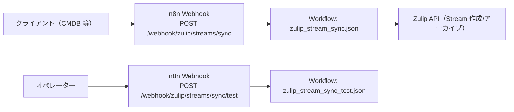

# OQ（運用適格性確認）: Zulip Stream Sync

## 目的

CMDB 等からの入力（Webhook）と、Zulip ストリーム作成/アーカイブの外部接続を確認します。

## 構成図（Mermaid / 現行実装）



## 接続パターン（外部アクセス）

- 入力 → n8n Webhook: `POST /webhook/zulip/streams/sync`
- n8n → Zulip API: Stream 作成/アーカイブ

## 前提

- n8n に次のワークフローが同期済みであること
  - `apps/zulip_stream_sync/workflows/zulip_stream_sync.json`
  - `apps/zulip_stream_sync/workflows/zulip_stream_sync_test.json`
- 環境変数（`apps/zulip_stream_sync/README.md` 記載）は、Zulip API へ実際に作成/アーカイブを行う場合に設定済みであること
  - 例外: `dry_run=true`（入力）または `ZULIP_STREAM_SYNC_DRY_RUN=true`（環境変数）の場合、`ZULIP_*` が未設定でも検証（入力チェックのみ）は可能

## OQ ケース（接続パターン別）

| case_id | 接続パターン | 実行内容 | 期待結果 |
| --- | --- | --- | --- |
| OQ-ZSS-001 | 入力 → n8n | `/webhook/zulip/streams/sync/test` を実行（`ZULIP_STREAM_SYNC_TEST_STRICT=true`） | `ok=true`、不足 env が無い |
| OQ-ZSS-002 | n8n → Zulip API | `action=create` で送信 | ストリームが作成される |
| OQ-ZSS-003 | n8n → Zulip API | `action=archive` で送信 | ストリームがアーカイブされる |
| OQ-ZSS-004 | 入力 → n8n | `realm` を切り替えて dry-run で送信 | `realm` と `zulip_base_url` が期待どおり切り替わる |
| OQ-ZSS-005 | 入力 → n8n | 応答の追跡性（`realm`/`zulip_base_url`）を確認 | すべての応答に `realm` と `zulip_base_url` が含まれる |
| OQ-ZSS-006 | 入力 → n8n | dry-run 以外で認証情報不足を発生させる | `ok=false`、`status_code=424`、`missing=[...]` を返し、外部 API を呼ばない |

## 実行手順（例）

> 注意: `apps/zulip_stream_sync/scripts/run_oq.sh` は既定で Webhook を実行します。  
> 外部への HTTP 実行なしで確認したい場合は `--dry-run` を指定してください。

1. `POST /webhook/zulip/streams/sync/test` を実行し、`missing` が空であることを確認する。
2. `POST /webhook/zulip/streams/sync` へ以下の例を送信し、作成/アーカイブが成功することを確認する。

```json
{
  "action": "create",
  "stream_name": "oq-zulip-sync",
  "invite_only": true,
  "dry_run": false
}
```

```json
{
  "action": "archive",
  "stream_name": "oq-zulip-sync",
  "dry_run": false
}
```

## 証跡（evidence）

- `/webhook/zulip/streams/sync/test` の応答 JSON
- n8n 実行ログ（`status_code`, `action`）
- Zulip のストリーム作成/アーカイブ履歴

<!-- OQ_SCENARIOS_BEGIN -->
## OQ シナリオ（詳細）

このセクションは `docs/oq/oq_*.md` から自動生成されます（更新: `scripts/generate_oq_md.sh`）。
個別シナリオを追加/修正した場合は、まず `oq_*.md` を更新し、最後に本スクリプトで `oq.md` を更新してください。

### 一覧
- [oq_zulip_stream_archive.md](oq_zulip_stream_archive.md)
- [oq_zulip_stream_archive_idempotent.md](oq_zulip_stream_archive_idempotent.md)
- [oq_zulip_stream_create.md](oq_zulip_stream_create.md)
- [oq_zulip_stream_create_idempotent.md](oq_zulip_stream_create_idempotent.md)
- [oq_zulip_stream_sync_dry_run.md](oq_zulip_stream_sync_dry_run.md)
- [oq_zulip_stream_sync_env_check_test.md](oq_zulip_stream_sync_env_check_test.md)
- [oq_zulip_stream_sync_input_validation.md](oq_zulip_stream_sync_input_validation.md)
- [oq_zulip_stream_sync_missing_creds_failfast.md](oq_zulip_stream_sync_missing_creds_failfast.md)
- [oq_zulip_stream_sync_realm_routing.md](oq_zulip_stream_sync_realm_routing.md)
- [oq_zulip_stream_sync_response_traceability.md](oq_zulip_stream_sync_response_traceability.md)

---

### OQ: Zulip Stream Sync - ストリームアーカイブ（action=archive）（source: `oq_zulip_stream_archive.md`）

#### 対象

- アプリ: `apps/zulip_stream_sync`
- ワークフロー: `apps/zulip_stream_sync/workflows/zulip_stream_sync.json`
- Webhook: `POST /webhook/zulip/streams/sync`

#### 受け入れ基準

- 入力で `action=archive` を受け取れる
- `stream_name` または `stream_id` をキーに対象ストリームをアーカイブできる
- 成功時は `ok=true` かつ `status_code=200` を返す

#### テストケース

##### TC-01: archive（stream_name 指定）

- 前提:
  - Zulip 接続用 env が設定済み
  - `stream_name=oq-zulip-stream-archive` が存在する（事前に create しておく）
- 実行: `POST /webhook/zulip/streams/sync`（`action=archive`, `stream_name=oq-zulip-stream-archive`）
- 期待:
  - `ok=true`, `status_code=200`
  - `action=archive` が返る
  - Zulip 側でストリームがアーカイブされる

##### TC-02: archive（stream_id 指定）

- 前提:
  - Zulip 接続用 env が設定済み
  - 対象ストリームの `stream_id` が分かっている
- 実行: `POST /webhook/zulip/streams/sync`（`action=archive`, `stream_id=<id>`）
- 期待: TC-01 と同様

#### 証跡（evidence）

- 応答 JSON（`action`, `stream_name`, `stream_id`）
- Zulip 側のアーカイブ状態


---

### OQ: Zulip Stream Sync - アーカイブの冪等性（存在しなければスキップ）（source: `oq_zulip_stream_archive_idempotent.md`）

#### 対象

- アプリ: `apps/zulip_stream_sync`
- ワークフロー: `apps/zulip_stream_sync/workflows/zulip_stream_sync.json`
- Webhook: `POST /webhook/zulip/streams/sync`

#### 受け入れ基準

- `action=archive` で対象ストリームが存在しない場合でも失敗しない
- スキップ時は `skipped=true` かつ `reason=not found` を返す

#### テストケース

##### TC-01: 存在しない stream_name で archive

- 前提: Zulip 接続用 env が設定済み
- 実行: `POST /webhook/zulip/streams/sync`（`action=archive`, `stream_name=oq-zulip-stream-not-exist`）
- 期待:
  - `ok=true`, `status_code=200`
  - `skipped=true`, `reason=not found`

#### 証跡（evidence）

- 応答 JSON（`skipped`, `reason`）


---

### OQ: Zulip Stream Sync - ストリーム作成（action=create）（source: `oq_zulip_stream_create.md`）

#### 対象

- アプリ: `apps/zulip_stream_sync`
- ワークフロー: `apps/zulip_stream_sync/workflows/zulip_stream_sync.json`
- Webhook: `POST /webhook/zulip/streams/sync`

#### 受け入れ基準

- 入力で `action=create` と `stream_name` を受け取れる
- `invite_only` / `description`（別名: `stream_description`）を指定でき、Zulip 側に反映される
- 成功時は `ok=true` かつ `status_code=200` を返す

#### テストケース

##### TC-01: create（通常）

- 前提: Zulip 接続用 env が設定済み（`ZULIP_BASE_URL`, `ZULIP_BOT_EMAIL`, `ZULIP_BOT_API_KEY`）
- 入力例:
  - `action=create`
  - `stream_name=oq-zulip-stream-create`
  - `invite_only=true`
  - `description=OQ test stream`
- 期待:
  - `ok=true`, `status_code=200`
  - `action=create`, `stream_name` が返る
  - Zulip にストリームが作成される

#### 証跡（evidence）

- 応答 JSON（`ok`, `status_code`, `action`, `stream_name`, `stream_id`）
- Zulip 側でストリームが存在すること（UI/ API いずれでも可）


---

### OQ: Zulip Stream Sync - 作成の冪等性（既存ならスキップ）（source: `oq_zulip_stream_create_idempotent.md`）

#### 対象

- アプリ: `apps/zulip_stream_sync`
- ワークフロー: `apps/zulip_stream_sync/workflows/zulip_stream_sync.json`
- Webhook: `POST /webhook/zulip/streams/sync`

#### 受け入れ基準

- `action=create` で対象ストリームが既に存在する場合でも失敗しない
- スキップ時は `skipped=true` かつ `reason=already exists` を返す

#### テストケース

##### TC-01: 既存ストリームで create

- 前提:
  - Zulip 接続用 env が設定済み
  - 既に `stream_name=oq-zulip-stream-idempotent` が存在する
- 実行: `POST /webhook/zulip/streams/sync`（`action=create`, `stream_name=oq-zulip-stream-idempotent`）
- 期待:
  - `ok=true`, `status_code=200`
  - `skipped=true`, `reason=already exists`

#### 証跡（evidence）

- 応答 JSON（`skipped`, `reason`）
- Zulip 側でストリームが重複作成されていないこと


---

### OQ: Zulip Stream Sync - dry-run（外部 API 呼び出しなし）（source: `oq_zulip_stream_sync_dry_run.md`）

#### 対象

- アプリ: `apps/zulip_stream_sync`
- ワークフロー: `apps/zulip_stream_sync/workflows/zulip_stream_sync.json`
- Webhook: `POST /webhook/zulip/streams/sync`

#### 受け入れ基準

- 入力の `dry_run=true` または環境変数 `ZULIP_STREAM_SYNC_DRY_RUN=true` により dry-run が有効になる
- dry-run 有効時は Zulip API を呼ばずに成功応答を返す
- dry-run 有効時は認証情報（`ZULIP_*`）不足でもブロックしない

#### テストケース

##### TC-01: dry_run=true（入力）で create

- 前提: `ZULIP_*` が未設定でもよい
- 実行: `POST /webhook/zulip/streams/sync`（`action=create`, `stream_name=oq-zulip-dry-run`, `dry_run=true`）
- 期待:
  - `ok=true`, `status_code=200`
  - `dry_run=true` が返る

##### TC-02: ZULIP_STREAM_SYNC_DRY_RUN=true（環境変数）で archive

- 前提: `ZULIP_STREAM_SYNC_DRY_RUN=true`、`ZULIP_*` は未設定でもよい
- 実行: `POST /webhook/zulip/streams/sync`（`action=archive`, `stream_name=oq-zulip-dry-run-archive`）
- 期待: TC-01 と同様（`dry_run=true` が返る）

#### 証跡（evidence）

- 応答 JSON（`dry_run`）
- Zulip 側に変更が発生していないこと（任意）


---

### OQ: Zulip Stream Sync - 接続検証（env チェック / test webhook）（source: `oq_zulip_stream_sync_env_check_test.md`）

#### 対象

- アプリ: `apps/zulip_stream_sync`
- ワークフロー: `apps/zulip_stream_sync/workflows/zulip_stream_sync_test.json`
- Webhook: `POST /webhook/zulip/streams/sync/test`

#### 受け入れ基準

- `ZULIP_STREAM_SYNC_TEST_STRICT=true` のとき、必須環境変数（`ZULIP_BASE_URL`, `ZULIP_BOT_EMAIL`, `ZULIP_BOT_API_KEY`）が不足していれば `ok=false` かつ `status_code=424` で返る
- `ZULIP_STREAM_SYNC_TEST_STRICT` が未設定（または false 相当）のとき、必須環境変数が不足していても `ok=true` で返る（ただし `missing` は返る）

#### テストケース

##### TC-01: strict=true で不足なし

- 前提: `ZULIP_BASE_URL`, `ZULIP_BOT_EMAIL`, `ZULIP_BOT_API_KEY`, `ZULIP_STREAM_SYNC_TEST_STRICT=true` が設定済み
- 実行: `POST /webhook/zulip/streams/sync/test`
- 期待:
  - `ok=true`
  - `status_code=200`
  - `missing=[]`

##### TC-02: strict=true で不足あり

- 前提: 必須 env のいずれかを未設定、`ZULIP_STREAM_SYNC_TEST_STRICT=true`
- 実行: `POST /webhook/zulip/streams/sync/test`
- 期待:
  - `ok=false`
  - `status_code=424`
  - `missing` に不足キーが列挙される

##### TC-03: strict=false 相当で不足あり

- 前提: 必須 env のいずれかを未設定、`ZULIP_STREAM_SYNC_TEST_STRICT` は未設定（または false 相当）
- 実行: `POST /webhook/zulip/streams/sync/test`
- 期待:
  - `ok=true`
  - `status_code=200`
  - `missing` に不足キーが列挙される

#### 証跡（evidence）

- 応答 JSON（`ok`, `status_code`, `missing`, `strict`）
- n8n の実行ログ（Webhook 受信〜レスポンスまで）


---

### OQ: Zulip Stream Sync - 入力検証（400 で分かりやすく拒否）（source: `oq_zulip_stream_sync_input_validation.md`）

#### 対象

- アプリ: `apps/zulip_stream_sync`
- ワークフロー: `apps/zulip_stream_sync/workflows/zulip_stream_sync.json`
- Webhook: `POST /webhook/zulip/streams/sync`

#### 受け入れ基準

- `action` が `create|archive` 以外の場合、`status_code=400` かつ `ok=false` で返す
- `action=create` で `stream_name` が欠落している場合、`status_code=400` かつ `ok=false` で返す
- `action=archive` で `stream_name` と `stream_id` の両方が欠落している場合、`status_code=400` かつ `ok=false` で返す

#### テストケース

##### TC-01: action 不正

- 実行: `POST /webhook/zulip/streams/sync`（`action=delete`）
- 期待: `ok=false`, `status_code=400`

##### TC-02: create で stream_name 欠落

- 実行: `POST /webhook/zulip/streams/sync`（`action=create` のみ）
- 期待: `ok=false`, `status_code=400`

##### TC-03: archive でキー欠落

- 実行: `POST /webhook/zulip/streams/sync`（`action=archive` のみ）
- 期待: `ok=false`, `status_code=400`

#### 証跡（evidence）

- 応答 JSON（`ok`, `status_code`, `error`）


---

### OQ: Zulip Stream Sync - 認証情報不足の fail-fast（dry-run 以外）（source: `oq_zulip_stream_sync_missing_creds_failfast.md`）

#### 対象

- アプリ: `apps/zulip_stream_sync`
- ワークフロー: `apps/zulip_stream_sync/workflows/zulip_stream_sync.json`
- Webhook: `POST /webhook/zulip/streams/sync`

#### 受け入れ基準

- `dry_run` ではない実行で Zulip 接続情報（`ZULIP_BASE_URL`, `ZULIP_BOT_EMAIL`, `ZULIP_BOT_API_KEY`）が不足している場合、早期に失敗として返す
- 早期失敗時は `ok=false` かつ `status_code=424`、`missing=[...]` を返し、外部 API 呼び出しを行わない

#### テストケース

##### TC-01: dry-run ではない & 認証情報不足

- 前提: `ZULIP_*` のいずれかが未設定、`dry_run` は未指定（または false）
- 実行: `POST /webhook/zulip/streams/sync`（`action=create`, `stream_name=oq-zulip-failfast`）
- 期待:
  - `ok=false`, `status_code=424`
  - `missing` に不足キーが列挙される

#### 証跡（evidence）

- 実行日: 2026-01-29
- 対象: `realm=tenant-b` / `POST /webhook/zulip/streams/sync`
- 応答（抜粋）:

```json
{"ok":false,"status_code":424,"error":"missing zulip credentials","missing":["ZULIP_BASE_URL","ZULIP_BOT_EMAIL","ZULIP_BOT_API_KEY"]}
```

---

### OQ: Zulip Stream Sync realm routing（source: `oq_zulip_stream_sync_realm_routing.md`）

#### 目的

入力の `realm`（tenant）に応じて、Zulip 接続先（`zulip_base_url`）と認証情報が期待どおり解決されることを確認する。

#### 前提

- `apps/zulip_stream_sync/workflows/zulip_stream_sync.json` / `apps/zulip_stream_sync/workflows/zulip_stream_sync_test.json` が対象 n8n に同期済みであること
- `realm` ごとのマッピング（`N8N_ZULIP_*`）が設定済みであること（未設定の場合はフォールバックで動作し得る）

#### 実施（例）

1. `/webhook/zulip/streams/sync/test` を strict で実行し、必須 env（マッピングを含む）が不足していないことを確認する。
2. `/webhook/zulip/streams/sync` へ `realm=<対象realm>` を付与し、`dry_run=true` で `action=create` / `action=archive` を実行する。

#### 期待結果（合否判定）

- 応答に `realm` が含まれ、入力の `realm` と一致すること
- 応答に `zulip_base_url` が含まれ、対象 realm の想定接続先に一致すること
- `dry_run=true` の場合、Zulip API への更新を行わずに完走すること（`ok=true`）

#### 証跡（evidence）

- `apps/zulip_stream_sync/docs/oq/evidence/evidence_run_YYYY-MM-DD.md` へ、実施日時・対象 realm・応答（センシティブ情報はマスク済み）を記録する

---

### OQ: Zulip Stream Sync response traceability（source: `oq_zulip_stream_sync_response_traceability.md`）

#### 目的

すべての応答（成功/失敗）に `realm` と `zulip_base_url` が含まれ、運用上の追跡性（監査性）が担保されることを確認する。

#### 前提

- `apps/zulip_stream_sync/workflows/zulip_stream_sync.json` が対象 n8n に同期済みであること

#### 実施（例）

以下は外部 API を呼ばない確認（dry-run）を含む。

1. `dry_run=true` で `action=create` を実行する（入力は最低限: `stream_name`）。
2. `dry_run=true` で `action=archive` を実行する（入力は最低限: `stream_name` または `stream_id`）。

#### 期待結果（合否判定）

- 応答に `realm` と `zulip_base_url` が必ず含まれること
- `dry_run=true` では `ok=true` で完走し、外部（Zulip）更新が発生しないこと

#### 証跡（evidence）

- `apps/zulip_stream_sync/docs/oq/evidence/evidence_run_YYYY-MM-DD.md` に、該当 응答（センシティブキーはマスク）を添付する

---
<!-- OQ_SCENARIOS_END -->
