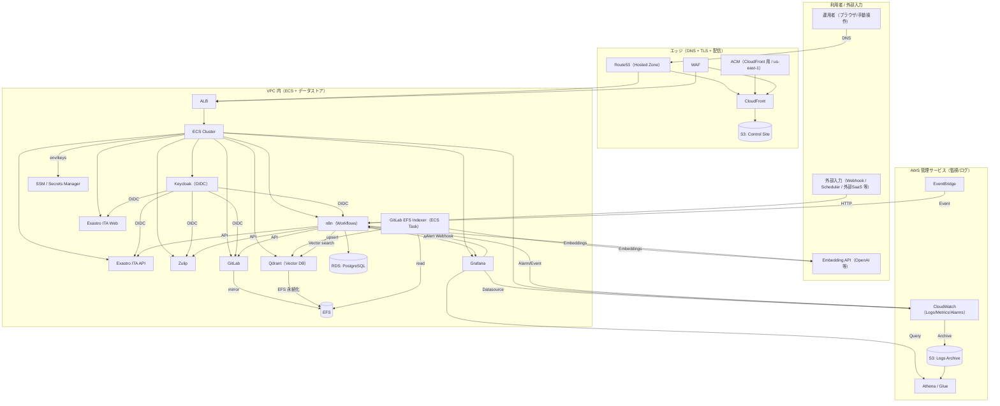

# ドキュメント（`docs/`）

`docs/` には、**監査対応（audit-facing）および提供物（delivery-facing）のドキュメント**を格納します。  
すべての文書は Markdown で記述し、実装成果物（コード/設定/ワークフロー等）と相互リンクします。

## 入口（まずここ）

- インフラ（Terraform）: `docs/infra/README.md`
- ITSM（サービス）: `docs/itsm/README.md`
  - 方針（最終決定/証跡/相互通知）: `docs/itsm/itsm-platform.md`
- apps（n8n ワークフロー同期）: `docs/apps/README.md`（全体像は `apps/README.md`）
- スクリプト仕様（副作用/入出力）: `docs/scripts.md`
- 用語: `docs/glossary.md`

## 構成図（Mermaid）

本リポジトリの「全体像」を俯瞰するための最小構成です。詳細は `docs/infra/README.md`（Terraform）と `apps/README.md`（n8n ワークフロー）を参照してください。

---

## AI ガバナンス構造（アプリ配下）

AI 関連の成果物は分離し、**変更管理下の構成アイテム（controlled configuration items）**として管理します。

## 主要原則

- AI は「自律的な権限主体」ではなく、**AI 有効化機能（AI-enabled functionality）**として扱う
- プロンプトファイルは変更管理下の構成アイテムとして扱う
- GxP に関連する出力はすべて、人による監督（レビュー/承認）を必須とする

## 内容

- `apps/*/docs/cs/ai_behavior_spec.md`（例: `apps/aiops_agent/docs/cs/ai_behavior_spec.md`）  
  AI の意図された振る舞い、制約、監督（オーバーサイト）を定義する
- プロンプト（例: `apps/aiops_agent/data/default/prompt/`）  
  環境別に管理されたプロンプト
- ツール権限定義（未整備）  
  例: `tool_permissions.yaml`（現在このリポジトリには存在しない）
- プロンプト/モデル/権限レジスタ（未整備）  
  例: prompt_model_tool_register.md（現在このリポジトリには存在しない）

---

## Infrastructure as Code（`infra/`）

Terraform コードは、**システム構成の権威ある定義（authoritative system configuration）**を表します。

## 特性

- Terraform のモジュール化設計
- 環境分離（dev / stg / prod）
- ロック付きのリモート state
- セキュリティおよび policy-as-code をサポート

`docs/infra/README.md` では、以下を説明します。

- アーキテクチャ上の判断
- パラメータ化の方針
- 構成アイテム境界（configuration item boundaries）

---

## 証跡管理（`evidence/`）

証跡（evidence）成果物は、**ログ、自動テスト結果、客観的記録**を重視することで CSA の原則を支えます。

## 保存方針

- 軽量な証跡はリポジトリ内に保存してよい
- 機微情報を含むもの、または大容量の成果物は外部へ保存する（例: CI artifacts, S3）
- 証跡（evidence）の保管場所は `evidence/` とし、必要に応じて `docs/` から参照する

---

## Git ベースの変更管理

## ブランチ戦略

- `main`: 本番ベースライン
- `feature/*`: Pull Request による管理変更
- `hotfix/*`: 緊急修正

## Pull Request の要件

各 PR は、最低限次を記載します。

- 変更目的
- 影響する構成アイテム
- リスク考慮（CSA）
- 検証証跡
- ロールバック方針

Pull Request は **変更管理記録（change control records）**として扱います。

---

## 人による監督（CODEOWNERS）

重要領域は、明示的な承認を必須とします。

- `infra/**` → Platform / Cloud Owner
- `ai/prompts/**` → QA + AI Responsible
- `docs/**` → Quality Assurance

これにより **human-in-the-loop のガバナンス**を強制します。

---

## リリースとバリデーションのベースライン

リリースは次で構成します。

1. `main` へのマージ
2. CI/CD による Terraform apply
3. 検証（verification）の実行
4. リリースノートの更新
5. Git tag の作成
6. Validation Summary Report の更新

Git tag は **バリデート済みベースライン（validated baselines）**を表します。

---

## コンプライアンス上の位置付け

- **GAMP® 5 第2版**  
  ライフサイクル構造と構成分類を提供する
- **CSA（FDA）**  
  リスクベースのアシュアランスと客観的証跡を重視する
- **NIST AI RMF**  
  AI リスク、監督、説明責任を統治する

---

# 11. 監査向けの重要ステートメント

> 本リポジトリは、ベンダーのバリデーションパッケージに依存するのではなく、  
> 変更管理下の構成、リスクベースの検証、  
> および文書化された人による監督によってアシュアランスを達成することを示します。

---

# 12. まとめ

この単一リポジトリモデルにより、次を実現します。

- DevOps の効率
- 明確な説明責任
- 監査対応のトレーサビリティ
- 拡張可能な AI ガバナンス
